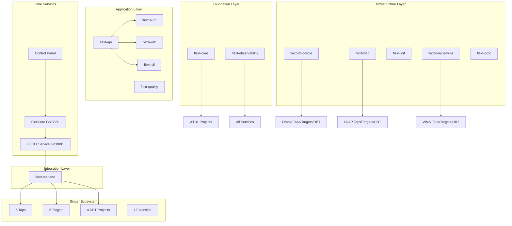

# FLEXT Ecosystem Navigation Hub

**Central navigation system for all 33 FLEXT ecosystem projects and documentation**

**Version**: 0.9.0
**Last Updated**: 2025-08-01  
**Status**: Master Navigation Index  
**Authority**: FLEXT Documentation Team

---

## 🎯 Quick Start Navigation

### **🚀 For New Developers**

```
Start Here → Follow This Path:
┌─ 1. [Getting Started](development/getting-started.md)
├─ 2. [Workspace Organization](ecosystem/workspace-organization.md)
├─ 3. [Ecosystem Architecture](architecture/ecosystem-architecture.md)
├─ 4. [Clean Architecture](architecture/clean-architecture.md)
└─ 5. [Integration Patterns](architecture/integration-patterns.md)
```

### **⚙️ For Operations Teams**

```
Operations Path:
┌─ 1. [Deployment Guide](deployment/)
├─ 2. [Configuration Management](configuration/)
├─ 3. [Monitoring Setup](deployment/monitoring.md)
├─ 4. [Troubleshooting](troubleshooting/)
└─ 5. [Health Monitoring](api/health-endpoints.md)
```

### **🏗️ For System Architects**

```
Architecture Path:
┌─ 1. [Ecosystem Architecture](architecture/ecosystem-architecture.md)
├─ 2. [Clean Architecture Implementation](architecture/clean-architecture.md)
├─ 3. [Domain-Driven Design](architecture/domain-driven-design.md)
├─ 4. [CQRS Patterns](architecture/cqrs.md)
└─ 5. [Integration Patterns](architecture/integration-patterns.md)
```

### **📡 For API Consumers**

```
API Path:
┌─ 1. [REST API Reference](api/rest-api.md)
├─ 2. [CLI Commands](api/cli.md)
├─ 3. [OpenAPI Specs](api/openapi/)
├─ 4. [Integration SDK](api/sdk.md)
└─ 5. [Examples](examples/)
```

---

## 🌐 Complete Ecosystem Map

### **📁 FLEXT Main Project (Control Panel)**

**Location**: `/home/marlonsc/flext/` (Main repository)  
**Type**: Control Panel + Documentation Hub  
**Role**: Enterprise control panel and central documentation

#### **Core Documentation**

- **[README.md](../README.md)** - Project overview and ecosystem introduction
- **[CLAUDE.md](../CLAUDE.md)** - Development guidance for Claude Code
- **[Documentation Hub](README.md)** - Central documentation index (this system)

#### **Architecture Documentation**

- **[Ecosystem Architecture](architecture/ecosystem-architecture.md)** - Complete architectural overview
- **[Service Architecture](architecture/service-architecture.md)** - FLEXT service implementation
- **[Architecture Overview](architecture/overview.md)** - General architectural principles
- **[Clean Architecture](architecture/clean-architecture.md)** - Implementation patterns
- **[Package Structure](architecture/pkg-structure.md)** - Go pkg/ organization
- **[Integration Patterns](architecture/integration-patterns.md)** - Cross-service communication
- **[Workspace Organization](ecosystem/workspace-organization.md)** - Project organization
- **[Meltano Consolidation](architecture/meltano-consolidation.md)** - Meltano integration details
- **[Architecture Corrections](architecture/corrections-summary.md)** - Recent architectural improvements

#### **Standards and Guidelines**

- **[Documentation Standard](DOCUMENTATION_STANDARD.md)** - Unified template for all projects
- **[Implementation Plan](development/implementation-plan.md)** - Standardization roadmap
- **[Ecosystem Index](ecosystem/index.md)** - Complete project cross-reference
- **[Python Module Organization](standards/python-module-organization.md)** - Python module structure standard
- **[PEP Semantic Matrix](standards/pep-semantic-matrix.md)** - Python Enhancement Proposal compliance

---

## 🏗️ Foundation Layer (2 Projects)

### **📚 flext-core** - Architectural Foundation

**Path**: [`flext-core/`](../flext-core/)  
**Purpose**: Foundation library with FlextResult, DI container, domain patterns

#### **Documentation Links**

- **[README.md](../flext-core/README.md)** - Foundation library overview
- **[CLAUDE.md](../flext-core/CLAUDE.md)** - Development patterns and usage
- **[API Reference](../flext-core/docs/api/)** - Complete API documentation
- **[Examples](../flext-core/examples/)** - Working code examples

#### **Key Exports**

```python
from flext_core import (
    FlextResult,      # Type-safe error handling
    FlextContainer,   # Dependency injection
    FlextEntity,      # Domain entities
    FlextService,     # Service lifecycle
    get_logger,       # Structured logging
)
```

### **📊 flext-observability** - Monitoring Foundation

**Path**: [`flext-observability/`](../flext-observability/)  
**Purpose**: Monitoring, metrics, tracing, health checks

#### **Documentation Links**

- **[README.md](../flext-observability/README.md)** - Monitoring overview
- **[CLAUDE.md](../flext-observability/CLAUDE.md)** - Observability patterns
- **[Metrics Guide](../flext-observability/docs/metrics.md)** - Metrics collection
- **[Tracing Guide](../flext-observability/docs/tracing.md)** - Distributed tracing

---

## ⚙️ Core Services (3 Projects)

### **🔥 FlexCore** - Go Runtime Container

**Path**: [`flexcore/`](../flexcore/)  
**Purpose**: Runtime container service with plugin system (port 8080)

#### **Documentation Links**

- **[README.md](../flexcore/README.md)** - Go service overview
- **[Architecture](../flexcore/docs/architecture.md)** - Go Clean Architecture
- **[Plugin System](../flexcore/docs/plugins.md)** - Plugin development
- **[Performance](../flexcore/docs/performance.md)** - Optimization guide

### **🚀 FLEXT Service** - Data Platform Service

**Path**: [`cmd/flext/`](../cmd/flext/)  
**Purpose**: Data platform service with Python bridge (port 8081)

#### **Documentation Links**

- **[README.md](../cmd/flext/README.md)** - Service overview
- **[Go-Python Bridge](../cmd/flext/docs/bridge.md)** - Integration patterns
- **[Meltano Integration](../cmd/flext/docs/meltano.md)** - Orchestration
- **[API Reference](../cmd/flext/docs/api.md)** - Service API

### **🎛️ FLEXT Control Panel** - Main Repository

**Path**: [`./`](../)  
**Purpose**: Enterprise control panel (this repository)

#### **Documentation Links**

- **[README.md](../README.md)** - Control panel overview
- **[Architecture](architecture/)** - Complete architecture docs
- **[Development](development/)** - Development guides
- **[API Reference](api/)** - REST API documentation

---

## 🚀 Application Services (5 Projects)

### **📡 flext-api** - REST API Services

**Path**: [`flext-api/`](../flext-api/)  
**Purpose**: REST API foundation with FastAPI

#### **Navigation Links**

- **[README.md](../flext-api/README.md)** - API library overview
- **[CLAUDE.md](../flext-api/CLAUDE.md)** - Development guidance
- **[Client Guide](../flext-api/docs/client.md)** - HTTP client usage
- **[Builders Guide](../flext-api/docs/builders.md)** - Query/Response builders

### **🔐 flext-auth** - Authentication Services

**Path**: [`flext-auth/`](../flext-auth/)  
**Purpose**: Authentication and authorization

#### **Navigation Links**

- **[README.md](../flext-auth/README.md)** - Authentication overview
- **[CLAUDE.md](../flext-auth/CLAUDE.md)** - Auth patterns
- **[Security Guide](../flext-auth/docs/security.md)** - Security best practices
- **[LDAP Integration](../flext-auth/docs/ldap.md)** - Directory integration

### **🌐 flext-web** - Web Interface

**Path**: [`flext-web/`](../flext-web/)  
**Purpose**: Web interface and dashboard

#### **Navigation Links**

- **[README.md](../flext-web/README.md)** - Web interface overview
- **[CLAUDE.md](../flext-web/CLAUDE.md)** - Frontend development
- **[UI Components](../flext-web/docs/components.md)** - Component library
- **[Deployment](../flext-web/docs/deployment.md)** - Web deployment

### **⌨️ flext-cli** - Command-Line Tools

**Path**: [`flext-cli/`](../flext-cli/)  
**Purpose**: CLI tools and utilities

#### **Navigation Links**

- **[README.md](../flext-cli/README.md)** - CLI overview
- **[CLAUDE.md](../flext-cli/CLAUDE.md)** - CLI development
- **[Commands Reference](../flext-cli/docs/commands.md)** - All CLI commands
- **[Scripting Guide](../flext-cli/docs/scripting.md)** - Automation

### **🔍 flext-quality** - Code Quality Analysis

**Path**: [`flext-quality/`](../flext-quality/)  
**Purpose**: Quality analysis and reporting

#### **Navigation Links**

- **[README.md](../flext-quality/README.md)** - Quality tools overview
- **[CLAUDE.md](../flext-quality/CLAUDE.md)** - Quality patterns
- **[Metrics Guide](../flext-quality/docs/metrics.md)** - Quality metrics
- **[Reports](../flext-quality/docs/reports.md)** - Analysis reports

---

## 🏗️ Infrastructure Libraries (6 Projects)

### **🗄️ flext-db-oracle** - Oracle Database

**Path**: [`flext-db-oracle/`](../flext-db-oracle/)  
**Purpose**: Oracle database connectivity and operations

#### **Navigation Links**

- **[README.md](../flext-db-oracle/README.md)** - Oracle integration overview
- **[CLAUDE.md](../flext-db-oracle/CLAUDE.md)** - Database patterns
- **[Connection Guide](../flext-db-oracle/docs/connection.md)** - Setup and config
- **[Performance](../flext-db-oracle/docs/performance.md)** - Optimization

### **📁 flext-ldap** - LDAP Directory Services

**Path**: [`flext-ldap/`](../flext-ldap/)  
**Purpose**: LDAP connectivity and directory operations

#### **Navigation Links**

- **[README.md](../flext-ldap/README.md)** - LDAP integration overview
- **[CLAUDE.md](../flext-ldap/CLAUDE.md)** - Directory patterns
- **[Operations Guide](../flext-ldap/docs/operations.md)** - LDAP operations
- **[Authentication](../flext-ldap/docs/auth.md)** - Auth integration

### **📄 flext-ldif** - LDIF File Processing

**Path**: [`flext-ldif/`](../flext-ldif/)  
**Purpose**: LDIF file processing and validation

#### **Navigation Links**

- **[README.md](../flext-ldif/README.md)** - LDIF processing overview
- **[CLAUDE.md](../flext-ldif/CLAUDE.md)** - File processing patterns
- **[Format Guide](../flext-ldif/docs/format.md)** - LDIF format details
- **[Validation](../flext-ldif/docs/validation.md)** - File validation

### **📦 flext-oracle-wms** - Oracle WMS Integration

**Path**: [`flext-oracle-wms/`](../flext-oracle-wms/)  
**Purpose**: Oracle WMS API connectivity and data models

#### **Navigation Links**

- **[README.md](../flext-oracle-wms/README.md)** - WMS integration overview
- **[CLAUDE.md](../flext-oracle-wms/CLAUDE.md)** - WMS patterns
- **[API Reference](../flext-oracle-wms/docs/api.md)** - WMS API details
- **[Data Models](../flext-oracle-wms/docs/models.md)** - WMS data structures

### **🔗 flext-grpc** - gRPC Communication

**Path**: [`flext-grpc/`](../flext-grpc/)  
**Purpose**: gRPC communication protocols

#### **Navigation Links**

- **[README.md](../flext-grpc/README.md)** - gRPC integration overview
- **[CLAUDE.md](../flext-grpc/CLAUDE.md)** - gRPC patterns
- **[Protocol Definitions](../flext-grpc/docs/protocols.md)** - Service definitions
- **[Client Guide](../flext-grpc/docs/client.md)** - gRPC client usage

### **🎼 flext-meltano** - Singer/Meltano Orchestration

**Path**: [`flext-meltano/`](../flext-meltano/)  
**Purpose**: Singer/Meltano/DBT orchestration platform

#### **Navigation Links**

- **[README.md](../flext-meltano/README.md)** - Orchestration overview
- **[CLAUDE.md](../flext-meltano/CLAUDE.md)** - Orchestration patterns
- **[Pipeline Guide](../flext-meltano/docs/pipelines.md)** - Pipeline management
- **[Plugin Development](../flext-meltano/docs/plugins.md)** - Singer plugins

---

## 🎵 Singer Ecosystem (15 Projects)

### **🔍 Data Extractors - Taps (5 Projects)**

#### **flext-tap-ldap** - LDAP Data Extraction

**Path**: [`flext-tap-ldap/`](../flext-tap-ldap/)

- **[README.md](../flext-tap-ldap/README.md)** | **[CLAUDE.md](../flext-tap-ldap/CLAUDE.md)**
- **[Configuration](../flext-tap-ldap/docs/config.md)** | **[Schema](../flext-tap-ldap/docs/schema.md)**

#### **flext-tap-ldif** - LDIF File Extraction

**Path**: [`flext-tap-ldif/`](../flext-tap-ldif/)

- **[README.md](../flext-tap-ldif/README.md)** | **[CLAUDE.md](../flext-tap-ldif/CLAUDE.md)**
- **[File Processing](../flext-tap-ldif/docs/processing.md)** | **[Examples](../flext-tap-ldif/examples/)**

#### **flext-tap-oracle** - Oracle Database Extraction

**Path**: [`flext-tap-oracle/`](../flext-tap-oracle/)

- **[README.md](../flext-tap-oracle/README.md)** | **[CLAUDE.md](../flext-tap-oracle/CLAUDE.md)**
- **[SQL Optimization](../flext-tap-oracle/docs/optimization.md)** | **[Schemas](../flext-tap-oracle/docs/schemas.md)**

#### **flext-tap-oracle-oic** - Oracle Integration Cloud

**Path**: [`flext-tap-oracle-oic/`](../flext-tap-oracle-oic/)

- **[README.md](../flext-tap-oracle-oic/README.md)** | **[CLAUDE.md](../flext-tap-oracle-oic/CLAUDE.md)**
- **[API Integration](../flext-tap-oracle-oic/docs/api.md)** | **[Auth](../flext-tap-oracle-oic/docs/auth.md)**

#### **flext-tap-oracle-wms** - Oracle WMS Extraction

**Path**: [`flext-tap-oracle-wms/`](../flext-tap-oracle-wms/)

- **[README.md](../flext-tap-oracle-wms/README.md)** | **[CLAUDE.md](../flext-tap-oracle-wms/CLAUDE.md)**
- **[WMS APIs](../flext-tap-oracle-wms/docs/wms-apis.md)** | **[Inventory](../flext-tap-oracle-wms/docs/inventory.md)**

### **🎯 Data Loaders - Targets (5 Projects)**

#### **flext-target-ldap** - LDAP Data Loading

**Path**: [`flext-target-ldap/`](../flext-target-ldap/)

- **[README.md](../flext-target-ldap/README.md)** | **[CLAUDE.md](../flext-target-ldap/CLAUDE.md)**
- **[Operations](../flext-target-ldap/docs/operations.md)** | **[Batch Loading](../flext-target-ldap/docs/batch.md)**

#### **flext-target-ldif** - LDIF File Loading

**Path**: [`flext-target-ldif/`](../flext-target-ldif/)

- **[README.md](../flext-target-ldif/README.md)** | **[CLAUDE.md](../flext-target-ldif/CLAUDE.md)**
- **[File Generation](../flext-target-ldif/docs/generation.md)** | **[Formats](../flext-target-ldif/docs/formats.md)**

#### **flext-target-oracle** - Oracle Database Loading

**Path**: [`flext-target-oracle/`](../flext-target-oracle/)

- **[README.md](../flext-target-oracle/README.md)** | **[CLAUDE.md](../flext-target-oracle/CLAUDE.md)**
- **[Bulk Loading](../flext-target-oracle/docs/bulk-loading.md)** | **[Transactions](../flext-target-oracle/docs/transactions.md)**

#### **flext-target-oracle-oic** - Oracle Integration Cloud Loading

**Path**: [`flext-target-oracle-oic/`](../flext-target-oracle-oic/)

- **[README.md](../flext-target-oracle-oic/README.md)** | **[CLAUDE.md](../flext-target-oracle-oic/CLAUDE.md)**
- **[Integration Flows](../flext-target-oracle-oic/docs/flows.md)** | **[Adapters](../flext-target-oracle-oic/docs/adapters.md)**

#### **flext-target-oracle-wms** - Oracle WMS Loading

**Path**: [`flext-target-oracle-wms/`](../flext-target-oracle-wms/)

- **[README.md](../flext-target-oracle-wms/README.md)** | **[CLAUDE.md](../flext-target-oracle-wms/CLAUDE.md)**
- **[Real-time Updates](../flext-target-oracle-wms/docs/realtime.md)** | **[Logistics](../flext-target-oracle-wms/docs/logistics.md)**

### **🔄 Data Transformers - DBT (4 Projects)**

#### **flext-dbt-ldap** - LDAP Transformations

**Path**: [`flext-dbt-ldap/`](../flext-dbt-ldap/)

- **[README.md](../flext-dbt-ldap/README.md)** | **[CLAUDE.md](../flext-dbt-ldap/CLAUDE.md)**
- **[Models](../flext-dbt-ldap/docs/models.md)** | **[Business Rules](../flext-dbt-ldap/docs/rules.md)**

#### **flext-dbt-ldif** - LDIF Transformations

**Path**: [`flext-dbt-ldif/`](../flext-dbt-ldif/)

- **[README.md](../flext-dbt-ldif/README.md)** | **[CLAUDE.md](../flext-dbt-ldif/CLAUDE.md)**
- **[Data Cleaning](../flext-dbt-ldif/docs/cleaning.md)** | **[Validation](../flext-dbt-ldif/docs/validation.md)**

#### **flext-dbt-oracle** - Oracle Transformations

**Path**: [`flext-dbt-oracle/`](../flext-dbt-oracle/)

- **[README.md](../flext-dbt-oracle/README.md)** | **[CLAUDE.md](../flext-dbt-oracle/CLAUDE.md)**
- **[Enterprise Models](../flext-dbt-oracle/docs/models.md)** | **[Performance](../flext-dbt-oracle/docs/performance.md)**

#### **flext-dbt-oracle-wms** - Oracle WMS Transformations

**Path**: [`flext-dbt-oracle-wms/`](../flext-dbt-oracle-wms/)

- **[README.md](../flext-dbt-oracle-wms/README.md)** | **[CLAUDE.md](../flext-dbt-oracle-wms/CLAUDE.md)**
- **[KPI Models](../flext-dbt-oracle-wms/docs/kpis.md)** | **[Logistics Rules](../flext-dbt-oracle-wms/docs/logistics.md)**

### **🔌 Extensions (1 Project)**

#### **flext-oracle-oic-ext** - Oracle OIC Extensions

**Path**: [`flext-oracle-oic-ext/`](../flext-oracle-oic-ext/)

- **[README.md](../flext-oracle-oic-ext/README.md)** | **[CLAUDE.md](../flext-oracle-oic-ext/CLAUDE.md)**
- **[Utilities](../flext-oracle-oic-ext/docs/utilities.md)** | **[Custom Adapters](../flext-oracle-oic-ext/docs/adapters.md)**

---

## 🏢 Specialized Projects (2 Projects)

### **🏛️ algar-oud-mig** - ALGAR Migration

**Path**: [`algar-oud-mig/`](../algar-oud-mig/)  
**Purpose**: ALGAR Oracle Unified Directory migration

#### **Navigation Links**

- **[README.md](../algar-oud-mig/README.md)** - Migration project overview
- **[CLAUDE.md](../algar-oud-mig/CLAUDE.md)** - Migration patterns
- **[Migration Guide](../algar-oud-mig/docs/migration.md)** - Step-by-step guide
- **[Validation](../algar-oud-mig/docs/validation.md)** - Data validation

### **🏢 gruponos-meltano-native** - GrupoNos Implementation

**Path**: [`gruponos-meltano-native/`](../gruponos-meltano-native/)  
**Purpose**: GrupoNos-specific Meltano implementation

#### **Navigation Links**

- **[README.md](../gruponos-meltano-native/README.md)** - GrupoNos overview
- **[CLAUDE.md](../gruponos-meltano-native/CLAUDE.md)** - Implementation patterns
- **[Custom Logic](../gruponos-meltano-native/docs/custom-logic.md)** - Business rules
- **[Deployment](../gruponos-meltano-native/docs/deployment.md)** - GrupoNos deployment

---

## 🔗 Cross-Project Integration Map

### **Dependency Relationships**



### **Communication Patterns**

#### **HTTP REST APIs**

- **FlexCore** ↔ **FLEXT Service** (ports 8080 ↔ 8081)
- **Control Panel** → **All Services** (REST API calls)
- **flext-web** → **flext-api** → **Services** (UI → API → Backend)

#### **Event-Driven Communication**

- **Domain Events** → All services via event bus
- **Pipeline Events** → Cross-service coordination
- **System Events** → Infrastructure notifications

#### **Plugin System Integration**

- **FlexCore** → **Plugin Registry** → **Meltano Plugins**
- **Singer Taps/Targets** → **Meltano** → **FLEXT Service**
- **DBT Models** → **Meltano** → **Transformation Pipeline**

---

## 📖 Documentation Standards and Navigation

### **Universal Documentation Structure**

Every project follows this standardized structure:

```
project-name/
├── README.md                    # Project overview following standard template
├── CLAUDE.md                    # Development guidance for Claude Code
├── docs/                        # Comprehensive documentation
│   ├── getting-started.md       # Installation and first steps
│   ├── architecture.md          # Project architecture and patterns
│   ├── api-reference.md         # Complete API documentation
│   ├── configuration.md         # Settings and environment management
│   ├── development.md           # Development workflow and guidelines
│   ├── examples/                # Working code examples
│   │   ├── basic-usage.md       # Basic usage examples
│   │   ├── advanced-patterns.md # Advanced implementation patterns
│   │   └── integration-examples.md # Integration with other projects
│   ├── integration.md           # Ecosystem integration patterns
│   ├── troubleshooting.md       # Common issues and solutions
│   └── TODO.md                  # Current gaps and development roadmap
├── examples/                    # Working code examples and demos
├── tests/                       # Comprehensive test suites
└── [project-specific-directories]
```

### **Cross-Reference System**

#### **Standard Link Patterns**

```markdown
# Internal Project Links

- [Configuration Guide](docs/configuration.md)
- [API Reference](docs/api-reference.md)
- [Examples](docs/examples/)

# Ecosystem Project Links

- **[flext-core](../flext-core/README.md)** - Foundation patterns
- **[flext-api](../flext-api/README.md)** - REST API services
- **[Main Documentation Hub](../docs/README.md)** - Complete navigation

# External Links

- [Python 3.13+](https://www.python.org/downloads/)
- [Clean Architecture](https://blog.cleancoder.com/uncle-bob/2012/08/13/the-clean-architecture.html)
```

#### **Navigation Breadcrumbs**

Every documentation page includes navigation breadcrumbs:

```markdown
**Navigation**: [FLEXT Hub](../docs/NAVIGATION.md) > [Architecture](../docs/architecture/) > Current Page
```

### **Quality and Validation**

#### **Documentation Quality Gates**

- ✅ All links validated and functional
- ✅ Code examples tested and working
- ✅ Version numbers accurate and current
- ✅ Professional English throughout
- ✅ Consistent terminology and formatting

#### **Automated Validation**

```bash
# Documentation validation commands
make docs-validate              # Validate all documentation
make docs-link-check           # Check all internal and external links
make docs-example-test         # Test all code examples
make docs-spelling-check       # Spell check all content
make docs-standard-compliance  # Check compliance with documentation standard
```

---

## 🚀 Quick Actions

### **Common Navigation Tasks**

#### **Find Project Documentation**

```bash
# Use ecosystem search
cd /home/marlonsc/flext
find . -name "README.md" | grep -E "(flext-|flexcore|cmd)" | head -10

# Direct project access
cd flext-core && open README.md        # Foundation library
cd flext-api && open CLAUDE.md         # API development guide
cd flexcore && open docs/architecture.md # Go service architecture
```

#### **Access API Documentation**

```bash
# REST API references
open docs/api/rest-api.md              # Main REST API
open flext-api/docs/api-reference.md   # API library reference
open cmd/flext/docs/api.md             # FLEXT Service API

# OpenAPI specifications
open docs/api/openapi/               # OpenAPI specs directory
open flext-api/docs/openapi.yaml    # API library OpenAPI spec
```

#### **Find Integration Examples**

```bash
# Integration patterns
open docs/architecture/integration-patterns.md # Complete integration guide
open docs/examples/                            # Example implementations
open flext-meltano/docs/examples/             # Meltano integration examples

# Cross-service examples
open examples/flexcore-flext-integration.md   # FlexCore ↔ FLEXT Service
open examples/go-python-bridge.md             # Go-Python bridge patterns
open examples/singer-pipeline-full.md         # Complete Singer pipeline
```

#### **Troubleshooting Navigation**

```bash
# General troubleshooting
open docs/troubleshooting/             # Main troubleshooting guide
open docs/troubleshooting/common-issues.md # Common problems

# Project-specific troubleshooting
open flext-core/docs/troubleshooting.md      # Foundation issues
open flexcore/docs/troubleshooting.md        # Go service issues
open flext-meltano/docs/troubleshooting.md   # Meltano pipeline issues
```

---

## 📞 Support and Feedback

### **Getting Help**

#### **Documentation Issues**

- **Missing Content**: Create issue in relevant project repository
- **Broken Links**: Report via [Main Repository Issues](https://github.com/flext-sh/flext/issues)
- **Unclear Information**: Submit improvement via pull request
- **General Questions**: Use [GitHub Discussions](https://github.com/flext-sh/flext/discussions)

#### **Project-Specific Support**

- **flext-core**: [Foundation library issues](https://github.com/flext-sh/flext-core/issues)
- **FlexCore**: [Go service issues](https://github.com/flext-sh/flexcore/issues)
- **API Libraries**: [Service-specific repositories](https://github.com/flext-sh/)

### **Contributing to Documentation**

#### **Improvement Process**

1. **Identify Issue**: Document what needs improvement
2. **Check Standards**: Follow [Documentation Standard](DOCUMENTATION_STANDARD.md)
3. **Make Changes**: Update relevant documentation
4. **Test Links**: Ensure all links work correctly
5. **Submit PR**: Include clear description of changes

#### **Navigation Updates**

When adding new projects or major documentation changes:

1. **Update This File**: Add new project to navigation
2. **Update Ecosystem Index**: Reflect changes in [ECOSYSTEM_INDEX.md](ECOSYSTEM_INDEX.md)
3. **Update Cross-References**: Ensure all related projects link correctly
4. **Validate Changes**: Run documentation validation tools

---

**Navigation Hub Version**: 2.0.0  
**Last Updated**: 2025-08-02  
**Next Review**: 2025-09-02  
**Maintained By**: FLEXT Documentation Team

**This is the MASTER NAVIGATION INDEX for the entire FLEXT ecosystem. All navigation and cross-referencing should route through this central hub.**
