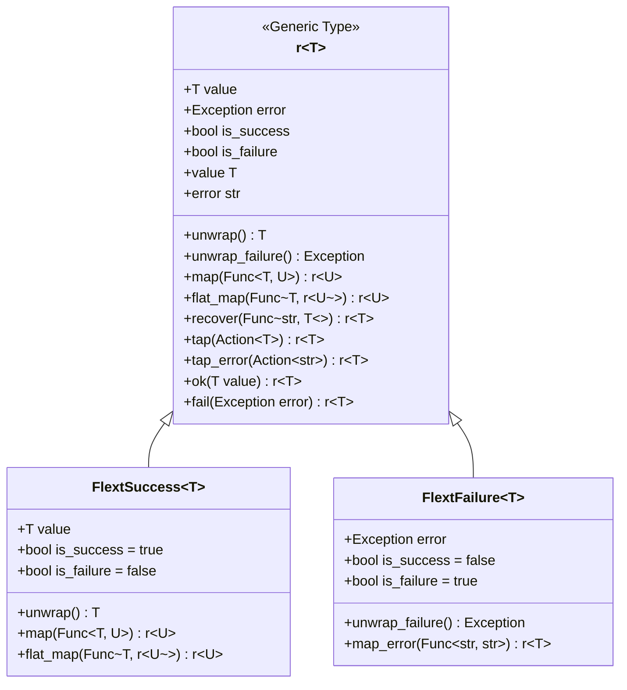
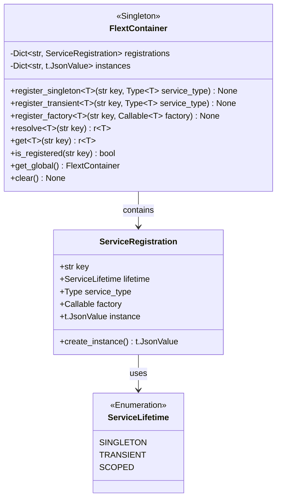
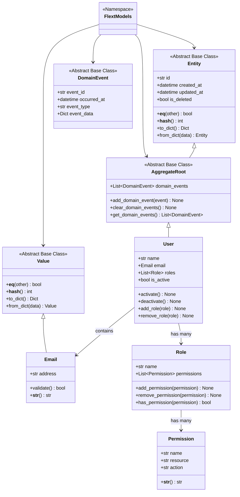
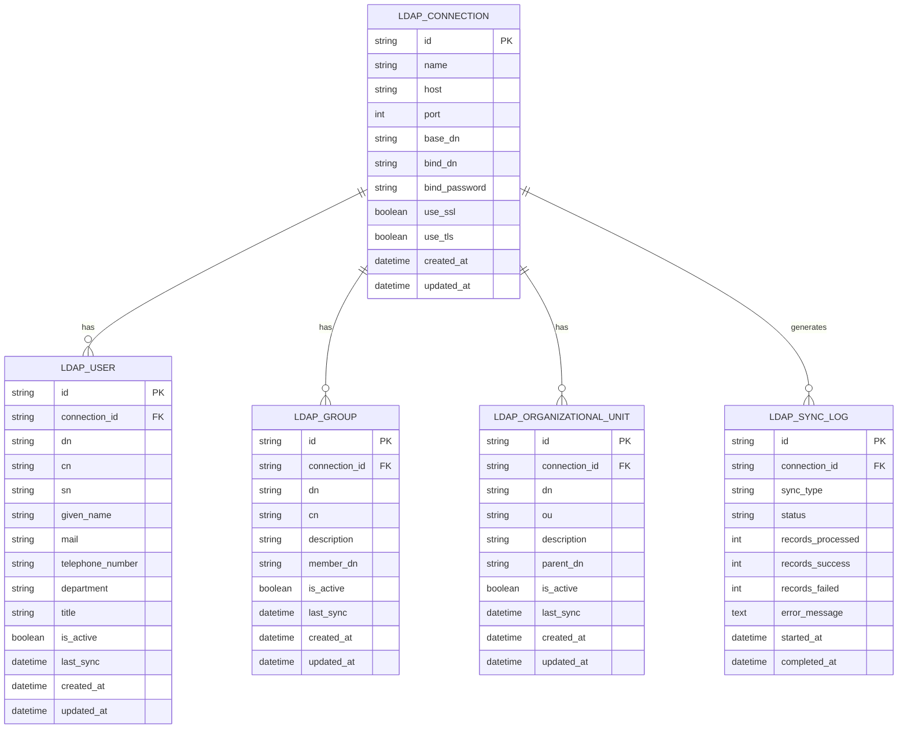
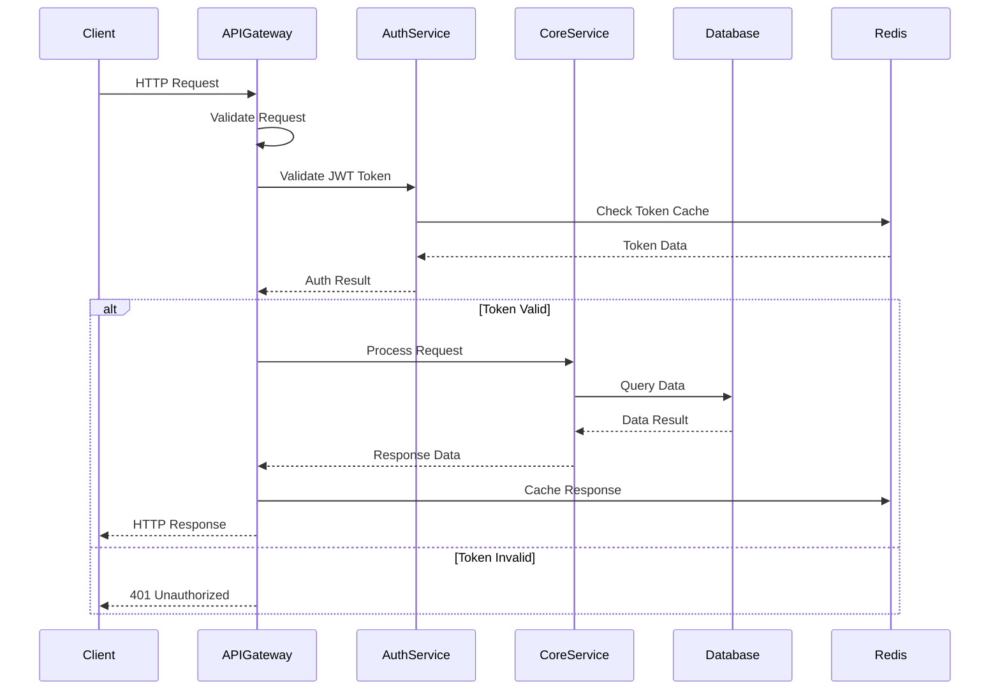
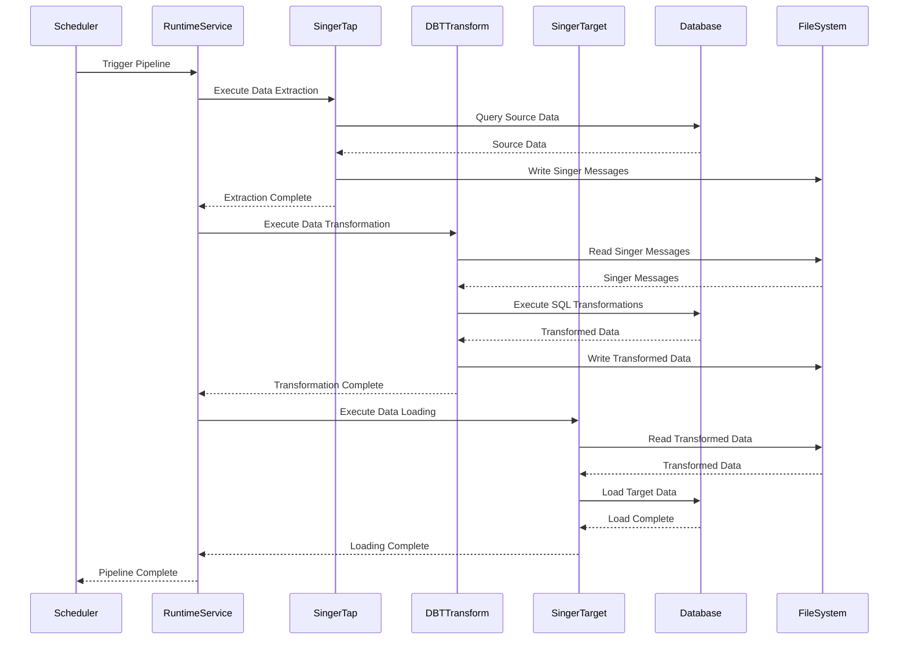
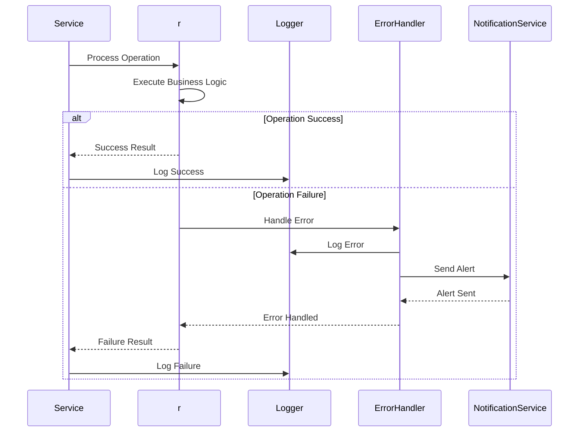
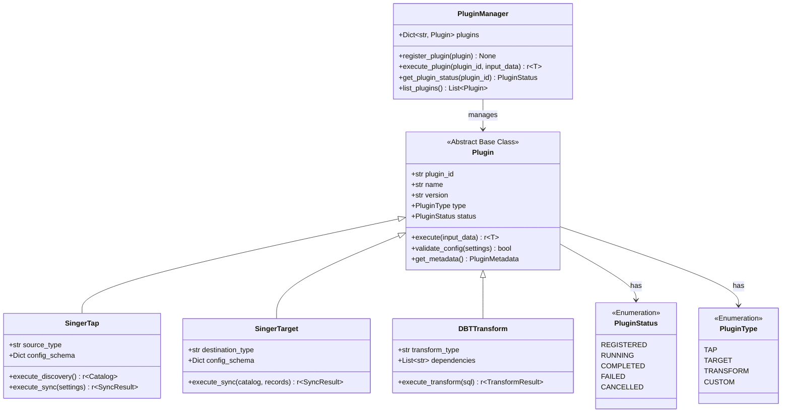
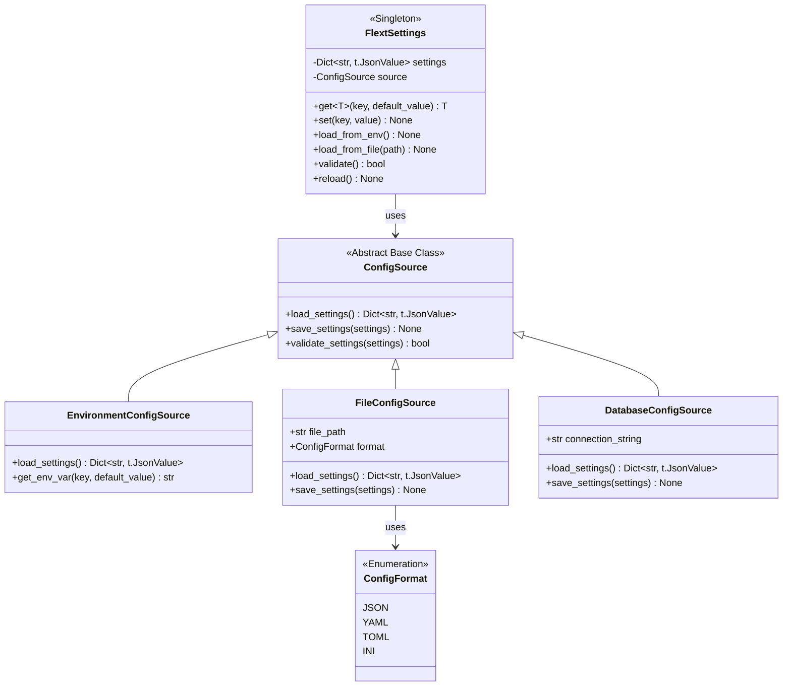
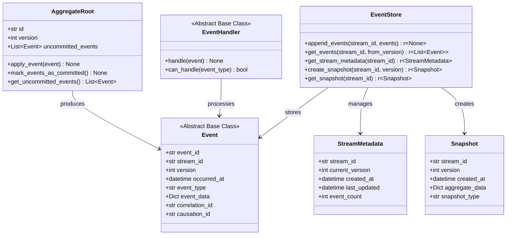

# FLEXT Code Diagrams

**Reviewed**: 2026-02-17 | **Scope**: Documentation alignment and link consistency

## Table of Contents

- [FLEXT Code Diagrams](#flext-code-diagrams)
  - [Overview](#overview)
  - [1. r[T] Class Diagram](#1-flextresultt-class-diagram)
  - [2. FlextContainer Class Diagram](#2-flextcontainer-class-diagram)
  - [3. FlextModels Domain Model](#3-flextmodels-domain-model)
  - [4. LDAP Service Entity Relationship Diagram](#4-ldap-service-entity-relationship-diagram)
  - [5. API Gateway Request Flow Sequence Diagram](#5-api-gateway-request-flow-sequence-diagram)
  - [6. Data Pipeline Execution Sequence Diagram](#6-data-pipeline-execution-sequence-diagram)
  - [7. Error Handling Flow Sequence Diagram](#7-error-handling-flow-sequence-diagram)
  - [8. Plugin Execution Architecture](#8-plugin-execution-architecture)
  - [9. Configuration Management Class Diagram](#9-configuration-management-class-diagram)
  - [10. Event Sourcing Architecture](#10-event-sourcing-architecture)
  - [Code Quality Metrics](#code-quality-metrics)
    - [Test Coverage by Component](#test-coverage-by-component)
    - [Performance Benchmarks](#performance-benchmarks)
    - [Memory Usage](#memory-usage)

## Overview

This document provides detailed code-level diagrams showing the implementation structure of key components in the FLEXT
platform,
including class diagrams, entity relationship diagrams, and sequence diagrams.

## 1. r[T] Class Diagram

## 2. FlextContainer Class Diagram

## 3. FlextModels Domain Model

## 4. LDAP Service Entity Relationship Diagram

## 5. API Gateway Request Flow Sequence Diagram

## 6. Data Pipeline Execution Sequence Diagram

## 7. Error Handling Flow Sequence Diagram

## 8. Plugin Execution Architecture

## 9. Configuration Management Class Diagram

## 10. Event Sourcing Architecture

## Code Quality Metrics

### Test Coverage by Component

- **r[T]**: 95% coverage
- **FlextContainer**: 99% coverage
- **FlextModels**: 65% coverage
- **LDAP Service**: 85% coverage
- **API Gateway**: 80% coverage
- **Plugin Manager**: 70% coverage

### Performance Benchmarks

- **r Operations**: < 1ms per operation
- **Container Resolution**: < 0.1ms per service
- **LDAP Queries**: < 100ms per query
- **API Response Time**: < 200ms per request
- **Plugin Execution**: < 5s per plugin

### Memory Usage

- **r Instances**: ~100 bytes per instance
- **Container Services**: ~1KB per service registration
- **LDAP Connections**: ~2MB per connection pool
- **API Gateway**: ~50MB base memory usage
- **Plugin Runtime**: ~10MB per plugin

---

**Last Updated**: 2025-01-XX
**Version**: 1.0.0
**Maintainer**: FLEXT Architecture Team
