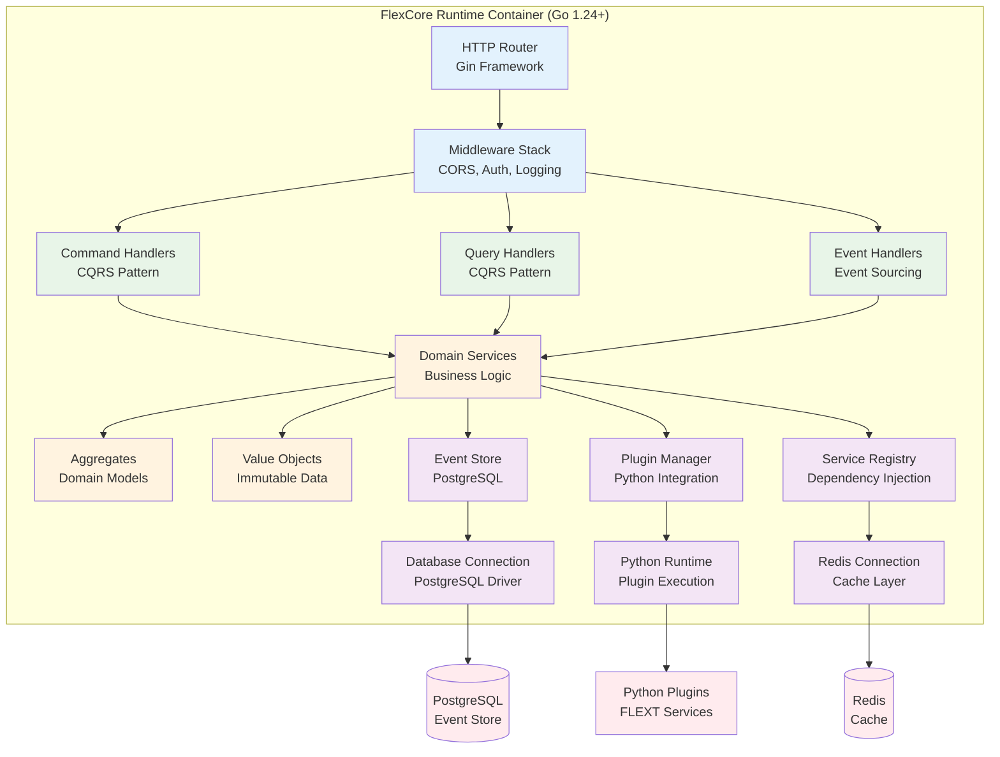
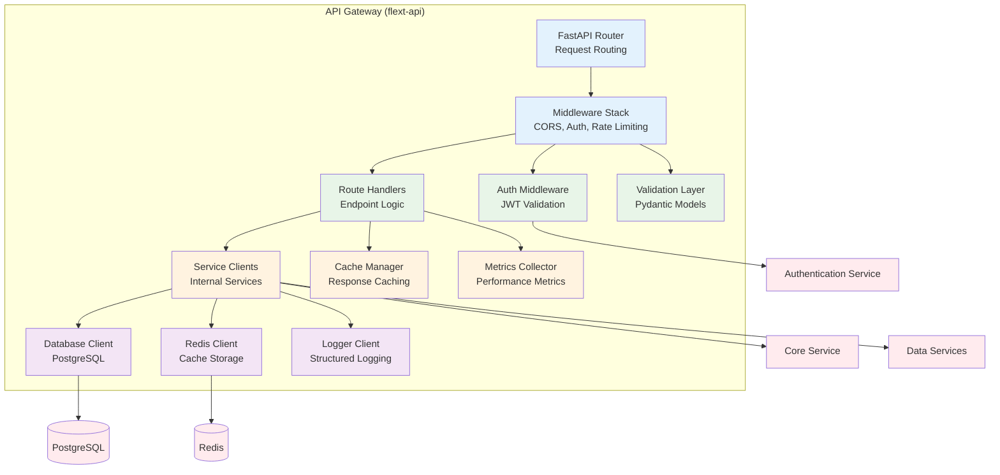
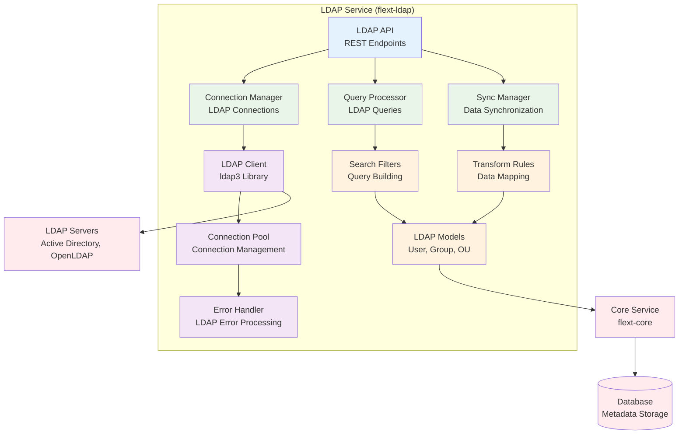

# FLEXT Component Diagrams
## Table of Contents

- [FLEXT Component Diagrams](#flext-component-diagrams)
  - [Overview](#overview)
  - [1. FlexCore Runtime Container Components](#1-flexcore-runtime-container-components)
  - [2. FLEXT Core Service Components](#2-flext-core-service-components)
  - [3. API Gateway Components](#3-api-gateway-components)
  - [4. LDAP Service Components](#4-ldap-service-components)
  - [5. Singer Platform Components](#5-singer-platform-components)
  - [Component Interaction Patterns](#component-interaction-patterns)
    - [1. Request-Response Pattern](#1-request-response-pattern)
    - [2. Event-Driven Pattern](#2-event-driven-pattern)
    - [3. Pipeline Pattern](#3-pipeline-pattern)
    - [4. CQRS Pattern](#4-cqrs-pattern)
    - [5. Railway Pattern](#5-railway-pattern)
  - [Technology Stack by Component](#technology-stack-by-component)
    - [Go Components (FlexCore)](#go-components-flexcore)
    - [Python Components (FLEXT Services)](#python-components-flext-services)
    - [Common Patterns](#common-patterns)


## Overview

This document provides detailed component diagrams for the key containers in the FLEXT platform,
     showing how each container is composed of components and their relationships.

## 1. FlexCore Runtime Container Components



## 2. FLEXT Core Service Components

```mermaid
graph TB
    subgraph CoreService["FLEXT Core Service (Python 3.13+)"]
        %% API Layer
        CoreAPI[Core API<br/>Public Interface]

        %% Application Layer
        ResultProcessor[Result Processor<br/>Railway Pattern]
        ContainerManager[Container Manager<br/>Dependency Injection]
        BusManager[Bus Manager<br/>Event Bus]

        %% Domain Layer
        ResultTypes[Result Types<br/>FlextResult[T]]
        ContainerTypes[Container Types<br/>FlextContainer]
        ModelTypes[Model Types<br/>FlextModels]
        LoggerTypes[Logger Types<br/>FlextLogger]

        %% Infrastructure Layer
        ConfigManager[Config Manager<br/>Environment Config]
        ContextManager[Context Manager<br/>Request Context]
        ExceptionHandler[Exception Handler<br/>Error Management]

        %% Utilities
        TypeSystem[Type System<br/>TypeVars & Protocols]
        Constants[Constants<br/>System Constants]
        Utilities[Utilities<br/>Helper Functions]
    end

    %% External Dependencies
    Environment[Environment Variables]
    ConfigFiles[Configuration Files]
    LoggingSystem[Logging System]

    %% Internal Flow
    CoreAPI --> ResultProcessor
    CoreAPI --> ContainerManager
    CoreAPI --> BusManager

    ResultProcessor --> ResultTypes
    ContainerManager --> ContainerTypes
    BusManager --> ModelTypes

    ResultTypes --> TypeSystem
    ContainerTypes --> TypeSystem
    ModelTypes --> TypeSystem
    LoggerTypes --> TypeSystem

    TypeSystem --> Constants
    TypeSystem --> Utilities

    ConfigManager --> Environment
    ConfigManager --> ConfigFiles
    ContextManager --> LoggingSystem
    ExceptionHandler --> LoggingSystem

    %% Styling
    classDef api fill:#e3f2fd
    classDef app fill:#e8f5e8
    classDef domain fill:#fff3e0
    classDef infra fill:#f3e5f5
    classDef util fill:#f1f8e9
    classDef external fill:#ffebee

    class CoreAPI api
    class ResultProcessor,ContainerManager,BusManager app
    class ResultTypes,ContainerTypes,ModelTypes,LoggerTypes domain
    class ConfigManager,ContextManager,ExceptionHandler infra
    class TypeSystem,Constants,Utilities util
    class Environment,ConfigFiles,LoggingSystem external
```

## 3. API Gateway Components



## 4. LDAP Service Components



## 5. Singer Platform Components

```mermaid
graph TB
    subgraph SingerPlatform["Singer Platform (Data Integration)"]
        %% Tap Components
        subgraph Taps["Singer Taps (Data Extraction)"]
            TapLDAP[LDAP Tap<br/>flext-tap-ldap]
            TapLDIF[LDIF Tap<br/>flext-tap-ldif]
            TapOracle[Oracle Tap<br/>flext-tap-oracle]
            TapOracleOic[Oracle OIC Tap<br/>flext-tap-oracle-oic]
            TapOracleWMS[Oracle WMS Tap<br/>flext-tap-oracle-wms]
        end

        %% Target Components
        subgraph Targets["Singer Targets (Data Loading)"]
            TargetLDAP[LDAP Target<br/>flext-target-ldap]
            TargetLDIF[LDIF Target<br/>flext-target-ldif]
            TargetOracle[Oracle Target<br/>flext-target-oracle]
            TargetOracleOic[Oracle OIC Target<br/>flext-target-oracle-oic]
            TargetOracleWMS[Oracle WMS Target<br/>flext-target-oracle-wms]
        end

        %% DBT Components
        subgraph DBT["DBT Transformations"]
            DBTLDAP[LDAP DBT<br/>flext-dbt-ldap]
            DBTLDIF[LDIF DBT<br/>flext-dbt-ldif]
            DBTOracle[Oracle DBT<br/>flext-dbt-oracle]
            DBTOracleWMS[Oracle WMS DBT<br/>flext-dbt-oracle-wms]
        end

        %% Common Components
        SingerSDK[Singer SDK<br/>Common Framework]
        StateManager[State Manager<br/>Checkpoint Management]
        SchemaManager[Schema Manager<br/>Schema Evolution]
        ErrorHandler[Error Handler<br/>Retry Logic]
    end

    %% External Systems
    DataSources[Data Sources<br/>LDAP, Oracle, Files]
    DataDestinations[Data Destinations<br/>Databases, Files]
    CoreService[Core Service<br/>flext-core]

    %% Internal Flow
    TapLDAP --> SingerSDK
    TapLDIF --> SingerSDK
    TapOracle --> SingerSDK
    TapOracleOic --> SingerSDK
    TapOracleWMS --> SingerSDK

    TargetLDAP --> SingerSDK
    TargetLDIF --> SingerSDK
    TargetOracle --> SingerSDK
    TargetOracleOic --> SingerSDK
    TargetOracleWMS --> SingerSDK

    DBTLDAP --> SingerSDK
    DBTLDIF --> SingerSDK
    DBTOracle --> SingerSDK
    DBTOracleWMS --> SingerSDK

    SingerSDK --> StateManager
    SingerSDK --> SchemaManager
    SingerSDK --> ErrorHandler

    StateManager --> CoreService
    SchemaManager --> CoreService
    ErrorHandler --> CoreService

    %% External Connections
    TapLDAP --> DataSources
    TapLDIF --> DataSources
    TapOracle --> DataSources
    TapOracleOic --> DataSources
    TapOracleWMS --> DataSources

    TargetLDAP --> DataDestinations
    TargetLDIF --> DataDestinations
    TargetOracle --> DataDestinations
    TargetOracleOic --> DataDestinations
    TargetOracleWMS --> DataDestinations

    %% Styling
    classDef tap fill:#e3f2fd
    classDef target fill:#e8f5e8
    classDef dbt fill:#fff3e0
    classDef common fill:#f3e5f5
    classDef external fill:#ffebee

    class TapLDAP,TapLDIF,TapOracle,TapOracleOic,TapOracleWMS tap
    class TargetLDAP,TargetLDIF,TargetOracle,TargetOracleOic,TargetOracleWMS target
    class DBTLDAP,DBTLDIF,DBTOracle,DBTOracleWMS dbt
    class SingerSDK,StateManager,SchemaManager,ErrorHandler common
    class DataSources,DataDestinations,CoreService external
```



## Component Interaction Patterns

### 1. Request-Response Pattern

- **API Gateway** → **Service Components** → **External Systems**
- Synchronous communication for immediate responses
- Used for user-initiated operations and real-time queries

### 2. Event-Driven Pattern

- **Event Handlers** → **Domain Services** → **Event Store**
- Asynchronous communication for decoupled operations
- Used for data synchronization and business process automation

### 3. Pipeline Pattern

- **Singer Taps** → **DBT Transformations** → **Singer Targets**
- Sequential data processing through multiple stages
- Used for data integration and transformation workflows

### 4. CQRS Pattern

- **Command Handlers** → **Domain Services** → **Event Store**
- **Query Handlers** → **Read Models** → **Database**
- Separation of read and write operations for scalability

### 5. Railway Pattern

- **FlextResult[T]** → **Error Handling** → **Recovery Logic**
- Functional error handling with composition
- Used throughout the system for robust error management

## Technology Stack by Component

### Go Components (FlexCore)

- **Framework**: Gin for HTTP routing
- **Database**: PostgreSQL driver with connection pooling
- **Cache**: Redis client with clustering support
- **Logging**: Structured logging with context propagation

### Python Components (FLEXT Services)

- **Framework**: FastAPI for REST APIs
- **Foundation**: flext-core for architectural patterns
- **Database**: SQLAlchemy with async support
- **Integration**: Singer SDK for data integration
- **Validation**: Pydantic v2 for data validation

### Common Patterns

- **Dependency Injection**: FlextContainer for service management
- **Error Handling**: FlextResult[T] for railway-oriented programming
- **Logging**: Structured logging with correlation IDs
- **Configuration**: Environment-based configuration management
- **Testing**: Comprehensive test coverage with quality gates

---

**Last Updated**: 2025-01-XX
**Version**: 1.0.0
**Maintainer**: FLEXT Architecture Team
