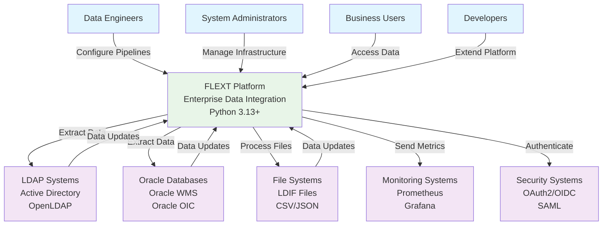

# FLEXT System Context Diagram

## Table of Contents

- [FLEXT System Context Diagram](#flext-system-context-diagram)
  - [Overview](#overview)
  - [System Context Diagram](#system-context-diagram)
  - [Key Stakeholders](#key-stakeholders)
    - [Primary Users](#primary-users)
    - [External Systems](#external-systems)
  - [System Responsibilities](#system-responsibilities)
    - [Core Capabilities](#core-capabilities)
  - [Quality Attributes](#quality-attributes)
    - [Performance](#performance)
    - [Reliability](#reliability)
    - [Security](#security)
    - [Maintainability](#maintainability)
  - [Technology Stack](#technology-stack)
    - [Runtime Environment](#runtime-environment)
    - [Data Storage](#data-storage)
    - [Integration Protocols](#integration-protocols)
    - [Monitoring and Observability](#monitoring-and-observability)

## Overview

The FLEXT Enterprise Data Integration Platform serves as a comprehensive data integration solution for enterprise
environments,
connecting various data sources and destinations through a unified, scalable architecture.

## System Context Diagram

## Key Stakeholders

### Primary Users

1. **Data Engineers**
   - Configure and manage data pipelines
   - Monitor data quality and processing
   - Troubleshoot integration issues

2. **System Administrators**
   - Deploy and maintain FLEXT infrastructure
   - Manage security and access controls
   - Monitor system health and performance

3. **Business Users**
   - Access integrated data through APIs
   - View data quality reports
   - Request new data sources

4. **Developers**
   - Extend FLEXT with custom plugins
   - Integrate FLEXT with existing systems
   - Develop custom data transformations

### External Systems

1. **LDAP Systems**
   - Active Directory
   - OpenLDAP
   - Other LDAP-compliant directories

2. **Oracle Systems**
   - Oracle Database
   - Oracle WMS (Warehouse Management)
   - Oracle OIC (Integration Cloud)

3. **File Systems**
   - LDIF files for LDAP data
   - CSV/JSON files for data exchange
   - Configuration files

4. **Monitoring Systems**
   - Prometheus for metrics collection
   - Grafana for visualization
   - Alerting systems

5. **Security Systems**
   - OAuth2/OIDC providers
   - SAML identity providers
   - Certificate authorities

## System Responsibilities

### Core Capabilities

1. **Data Integration**
   - Extract data from multiple sources
   - Transform data according to business rules
   - Load data into target systems
   - Ensure data quality and consistency

2. **Pipeline Orchestration**
   - Schedule and execute data pipelines
   - Handle dependencies between tasks
   - Provide retry and error handling
   - Monitor pipeline execution

3. **Data Quality Management**
   - Validate data against schemas
   - Detect and report data anomalies
   - Provide data lineage tracking
   - Generate quality reports

4. **Security and Compliance**
   - Authenticate users and systems
   - Authorize access to data and functions
   - Encrypt data in transit and at rest
   - Audit all data access and modifications

5. **Monitoring and Observability**
   - Collect metrics and logs
   - Provide health checks and status
   - Generate alerts for issues
   - Support distributed tracing

## Quality Attributes

### Performance

- **Throughput**: Process millions of records per hour
- **Latency**: Sub-second response times for API calls
- **Scalability**: Horizontal scaling to handle increased load

### Reliability

- **Availability**: 99.9% uptime target
- **Fault Tolerance**: Graceful handling of component failures
- **Data Consistency**: ACID compliance for critical operations

### Security

- **Authentication**: Multi-factor authentication support
- **Authorization**: Role-based access control
- **Data Protection**: Encryption and secure communication
- **Audit Trail**: Comprehensive logging of all activities

### Maintainability

- **Modularity**: Clear separation of concerns
- **Testability**: Comprehensive test coverage
- **Documentation**: Complete API and architecture documentation
- **Extensibility**: Plugin architecture for custom functionality

## Technology Stack

### Runtime Environment

- **Python 3.13+**: Primary business logic language
- **Docker**: Containerization and deployment

### Data Storage

- **PostgreSQL**: Primary database for metadata and configuration
- **Redis**: Caching and session management
- **File System**: LDIF and configuration file storage

### Integration Protocols

- **LDAP/LDIF**: Directory service integration
- **SQL**: Database connectivity
- **REST APIs**: Web service integration
- **gRPC**: High-performance service communication

### Monitoring and Observability

- **Prometheus**: Metrics collection
- **Grafana**: Visualization and dashboards
- **Structured Logging**: JSON-formatted logs
- **Distributed Tracing**: Request flow tracking

---

**Last Updated**: 2025-01-XX
**Version**: 1.0.0
**Maintainer**: FLEXT Architecture Team
