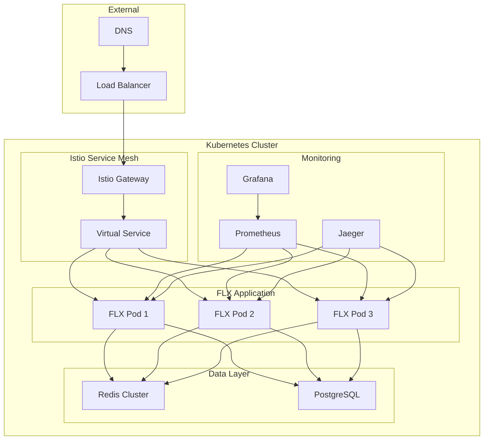

# 🚢 Kubernetes Deployment Guide - Production Orchestration

> **Function**: Complete Kubernetes deployment guide for FLX applications | **Audience**: Platform engineers, DevOps teams, SRE | **Status**: Production-Ready

[](https://kubernetes.io/)
[](./production-checklist.md)
[](#auto-scaling)

**Complete guide for deploying FLX applications on Kubernetes with production-grade configurations, scaling strategies, and operational best practices**

---

## 🧭 **Navigation Context**

**🏠 Root**: [Documentation Home](../../index.md) → **📂 Section**: [Deployment](../index.md) → **📂 Hub**: [Strategies](./index.md) → **📄 Current**: Kubernetes Deployment

### **📍 Learning Path Position**

```
[Production Checklist](./production-checklist.md) → **[KUBERNETES DEPLOYMENT]** → [Infrastructure Deployment](../infrastructure/infrastructure-deployment.md)
```

## 🎯 **Quick Links**

- **📂 Section Hub**: [Deployment Strategies](./index.md)
- **🏠 Documentation Root**: [Root Index](../../index.md)
- **🔗 Prerequisites**: [Production Checklist](./production-checklist.md)

---

## 🎯 Overview

This guide covers deploying FLX applications on Kubernetes with:

- **High Availability**: Multi-zone deployment with redundancy
- **Auto-scaling**: Horizontal and vertical pod autoscaling
- **Service Mesh**: Istio integration for advanced traffic management
- **Security**: RBAC, network policies, and secret management
- **Monitoring**: Prometheus, Grafana, and distributed tracing

## 🏗️ Architecture

### **Kubernetes Architecture**



## 📦 Container Configuration

### **Dockerfile Optimization**

```dockerfile
# Dockerfile.production
FROM python:3.13-slim AS builder

# Install system dependencies
RUN apt-get update && apt-get install -y \
    build-essential \
    libpq-dev \
    && rm -rf /var/lib/apt/lists/*

# Create virtual environment
RUN python -m venv /opt/venv
ENV PATH="/opt/venv/bin:$PATH"

# Install Python dependencies
COPY requirements.txt .
RUN pip install --no-cache-dir -r requirements.txt

# Production stage
FROM python:3.13-slim AS production

# Install runtime dependencies
RUN apt-get update && apt-get install -y \
    libpq5 \
    && rm -rf /var/lib/apt/lists/* \
    && groupadd -r flx && useradd -r -g flx flx

# Copy virtual environment
COPY --from=builder /opt/venv /opt/venv
ENV PATH="/opt/venv/bin:$PATH"

# Copy application code
WORKDIR /app
COPY src/ ./src/
COPY pyproject.toml ./

# Install FLX in production mode
RUN pip install -e .

# Security: run as non-root user
USER flx

# Health check
HEALTHCHECK --interval=30s --timeout=10s --start-period=60s --retries=3 \
    CMD python -c "import requests; requests.get('http://localhost:8000/health')"

# Default command
CMD ["python", "-m", "flx", "serve", "--host", "0.0.0.0", "--port", "8000"]
```

### **Multi-stage Build with Security**

```dockerfile
# Dockerfile.secure
FROM python:3.13-slim AS security-scanner

# Install security tools
RUN pip install bandit safety

# Copy source for security scanning
COPY src/ /app/src/
COPY requirements.txt /app/

# Run security scans
WORKDIR /app
RUN bandit -r src/ -f json -o bandit-report.json || true
RUN safety check -r requirements.txt --json --output safety-report.json || true

FROM python:3.13-slim AS production

# Copy security reports (optional, for audit trails)
COPY --from=security-scanner /app/*-report.json /security-reports/

# ... rest of production configuration
```

## ⚙️ Kubernetes Manifests

### **Namespace Configuration**

```yaml
# namespace.yaml
apiVersion: v1
kind: Namespace
metadata:
  name: flx-production
  labels:
    name: flx-production
    environment: production
    team: platform
---
apiVersion: v1
kind: Namespace
metadata:
  name: flx-staging
  labels:
    name: flx-staging
    environment: staging
    team: platform
```

### **ConfigMap and Secrets**

```yaml
# configmap.yaml
apiVersion: v1
kind: ConfigMap
metadata:
  name: flx-config
  namespace: flx-production
data:
  FLX_LOG_LEVEL: "INFO"
  FLX_LOG_FORMAT: "json"
  FLX_CACHE_BACKEND: "redis"
  FLX_CACHE_URL: "redis://redis-cluster:6379"
  FLX_DATABASE_URL: "postgresql://flx-user@postgres:5432/flx_prod"
  FLX_METRICS_ENABLED: "true"
  FLX_TRACING_ENABLED: "true"
  FLX_ENVIRONMENT: "production"
---
apiVersion: v1
kind: Secret
metadata:
  name: flx-secrets
  namespace: flx-production
type: Opaque
data:
  DATABASE_PASSWORD: <base64-encoded-password>
  REDIS_PASSWORD: <base64-encoded-password>
  JWT_SECRET: <base64-encoded-jwt-secret>
  API_KEY: <base64-encoded-api-key>
```

### **Deployment Configuration**

```yaml
# deployment.yaml
apiVersion: apps/v1
kind: Deployment
metadata:
  name: flx-app
  namespace: flx-production
  labels:
    app: flx
    version: v0.4.0
    component: application
spec:
  replicas: 3
  strategy:
    type: RollingUpdate
    rollingUpdate:
      maxSurge: 1
      maxUnavailable: 0
  selector:
    matchLabels:
      app: flx
  template:
    metadata:
      labels:
        app: flx
        version: v0.4.0
        component: application
      annotations:
        sidecar.istio.io/inject: "true"
        prometheus.io/scrape: "true"
        prometheus.io/port: "8000"
        prometheus.io/path: "/metrics"
    spec:
      serviceAccountName: flx-service-account
      
      # Security context
      securityContext:
        runAsNonRoot: true
        runAsUser: 1000
        runAsGroup: 1000
        fsGroup: 1000
      
      # Init containers
      initContainers:
      - name: wait-for-db
        image: postgres:15-alpine
        command: ['sh', '-c']
        args:
        - |
          until pg_isready -h postgres -p 5432 -U flx-user; do
            echo "Waiting for database..."
            sleep 2
          done
          echo "Database is ready!"
        env:
        - name: PGPASSWORD
          valueFrom:
            secretKeyRef:
              name: flx-secrets
              key: DATABASE_PASSWORD
      
      - name: wait-for-redis
        image: redis:7-alpine
        command: ['sh', '-c']
        args:
        - |
          until redis-cli -h redis-cluster -p 6379 ping; do
            echo "Waiting for Redis..."
            sleep 2
          done
          echo "Redis is ready!"
      
      containers:
      - name: flx-app
        image: flx:v0.4.0
        ports:
        - name: http
          containerPort: 8000
          protocol: TCP
        - name: metrics
          containerPort: 9090
          protocol: TCP
        
        # Environment configuration
        envFrom:
        - configMapRef:
            name: flx-config
        env:
        - name: DATABASE_PASSWORD
          valueFrom:
            secretKeyRef:
              name: flx-secrets
              key: DATABASE_PASSWORD
        - name: REDIS_PASSWORD
          valueFrom:
            secretKeyRef:
              name: flx-secrets
              key: REDIS_PASSWORD
        - name: JWT_SECRET
          valueFrom:
            secretKeyRef:
              name: flx-secrets
              key: JWT_SECRET
        
        # Resource limits
        resources:
          requests:
            memory: "256Mi"
            cpu: "100m"
          limits:
            memory: "512Mi"
            cpu: "500m"
        
        # Health checks
        livenessProbe:
          httpGet:
            path: /health
            port: http
          initialDelaySeconds: 60
          periodSeconds: 30
          timeoutSeconds: 10
          failureThreshold: 3
        
        readinessProbe:
          httpGet:
            path: /ready
            port: http
          initialDelaySeconds: 30
          periodSeconds: 10
          timeoutSeconds: 5
          failureThreshold: 3
        
        # Startup probe for slow-starting applications
        startupProbe:
          httpGet:
            path: /health
            port: http
          initialDelaySeconds: 30
          periodSeconds: 10
          timeoutSeconds: 5
          failureThreshold: 10
        
        # Security context
        securityContext:
          allowPrivilegeEscalation: false
          readOnlyRootFilesystem: true
          capabilities:
            drop:
            - ALL
        
        # Volume mounts
        volumeMounts:
        - name: tmp
          mountPath: /tmp
        - name: cache
          mountPath: /app/cache
      
      volumes:
      - name: tmp
        emptyDir: {}
      - name: cache
        emptyDir: {}
      
      # Pod scheduling
      affinity:
        podAntiAffinity:
          preferredDuringSchedulingIgnoredDuringExecution:
          - weight: 100
            podAffinityTerm:
              labelSelector:
                matchExpressions:
                - key: app
                  operator: In
                  values:
                  - flx
              topologyKey: kubernetes.io/hostname
      
      # Tolerations for node taints
      tolerations:
      - key: "node-role.kubernetes.io/spot"
        operator: "Equal"
        value: "true"
        effect: "NoSchedule"
```

### **Service Configuration**

```yaml
# service.yaml
apiVersion: v1
kind: Service
metadata:
  name: flx-service
  namespace: flx-production
  labels:
    app: flx
    component: application
  annotations:
    service.beta.kubernetes.io/aws-load-balancer-type: "nlb"
    service.beta.kubernetes.io/aws-load-balancer-backend-protocol: "http"
spec:
  type: LoadBalancer
  ports:
  - name: http
    port: 80
    targetPort: http
    protocol: TCP
  - name: https
    port: 443
    targetPort: http
    protocol: TCP
  selector:
    app: flx
---
# Internal service for service mesh
apiVersion: v1
kind: Service
metadata:
  name: flx-internal
  namespace: flx-production
  labels:
    app: flx
    component: application
spec:
  type: ClusterIP
  ports:
  - name: http
    port: 8000
    targetPort: http
    protocol: TCP
  - name: metrics
    port: 9090
    targetPort: metrics
    protocol: TCP
  selector:
    app: flx
```

### **Horizontal Pod Autoscaler**

```yaml
# hpa.yaml
apiVersion: autoscaling/v2
kind: HorizontalPodAutoscaler
metadata:
  name: flx-hpa
  namespace: flx-production
spec:
  scaleTargetRef:
    apiVersion: apps/v1
    kind: Deployment
    name: flx-app
  minReplicas: 3
  maxReplicas: 20
  metrics:
  - type: Resource
    resource:
      name: cpu
      target:
        type: Utilization
        averageUtilization: 70
  - type: Resource
    resource:
      name: memory
      target:
        type: Utilization
        averageUtilization: 80
  - type: Pods
    pods:
      metric:
        name: flx_requests_per_second
      target:
        type: AverageValue
        averageValue: "100"
  behavior:
    scaleUp:
      stabilizationWindowSeconds: 60
      policies:
      - type: Percent
        value: 50
        periodSeconds: 60
    scaleDown:
      stabilizationWindowSeconds: 300
      policies:
      - type: Percent
        value: 10
        periodSeconds: 60
```

### **Vertical Pod Autoscaler**

```yaml
# vpa.yaml
apiVersion: autoscaling.k8s.io/v1
kind: VerticalPodAutoscaler
metadata:
  name: flx-vpa
  namespace: flx-production
spec:
  targetRef:
    apiVersion: apps/v1
    kind: Deployment
    name: flx-app
  updatePolicy:
    updateMode: "Auto"
  resourcePolicy:
    containerPolicies:
    - containerName: flx-app
      minAllowed:
        cpu: 100m
        memory: 128Mi
      maxAllowed:
        cpu: 2
        memory: 1Gi
      controlledResources: ["cpu", "memory"]
```

## 🔒 Security Configuration

### **RBAC Configuration**

```yaml
# rbac.yaml
apiVersion: v1
kind: ServiceAccount
metadata:
  name: flx-service-account
  namespace: flx-production
  labels:
    app: flx
---
apiVersion: rbac.authorization.k8s.io/v1
kind: Role
metadata:
  namespace: flx-production
  name: flx-role
rules:
- apiGroups: [""]
  resources: ["configmaps", "secrets"]
  verbs: ["get", "list", "watch"]
- apiGroups: [""]
  resources: ["pods"]
  verbs: ["get", "list", "watch"]
---
apiVersion: rbac.authorization.k8s.io/v1
kind: RoleBinding
metadata:
  name: flx-role-binding
  namespace: flx-production
subjects:
- kind: ServiceAccount
  name: flx-service-account
  namespace: flx-production
roleRef:
  kind: Role
  name: flx-role
  apiGroup: rbac.authorization.k8s.io
```

### **Network Policies**

```yaml
# network-policy.yaml
apiVersion: networking.k8s.io/v1
kind: NetworkPolicy
metadata:
  name: flx-network-policy
  namespace: flx-production
spec:
  podSelector:
    matchLabels:
      app: flx
  policyTypes:
  - Ingress
  - Egress
  ingress:
  - from:
    - namespaceSelector:
        matchLabels:
          name: istio-system
    - namespaceSelector:
        matchLabels:
          name: flx-production
    ports:
    - protocol: TCP
      port: 8000
    - protocol: TCP
      port: 9090
  egress:
  - to:
    - namespaceSelector:
        matchLabels:
          name: flx-production
    ports:
    - protocol: TCP
      port: 5432  # PostgreSQL
    - protocol: TCP
      port: 6379  # Redis
  - to: []  # Allow DNS
    ports:
    - protocol: UDP
      port: 53
  - to: []  # Allow HTTPS for external APIs
    ports:
    - protocol: TCP
      port: 443
```

### **Pod Security Standards**

```yaml
# pod-security-policy.yaml
apiVersion: policy/v1beta1
kind: PodSecurityPolicy
metadata:
  name: flx-psp
spec:
  privileged: false
  allowPrivilegeEscalation: false
  requiredDropCapabilities:
    - ALL
  volumes:
    - 'configMap'
    - 'emptyDir'
    - 'projected'
    - 'secret'
    - 'downwardAPI'
    - 'persistentVolumeClaim'
  runAsUser:
    rule: 'MustRunAsNonRoot'
  seLinux:
    rule: 'RunAsAny'
  fsGroup:
    rule: 'RunAsAny'
```

## 📊 Monitoring Integration

### **ServiceMonitor for Prometheus**

```yaml
# service-monitor.yaml
apiVersion: monitoring.coreos.com/v1
kind: ServiceMonitor
metadata:
  name: flx-service-monitor
  namespace: flx-production
  labels:
    app: flx
spec:
  selector:
    matchLabels:
      app: flx
  endpoints:
  - port: metrics
    interval: 30s
    path: /metrics
    honorLabels: true
  namespaceSelector:
    matchNames:
    - flx-production
```

### **PrometheusRule for Alerting**

```yaml
# prometheus-rule.yaml
apiVersion: monitoring.coreos.com/v1
kind: PrometheusRule
metadata:
  name: flx-alerts
  namespace: flx-production
  labels:
    app: flx
spec:
  groups:
  - name: flx.rules
    rules:
    - alert: FlxHighErrorRate
      expr: |
        (
          rate(flx_requests_total{status=~"5.."}[5m]) / 
          rate(flx_requests_total[5m])
        ) > 0.05
      for: 5m
      labels:
        severity: critical
        component: flx
      annotations:
        summary: "FLX application has high error rate"
        description: "Error rate is {{ $value | humanizePercentage }}"
    
    - alert: FlxHighLatency
      expr: |
        histogram_quantile(0.95, 
          rate(flx_request_duration_seconds_bucket[5m])
        ) > 0.5
      for: 5m
      labels:
        severity: warning
        component: flx
      annotations:
        summary: "FLX application has high latency"
        description: "95th percentile latency is {{ $value }}s"
    
    - alert: FlxPodCrashLooping
      expr: |
        rate(kube_pod_container_status_restarts_total{
          namespace="flx-production",
          pod=~"flx-.*"
        }[5m]) > 0
      for: 5m
      labels:
        severity: critical
        component: flx
      annotations:
        summary: "FLX pod is crash looping"
        description: "Pod {{ $labels.pod }} is restarting frequently"
```

## 🌐 Istio Service Mesh

### **Gateway Configuration**

```yaml
# istio-gateway.yaml
apiVersion: networking.istio.io/v1beta1
kind: Gateway
metadata:
  name: flx-gateway
  namespace: flx-production
spec:
  selector:
    istio: ingressgateway
  servers:
  - port:
      number: 80
      name: http
      protocol: HTTP
    hosts:
    - flx-api.company.com
    tls:
      httpsRedirect: true
  - port:
      number: 443
      name: https
      protocol: HTTPS
    tls:
      mode: SIMPLE
      credentialName: flx-tls-cert
    hosts:
    - flx-api.company.com
```

### **VirtualService Configuration**

```yaml
# virtual-service.yaml
apiVersion: networking.istio.io/v1beta1
kind: VirtualService
metadata:
  name: flx-virtual-service
  namespace: flx-production
spec:
  hosts:
  - flx-api.company.com
  gateways:
  - flx-gateway
  http:
  - match:
    - uri:
        prefix: /health
    route:
    - destination:
        host: flx-internal
        port:
          number: 8000
    timeout: 5s
  - match:
    - uri:
        prefix: /api/v1
    route:
    - destination:
        host: flx-internal
        port:
          number: 8000
    timeout: 30s
    retries:
      attempts: 3
      perTryTimeout: 10s
    fault:
      delay:
        percentage:
          value: 0.1
        fixedDelay: 100ms
  - match:
    - uri:
        prefix: /
    route:
    - destination:
        host: flx-internal
        port:
          number: 8000
```

### **DestinationRule Configuration**

```yaml
# destination-rule.yaml
apiVersion: networking.istio.io/v1beta1
kind: DestinationRule
metadata:
  name: flx-destination-rule
  namespace: flx-production
spec:
  host: flx-internal
  trafficPolicy:
    connectionPool:
      tcp:
        maxConnections: 100
      http:
        http1MaxPendingRequests: 50
        maxRequestsPerConnection: 10
    loadBalancer:
      simple: LEAST_CONN
    outlierDetection:
      consecutiveErrors: 3
      interval: 30s
      baseEjectionTime: 30s
      maxEjectionPercent: 50
  subsets:
  - name: v0-4-0
    labels:
      version: v0.4.0
```

## 🚀 Deployment Strategies

### **Blue-Green Deployment**

```bash
#!/bin/bash
# deploy-blue-green.sh

set -e

NAMESPACE="flx-production"
NEW_VERSION="v0.4.0"
OLD_VERSION="v0.3.9"

echo "Starting blue-green deployment..."

# Deploy green environment
echo "Deploying green environment with version $NEW_VERSION"
kubectl apply -f k8s/green/ -n $NAMESPACE

# Wait for green deployment to be ready
echo "Waiting for green deployment to be ready..."
kubectl wait --for=condition=available deployment/flx-app-green -n $NAMESPACE --timeout=600s

# Run health checks on green environment
echo "Running health checks on green environment..."
GREEN_POD=$(kubectl get pods -l app=flx-green -n $NAMESPACE -o jsonpath='{.items[0].metadata.name}')
kubectl exec $GREEN_POD -n $NAMESPACE -- flx system health

# Switch traffic to green
echo "Switching traffic to green environment..."
kubectl patch service flx-service -n $NAMESPACE -p '{"spec":{"selector":{"version":"'$NEW_VERSION'"}}}'

# Monitor for 5 minutes
echo "Monitoring green environment for 5 minutes..."
sleep 300

# If everything is OK, cleanup blue environment
echo "Cleaning up blue environment..."
kubectl delete deployment flx-app-blue -n $NAMESPACE

echo "Blue-green deployment completed successfully!"
```

### **Canary Deployment with Istio**

```yaml
# canary-virtual-service.yaml
apiVersion: networking.istio.io/v1beta1
kind: VirtualService
metadata:
  name: flx-canary
  namespace: flx-production
spec:
  hosts:
  - flx-internal
  http:
  - match:
    - headers:
        canary:
          exact: "true"
    route:
    - destination:
        host: flx-internal
        subset: v0-4-0
  - route:
    - destination:
        host: flx-internal
        subset: v0-3-9
      weight: 90
    - destination:
        host: flx-internal
        subset: v0-4-0
      weight: 10
```

### **Automated Deployment Pipeline**

```yaml
# .github/workflows/deploy.yml
name: Deploy to Kubernetes

on:
  push:
    tags:
      - 'v*'

jobs:
  deploy:
    runs-on: ubuntu-latest
    steps:
    - uses: actions/checkout@v3
    
    - name: Configure AWS credentials
      uses: aws-actions/configure-aws-credentials@v2
      with:
        aws-access-key-id: ${{ secrets.AWS_ACCESS_KEY_ID }}
        aws-secret-access-key: ${{ secrets.AWS_SECRET_ACCESS_KEY }}
        aws-region: us-west-2
    
    - name: Login to Amazon ECR
      run: |
        aws ecr get-login-password --region us-west-2 | \
        docker login --username AWS --password-stdin $ECR_REGISTRY
    
    - name: Build and push Docker image
      run: |
        docker build -t $ECR_REGISTRY/flx:$GITHUB_REF_NAME .
        docker push $ECR_REGISTRY/flx:$GITHUB_REF_NAME
    
    - name: Update kubeconfig
      run: |
        aws eks update-kubeconfig --region us-west-2 --name production-cluster
    
    - name: Deploy to Kubernetes
      run: |
        sed -i 's|flx:latest|'$ECR_REGISTRY'/flx:'$GITHUB_REF_NAME'|g' k8s/production/*.yaml
        kubectl apply -f k8s/production/ -n flx-production
    
    - name: Wait for deployment
      run: |
        kubectl rollout status deployment/flx-app -n flx-production --timeout=600s
    
    - name: Run smoke tests
      run: |
        kubectl run smoke-test --rm -i --image=$ECR_REGISTRY/flx:$GITHUB_REF_NAME \
          --restart=Never -n flx-production -- python -m pytest tests/smoke/
```

## 🔍 Troubleshooting

### **Common Issues**

#### Pod Startup Issues

```bash
# Check pod status
kubectl get pods -n flx-production -l app=flx

# Get pod events
kubectl describe pod <pod-name> -n flx-production

# Check logs
kubectl logs <pod-name> -n flx-production --previous
```

#### Service Discovery Issues

```bash
# Check service endpoints
kubectl get endpoints flx-service -n flx-production

# Test service connectivity
kubectl run debug --rm -i --tty --image=nicolaka/netshoot -- /bin/bash
nslookup flx-service.flx-production.svc.cluster.local
```

#### Resource Issues

```bash
# Check resource usage
kubectl top pods -n flx-production
kubectl top nodes

# Check resource quotas
kubectl describe resourcequota -n flx-production
```

### **Performance Tuning**

#### JVM Tuning (if applicable)

```yaml
env:
- name: JAVA_OPTS
  value: "-Xms512m -Xmx1g -XX:+UseG1GC -XX:MaxGCPauseMillis=200"
```

#### Resource Optimization

```yaml
resources:
  requests:
    memory: "256Mi"
    cpu: "100m"
  limits:
    memory: "1Gi"
    cpu: "1000m"
```

---

**🚀 Your FLX application is now running on Kubernetes with enterprise-grade scalability and reliability!**

---

## 🔗 **Cross-References**

### **Prerequisites**

- [Production Checklist](./production-checklist.md) - Essential production readiness validation before Kubernetes deployment
- [Infrastructure Hub](../../infrastructure/index.md) - Understanding production infrastructure services and configuration patterns
- [Architecture Hub](../../architecture/index.md) - Hexagonal architecture patterns for containerized deployments

### **Next Steps**

- [Security Hub](../../security/index.md) - Kubernetes security hardening and authentication integration
- [Optimization Hub](../../optimization/index.md) - Container performance optimization and resource tuning
- [Infrastructure Deployment](../infrastructure/infrastructure-deployment.md) - Infrastructure as Code for Kubernetes clusters

### **Related Topics**

- [Guides Hub](../../guides/index.md) - Oracle integration deployment patterns in Kubernetes environments
- [Examples Hub](../../examples/index.md) - Working Kubernetes deployment examples and automation templates
- [Migration Hub](../../migration/index.md) - Kubernetes deployment considerations for framework migrations
- [API Reference Hub](../../api-reference/index.md) - Production API configurations for containerized environments

---

**📂 Hub**: [Deployment Strategies](./index.md) | **🏠 Root**: [Documentation Home](../../index.md) | **Framework**: FLX 0.4.0+ | **Updated**: 2025-06-11
