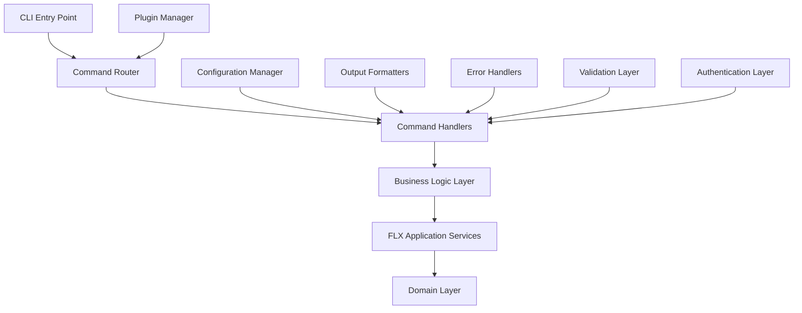

# 🛠️ FLX CLI Development Guide

> **Function**: Command-line interface development for FLX framework tools | **Audience**: CLI developers, automation engineers, DevOps teams | **Status**: Production-Ready

[](./index.md)
[](../../architecture/index.md)
[](../../index.md)

**Comprehensive guide for developing command-line interfaces and automation tools for FLX hexagonal architecture framework with modern CLI patterns and best practices**

---

## 🧭 **Navigation Context**

**🏠 Root**: [Documentation Home](../../index.md) → **📂 Hub**: [Development](../index.md) → **📂 Section**: [Tools](./index.md) → **📄 Current**: CLI Development Guide

### **📍 Learning Path Position**

```
[Development Hub](../index.md) → [Development Workflow](../guides/development-workflow.md) → **[CLI Development Guide]** → [GitHub Workflow Setup](./github-workflow-setup.md)
```

Essential guide for building professional command-line interfaces that integrate with FLX framework development workflow and automation requirements.

## CLI Development Philosophy

FLX CLI development embodies:

- **User-Centric Design**: CLIs designed for developer productivity
- **Consistent Interface**: Uniform command patterns across tools
- **Robust Error Handling**: Clear error messages and recovery guidance
- **Automation-Friendly**: Scriptable with proper exit codes and JSON output
- **Extensible Architecture**: Plugin-based architecture for extensibility

## CLI Architecture Overview



## Modern CLI Stack

### Core CLI Dependencies

```toml
# pyproject.toml CLI dependencies
[project.optional-dependencies]
cli = [
    "typer>=0.9.0",           # Modern CLI framework
    "rich>=13.5.0",           # Rich terminal output
    "click>=8.1.0",           # Click integration
    "pydantic>=2.3.0",        # Configuration validation
    "httpx>=0.24.0",          # HTTP client for API calls
    "aiofiles>=23.2.0",       # Async file operations
    "tabulate>=0.9.0",        # Table formatting
    "python-dotenv>=1.0.0",   # Environment management
    "questionary>=2.0.0",     # Interactive prompts
    "shellingham>=1.5.0",     # Shell detection
]

[project.scripts]
flext = "flext.cli.main:app"
flext-dev = "flext.cli.dev:app"
flext-REDACTED_LDAP_BIND_PASSWORD = "flext.cli.REDACTED_LDAP_BIND_PASSWORD:app"
```

### CLI Project Structure

```
src/flext/cli/
├── __init__.py
├── main.py                    # Main CLI entry point
├── dev.py                     # Development commands
├── REDACTED_LDAP_BIND_PASSWORD.py                   # Administrative commands
├── core/
│   ├── __init__.py
│   ├── app.py                 # CLI application setup
│   ├── config.py              # CLI configuration
│   ├── context.py             # Command context management
│   ├── exceptions.py          # CLI-specific exceptions
│   └── formatters.py          # Output formatting
├── commands/
│   ├── __init__.py
│   ├── base.py                # Base command classes
│   ├── project.py             # Project management commands
│   ├── database.py            # Database commands
│   ├── testing.py             # Testing commands
│   ├── quality.py             # Code quality commands
│   └── deployment.py          # Deployment commands
├── plugins/
│   ├── __init__.py
│   ├── base.py                # Plugin interface
│   ├── oracle.py              # Oracle-specific commands
│   ├── meltano.py             # Meltano integration
│   └── monitoring.py          # Monitoring commands
└── utils/
    ├── __init__.py
    ├── files.py               # File operations
    ├── git.py                 # Git integration
    ├── docker.py              # Docker operations
    └── validation.py          # Input validation
```

## Core CLI Implementation

### Main CLI Application

```python
# src/flext/cli/main.py
from typing import Optional
import typer
from rich.console import Console
from rich.table import Table
from rich import print as rprint

from flext.cli.core.app import create_cli_app
from flext.cli.core.config import CLIConfig
from flext.cli.core.context import CLIContext
from flext.cli.commands import (
    project_commands,
    database_commands,
    testing_commands,
    quality_commands
)

# Create main CLI application
app = typer.Typer(
    name="flext",
    help="FLX Framework Development CLI",
    epilog="For more information, visit: https://docs.flext-framework.dev",
    no_args_is_help=True,
    rich_markup_mode="rich",
    context_settings={"help_option_names": ["-h", "--help"]}
)

# Add command groups
app.add_typer(project_commands.app, name="project", help="Project management commands")
app.add_typer(database_commands.app, name="db", help="Database operations")
app.add_typer(testing_commands.app, name="test", help="Testing utilities")
app.add_typer(quality_commands.app, name="quality", help="Code quality tools")

console = Console()

@app.callback()
def main(
    ctx: typer.Context,
    config_file: Optional[str] = typer.Option(
        None,
        "--config",
        "-c",
        help="Path to configuration file"
    ),
    verbose: bool = typer.Option(
        False,
        "--verbose",
        "-v",
        help="Enable verbose output"
    ),
    quiet: bool = typer.Option(
        False,
        "--quiet",
        "-q",
        help="Suppress non-essential output"
    ),
    output_format: str = typer.Option(
        "text",
        "--format",
        "-f",
        help="Output format: text, json, yaml"
    )
):
    """
    FLX Framework Development CLI

    A comprehensive command-line interface for FLX hexagonal architecture
    framework development, testing, and deployment operations.
    """
    # Initialize CLI context
    cli_config = CLIConfig.load(config_file)
    cli_context = CLIContext(
        config=cli_config,
        verbose=verbose,
        quiet=quiet,
        output_format=output_format,
        console=console
    )

    # Store context for commands
    ctx.obj = cli_context

@app.command()
def version(
    ctx: typer.Context,
    detailed: bool = typer.Option(
        False,
        "--detailed",
        "-d",
        help="Show detailed version information"
    )
):
    """Show FLX CLI version information."""
    cli_context: CLIContext = ctx.obj

    if detailed:
        version_info = cli_context.get_detailed_version_info()
        table = Table(title="FLX CLI Version Information")
        table.add_column("Component", style="cyan")
        table.add_column("Version", style="green")
        table.add_column("Build", style="yellow")

        for component, info in version_info.items():
            table.add_row(component, info['version'], info.get('build', 'N/A'))

        console.print(table)
    else:
        rprint(f"[green]FLX CLI[/green] version [cyan]{cli_context.version}[/cyan]")

@app.command()
def info(ctx: typer.Context):
    """Show system and environment information."""
    cli_context: CLIContext = ctx.obj

    info_data = cli_context.get_system_info()

    if cli_context.output_format == "json":
        console.print_json(data=info_data)
    else:
        table = Table(title="System Information")
        table.add_column("Property", style="cyan")
        table.add_column("Value", style="green")

        for key, value in info_data.items():
            table.add_row(key.replace('_', ' ').title(), str(value))

        console.print(table)

if __name__ == "__main__":
    app()
```

### CLI Context and Configuration

```python
# src/flext/cli/core/context.py
from dataclasses import dataclass
from pathlib import Path
from typing import Optional, Dict, Any
import json
import platform
import sys
from rich.console import Console

from flext.cli.core.config import CLIConfig
from flext.core.version import __version__

@dataclass
class CLIContext:
    """CLI execution context with configuration and state."""

    config: CLIConfig
    verbose: bool = False
    quiet: bool = False
    output_format: str = "text"
    console: Optional[Console] = None

    def __post_init__(self):
        if self.console is None:
            self.console = Console()

    @property
    def version(self) -> str:
        """Get FLX CLI version."""
        return __version__

    def get_detailed_version_info(self) -> Dict[str, Dict[str, str]]:
        """Get detailed version information."""
        return {
            "FLX CLI": {
                "version": self.version,
                "build": "release"
            },
            "Python": {
                "version": sys.version.split()[0],
                "build": platform.python_implementation()
            },
            "Platform": {
                "version": platform.platform(),
                "build": platform.machine()
            }
        }

    def get_system_info(self) -> Dict[str, Any]:
        """Get comprehensive system information."""
        return {
            "cli_version": self.version,
            "python_version": sys.version.split()[0],
            "platform": platform.platform(),
            "architecture": platform.machine(),
            "cwd": str(Path.cwd()),
            "config_file": str(self.config.config_file) if self.config.config_file else None,
            "output_format": self.output_format,
            "verbose": self.verbose
        }

    def print_success(self, message: str, **kwargs):
        """Print success message with consistent formatting."""
        if not self.quiet:
            self.console.print(f"[green]✓[/green] {message}", **kwargs)

    def print_error(self, message: str, **kwargs):
        """Print error message with consistent formatting."""
        self.console.print(f"[red]✗[/red] {message}", **kwargs)

    def print_warning(self, message: str, **kwargs):
        """Print warning message with consistent formatting."""
        if not self.quiet:
            self.console.print(f"[yellow]⚠[/yellow] {message}", **kwargs)

    def print_info(self, message: str, **kwargs):
        """Print info message with consistent formatting."""
        if self.verbose and not self.quiet:
            self.console.print(f"[blue]ℹ[/blue] {message}", **kwargs)

    def output_data(self, data: Any, title: Optional[str] = None):
        """Output data in the requested format."""
        if self.output_format == "json":
            self.console.print_json(data=data)
        elif self.output_format == "yaml":
            import yaml
            yaml_output = yaml.dump(data, default_flow_style=False)
            self.console.print(yaml_output)
        else:
            # Text format - use rich formatting
            if title:
                self.console.print(f"[bold]{title}[/bold]")

            if isinstance(data, dict):
                self._print_dict_as_table(data, title)
            elif isinstance(data, list):
                self._print_list_as_table(data, title)
            else:
                self.console.print(str(data))

    def _print_dict_as_table(self, data: Dict[str, Any], title: Optional[str] = None):
        """Print dictionary as a formatted table."""
        from rich.table import Table

        table = Table(title=title)
        table.add_column("Key", style="cyan")
        table.add_column("Value", style="green")

        for key, value in data.items():
            table.add_row(str(key), str(value))

        self.console.print(table)

    def _print_list_as_table(self, data: list, title: Optional[str] = None):
        """Print list as a formatted table."""
        from rich.table import Table

        if not data:
            self.console.print("No data available")
            return

        table = Table(title=title)

        # If list contains dictionaries, use keys as columns
        if isinstance(data[0], dict):
            for key in data[0].keys():
                table.add_column(str(key).title(), style="cyan")

            for item in data:
                table.add_row(*[str(v) for v in item.values()])
        else:
            table.add_column("Item", style="cyan")
            for item in data:
                table.add_row(str(item))

        self.console.print(table)

# src/flext/cli/core/config.py
from pathlib import Path
from typing import Optional, Dict, Any
from pydantic import BaseModel, Field
import yaml
import os

class CLIConfig(BaseModel):
    """CLI configuration model."""

    # Project settings
    project_root: Path = Field(default_factory=Path.cwd)
    default_profile: str = "development"

    # Output settings
    default_format: str = "text"
    color_output: bool = True
    verbose_by_default: bool = False

    # Tool integrations
    editor: str = "code"  # Default editor for opening files
    browser: str = "default"  # Default browser for opening URLs

    # Database settings
    default_database_url: Optional[str] = None

    # Testing settings
    test_command: str = "pytest"
    coverage_threshold: float = 90.0

    # Quality settings
    lint_command: str = "ruff check"
    format_command: str = "black"
    type_check_command: str = "mypy"

    # Custom settings
    custom: Dict[str, Any] = Field(default_factory=dict)

    # Internal
    config_file: Optional[Path] = None

    @classmethod
    def load(cls, config_file: Optional[str] = None) -> "CLIConfig":
        """Load configuration from file or environment."""
        config_data = {}

        # Try to find config file
        if config_file:
            config_path = Path(config_file)
        else:
            # Look for config in standard locations
            config_path = cls._find_config_file()

        # Load config file if found
        if config_path and config_path.exists():
            with open(config_path) as f:
                if config_path.suffix in ['.yaml', '.yml']:
                    config_data = yaml.safe_load(f) or {}
                else:
                    import json
                    config_data = json.load(f)

        # Override with environment variables
        config_data.update(cls._load_from_environment())

        # Create config instance
        config = cls(**config_data)
        config.config_file = config_path

        return config

    @staticmethod
    def _find_config_file() -> Optional[Path]:
        """Find configuration file in standard locations."""
        possible_locations = [
            Path.cwd() / ".flext.yaml",
            Path.cwd() / ".flext.yml",
            Path.cwd() / "flext.config.yaml",
            Path.home() / ".config" / "flext" / "config.yaml",
            Path.home() / ".flext.yaml"
        ]

        for location in possible_locations:
            if location.exists():
                return location

        return None

    @staticmethod
    def _load_from_environment() -> Dict[str, Any]:
        """Load configuration from environment variables."""
        config = {}

        # Map environment variables to config keys
        env_mapping = {
            'FLX_CLI_PROFILE': 'default_profile',
            'FLX_CLI_FORMAT': 'default_format',
            'FLX_CLI_VERBOSE': 'verbose_by_default',
            'FLX_CLI_EDITOR': 'editor',
            'FLX_CLI_DATABASE_URL': 'default_database_url',
            'FLX_CLI_TEST_COMMAND': 'test_command',
            'FLX_CLI_COVERAGE_THRESHOLD': 'coverage_threshold'
        }

        for env_var, config_key in env_mapping.items():
            value = os.getenv(env_var)
            if value is not None:
                # Convert boolean strings
                if value.lower() in ['true', 'false']:
                    value = value.lower() == 'true'
                # Convert numeric strings
                elif value.replace('.', '').isdigit():
                    value = float(value) if '.' in value else int(value)

                config[config_key] = value

        return config
```

### Command Implementation Patterns

```python
# src/flext/cli/commands/base.py
from abc import ABC, abstractmethod
from typing import Optional, Dict, Any
import typer
from rich.progress import Progress, TaskID

from flext.cli.core.context import CLIContext
from flext.cli.core.exceptions import CLIError

class BaseCommand(ABC):
    """Base class for CLI commands with common functionality."""

    def __init__(self, context: CLIContext):
        self.context = context
        self.console = context.console

    @abstractmethod
    async def execute(self, **kwargs) -> Dict[str, Any]:
        """Execute the command and return results."""
        pass

    def validate_inputs(self, **kwargs) -> None:
        """Validate command inputs."""
        pass

    def pre_execute(self, **kwargs) -> None:
        """Pre-execution setup."""
        self.validate_inputs(**kwargs)

    def post_execute(self, result: Dict[str, Any]) -> None:
        """Post-execution cleanup and reporting."""
        if result.get('success', False):
            self.context.print_success("Command completed successfully")
        else:
            self.context.print_error(f"Command failed: {result.get('error', 'Unknown error')}")

    async def run(self, **kwargs) -> Dict[str, Any]:
        """Run the complete command lifecycle."""
        try:
            self.pre_execute(**kwargs)
            result = await self.execute(**kwargs)
            self.post_execute(result)
            return result
        except Exception as e:
            error_result = {
                'success': False,
                'error': str(e),
                'error_type': type(e).__name__
            }
            self.post_execute(error_result)
            raise CLIError(f"Command execution failed: {e}") from e

    def progress_context(self, description: str = "Processing"):
        """Create a progress context for long-running operations."""
        return Progress(console=self.console)

# src/flext/cli/commands/project.py
from typing import Optional, List, Dict, Any
from pathlib import Path
import typer
from rich.table import Table
import asyncio

from flext.cli.commands.base import BaseCommand
from flext.cli.core.context import CLIContext
from flext.project.manager import ProjectManager
from flext.project.models import ProjectConfig, ProjectTemplate

# Create command group
app = typer.Typer(name="project", help="Project management commands")

class CreateProjectCommand(BaseCommand):
    """Command to create new FLX projects."""

    async def execute(
        self,
        name: str,
        template: str = "basic",
        directory: Optional[Path] = None,
        **kwargs
    ) -> Dict[str, Any]:
        """Create a new FLX project."""

        project_dir = directory or Path.cwd() / name

        self.context.print_info(f"Creating project '{name}' using template '{template}'")

        with self.progress_context("Creating project") as progress:
            task = progress.add_task("Setting up project structure", total=100)

            # Initialize project manager
            project_manager = ProjectManager(self.context.config)

            # Create project
            progress.update(task, advance=20, description="Creating directory structure")
            project_config = await project_manager.create_project(
                name=name,
                template=template,
                directory=project_dir
            )

            progress.update(task, advance=30, description="Installing dependencies")
            await project_manager.install_dependencies(project_dir)

            progress.update(task, advance=25, description="Setting up development tools")
            await project_manager.setup_dev_tools(project_dir)

            progress.update(task, advance=15, description="Initializing git repository")
            await project_manager.init_git_repo(project_dir)

            progress.update(task, advance=10, description="Finalizing setup")

        self.context.print_success(f"Project '{name}' created successfully at {project_dir}")

        return {
            'success': True,
            'project_name': name,
            'project_directory': str(project_dir),
            'template': template,
            'config': project_config.dict()
        }

@app.command()
def create(
    ctx: typer.Context,
    name: str = typer.Argument(..., help="Project name"),
    template: str = typer.Option("basic", help="Project template to use"),
    directory: Optional[str] = typer.Option(None, help="Target directory"),
    interactive: bool = typer.Option(False, help="Interactive project setup")
):
    """Create a new FLX project."""
    cli_context: CLIContext = ctx.obj

    # Interactive mode
    if interactive:
        import questionary

        name = questionary.text("Project name:", default=name).ask()
        template = questionary.select(
            "Select project template:",
            choices=["basic", "web-api", "cli-tool", "data-pipeline", "microservice"]
        ).ask()

        if questionary.confirm("Create project?").ask():
            pass
        else:
            cli_context.print_info("Project creation cancelled")
            raise typer.Exit()

    # Convert directory string to Path
    target_dir = Path(directory) if directory else None

    # Create and run command
    command = CreateProjectCommand(cli_context)
    result = asyncio.run(command.run(
        name=name,
        template=template,
        directory=target_dir
    ))

    # Output result
    cli_context.output_data(result, title="Project Creation Result")

@app.command()
def list_templates(ctx: typer.Context):
    """List available project templates."""
    cli_context: CLIContext = ctx.obj

    templates = [
        {
            "name": "basic",
            "description": "Basic FLX project with core structure",
            "features": "Core architecture, basic testing, documentation"
        },
        {
            "name": "web-api",
            "description": "REST API project with FastAPI integration",
            "features": "FastAPI, OpenAPI docs, async support, database integration"
        },
        {
            "name": "cli-tool",
            "description": "Command-line tool project",
            "features": "Typer CLI, rich output, configuration management"
        },
        {
            "name": "data-pipeline",
            "description": "Data processing pipeline with ETL capabilities",
            "features": "Pipeline orchestration, data validation, monitoring"
        },
        {
            "name": "microservice",
            "description": "Microservice with full production setup",
            "features": "Docker, Kubernetes, monitoring, health checks"
        }
    ]

    if cli_context.output_format == "json":
        cli_context.output_data(templates)
    else:
        table = Table(title="Available Project Templates")
        table.add_column("Template", style="cyan")
        table.add_column("Description", style="green")
        table.add_column("Features", style="yellow")

        for template in templates:
            table.add_row(
                template["name"],
                template["description"],
                template["features"]
            )

        cli_context.console.print(table)

@app.command()
def status(
    ctx: typer.Context,
    project_path: Optional[str] = typer.Option(None, help="Project path")
):
    """Show project status and health information."""
    cli_context: CLIContext = ctx.obj

    project_dir = Path(project_path) if project_path else Path.cwd()

    # Check if this is an FLX project
    config_file = project_dir / "pyproject.toml"
    if not config_file.exists():
        cli_context.print_error("Not an FLX project (no pyproject.toml found)")
        raise typer.Exit(1)

    # Gather project information
    project_info = {
        "project_path": str(project_dir),
        "has_venv": (project_dir / ".venv").exists(),
        "has_git": (project_dir / ".git").exists(),
        "has_tests": (project_dir / "tests").exists(),
        "has_docs": (project_dir / "docs").exists(),
        "python_version": "3.13",  # Could detect actual version
        "dependencies_installed": True,  # Could check actual installation
        "tests_passing": None,  # Could run quick test check
        "coverage": None  # Could check last coverage report
    }

    cli_context.output_data(project_info, title="Project Status")

# Additional commands for project management
@app.command()
def validate(
    ctx: typer.Context,
    project_path: Optional[str] = typer.Option(None, help="Project path"),
    fix: bool = typer.Option(False, help="Automatically fix issues")
):
    """Validate project structure and configuration."""
    cli_context: CLIContext = ctx.obj

    project_dir = Path(project_path) if project_path else Path.cwd()

    validation_results = {
        "valid": True,
        "issues": [],
        "warnings": [],
        "suggestions": []
    }

    # Validate project structure
    required_files = [
        "pyproject.toml",
        "README.md",
        "src",
        "tests"
    ]

    for required_file in required_files:
        if not (project_dir / required_file).exists():
            validation_results["issues"].append(f"Missing required file/directory: {required_file}")
            validation_results["valid"] = False

    # Output results
    if validation_results["valid"]:
        cli_context.print_success("Project validation passed")
    else:
        cli_context.print_error("Project validation failed")
        for issue in validation_results["issues"]:
            cli_context.print_error(f"  - {issue}")

    cli_context.output_data(validation_results, title="Validation Results")
```

### Testing Commands Implementation

```python
# src/flext/cli/commands/testing.py
from typing import Optional, List, Dict, Any
from pathlib import Path
import typer
import asyncio
import subprocess
from rich.live import Live
from rich.table import Table

from flext.cli.commands.base import BaseCommand
from flext.cli.core.context import CLIContext

# Create command group
app = typer.Typer(name="test", help="Testing utilities and commands")

class TestRunnerCommand(BaseCommand):
    """Command to run tests with various options."""

    async def execute(
        self,
        test_type: str = "all",
        pattern: Optional[str] = None,
        coverage: bool = True,
        parallel: bool = False,
        verbose: bool = False,
        **kwargs
    ) -> Dict[str, Any]:
        """Execute test suite with specified options."""

        # Build pytest command
        cmd_parts = ["pytest"]

        # Add test paths based on type
        if test_type == "unit":
            cmd_parts.append("tests/unit/")
        elif test_type == "integration":
            cmd_parts.append("tests/integration/")
        elif test_type == "e2e":
            cmd_parts.append("tests/e2e/")
        elif test_type == "all":
            cmd_parts.append("tests/")
        else:
            cmd_parts.append(f"tests/{test_type}/")

        # Add options
        if pattern:
            cmd_parts.extend(["-k", pattern])

        if coverage:
            cmd_parts.extend([
                "--cov=flext",
                "--cov-report=term-missing",
                "--cov-report=html:reports/coverage",
                "--cov-fail-under=90"
            ])

        if parallel:
            cmd_parts.extend(["-n", "auto"])

        if verbose:
            cmd_parts.append("-v")

        cmd_parts.extend(["--tb=short"])

        self.context.print_info(f"Running command: {' '.join(cmd_parts)}")

        # Execute tests
        with self.progress_context("Running tests") as progress:
            task = progress.add_task("Executing test suite", total=100)

            process = await asyncio.create_subprocess_exec(
                *cmd_parts,
                stdout=asyncio.subprocess.PIPE,
                stderr=asyncio.subprocess.PIPE,
                cwd=Path.cwd()
            )

            stdout, stderr = await process.communicate()

            progress.update(task, completed=100)

        # Parse results
        success = process.returncode == 0
        output = stdout.decode('utf-8')
        error_output = stderr.decode('utf-8')

        return {
            'success': success,
            'exit_code': process.returncode,
            'output': output,
            'error_output': error_output,
            'command': ' '.join(cmd_parts)
        }

@app.command()
def run(
    ctx: typer.Context,
    test_type: str = typer.Argument("all", help="Type of tests to run: unit, integration, e2e, all"),
    pattern: Optional[str] = typer.Option(None, "-k", help="Test pattern to match"),
    coverage: bool = typer.Option(True, help="Generate coverage report"),
    parallel: bool = typer.Option(False, "-p", help="Run tests in parallel"),
    verbose: bool = typer.Option(False, "-v", help="Verbose output"),
    watch: bool = typer.Option(False, "-w", help="Watch mode - rerun on changes"),
    fail_fast: bool = typer.Option(False, "-x", help="Stop on first failure")
):
    """Run the test suite with various options."""
    cli_context: CLIContext = ctx.obj

    if watch:
        cli_context.print_info("Starting test watch mode (Ctrl+C to stop)")
        # Implementation would use file watching library
        cli_context.print_warning("Watch mode not yet implemented")
        return

    # Create and run command
    command = TestRunnerCommand(cli_context)
    result = asyncio.run(command.run(
        test_type=test_type,
        pattern=pattern,
        coverage=coverage,
        parallel=parallel,
        verbose=verbose or cli_context.verbose
    ))

    # Display results
    if result['success']:
        cli_context.print_success("All tests passed!")
    else:
        cli_context.print_error("Some tests failed")
        if result['error_output']:
            cli_context.console.print("[red]Error Output:[/red]")
            cli_context.console.print(result['error_output'])

    # Show output if verbose
    if cli_context.verbose and result['output']:
        cli_context.console.print("[blue]Test Output:[/blue]")
        cli_context.console.print(result['output'])

@app.command()
def coverage(
    ctx: typer.Context,
    format: str = typer.Option("html", help="Coverage report format: html, xml, json"),
    threshold: float = typer.Option(90.0, help="Coverage threshold percentage"),
    open_report: bool = typer.Option(False, help="Open HTML report in browser")
):
    """Generate and display coverage reports."""
    cli_context: CLIContext = ctx.obj

    # Run tests with coverage
    cmd_parts = [
        "pytest",
        "tests/",
        f"--cov=flext",
        f"--cov-fail-under={threshold}"
    ]

    if format == "html":
        cmd_parts.append("--cov-report=html:reports/coverage")
    elif format == "xml":
        cmd_parts.append("--cov-report=xml:reports/coverage.xml")
    elif format == "json":
        cmd_parts.append("--cov-report=json:reports/coverage.json")

    cmd_parts.append("--cov-report=term-missing")

    cli_context.print_info(f"Generating {format} coverage report")

    try:
        result = subprocess.run(cmd_parts, capture_output=True, text=True)

        if result.returncode == 0:
            cli_context.print_success(f"Coverage report generated successfully")

            if format == "html" and open_report:
                import webbrowser
                report_path = Path("reports/coverage/index.html")
                if report_path.exists():
                    webbrowser.open(f"file://{report_path.absolute()}")
        else:
            cli_context.print_error("Coverage generation failed")
            cli_context.console.print(result.stderr)

    except Exception as e:
        cli_context.print_error(f"Failed to generate coverage report: {e}")

@app.command()
def benchmark(
    ctx: typer.Context,
    pattern: Optional[str] = typer.Option(None, help="Benchmark pattern to run"),
    compare: Optional[str] = typer.Option(None, help="Compare with previous results")
):
    """Run performance benchmarks."""
    cli_context: CLIContext = ctx.obj

    cmd_parts = ["pytest", "tests/", "-m", "benchmark", "--benchmark-only"]

    if pattern:
        cmd_parts.extend(["-k", pattern])

    if compare:
        cmd_parts.extend(["--benchmark-compare", compare])

    cli_context.print_info("Running performance benchmarks")

    try:
        result = subprocess.run(cmd_parts, capture_output=True, text=True)

        if result.returncode == 0:
            cli_context.print_success("Benchmarks completed")
            cli_context.console.print(result.stdout)
        else:
            cli_context.print_error("Benchmark execution failed")
            cli_context.console.print(result.stderr)

    except Exception as e:
        cli_context.print_error(f"Failed to run benchmarks: {e}")
```

## CLI Plugin System

### Plugin Interface

```python
# src/flext/cli/plugins/base.py
from abc import ABC, abstractmethod
from typing import Dict, Any, List
import typer

from flext.cli.core.context import CLIContext

class CLIPlugin(ABC):
    """Base class for CLI plugins."""

    def __init__(self, context: CLIContext):
        self.context = context

    @property
    @abstractmethod
    def name(self) -> str:
        """Plugin name."""
        pass

    @property
    @abstractmethod
    def description(self) -> str:
        """Plugin description."""
        pass

    @property
    @abstractmethod
    def version(self) -> str:
        """Plugin version."""
        pass

    @abstractmethod
    def register_commands(self) -> typer.Typer:
        """Register plugin commands."""
        pass

    def initialize(self) -> None:
        """Initialize plugin."""
        pass

    def cleanup(self) -> None:
        """Cleanup plugin resources."""
        pass

    def get_status(self) -> Dict[str, Any]:
        """Get plugin status information."""
        return {
            'name': self.name,
            'description': self.description,
            'version': self.version,
            'active': True
        }

# Plugin manager
class PluginManager:
    """Manage CLI plugins."""

    def __init__(self, context: CLIContext):
        self.context = context
        self.plugins: Dict[str, CLIPlugin] = {}

    def register_plugin(self, plugin: CLIPlugin) -> None:
        """Register a plugin."""
        plugin.initialize()
        self.plugins[plugin.name] = plugin
        self.context.print_info(f"Registered plugin: {plugin.name}")

    def unregister_plugin(self, plugin_name: str) -> None:
        """Unregister a plugin."""
        if plugin_name in self.plugins:
            self.plugins[plugin_name].cleanup()
            del self.plugins[plugin_name]
            self.context.print_info(f"Unregistered plugin: {plugin_name}")

    def get_plugin(self, plugin_name: str) -> CLIPlugin:
        """Get a plugin by name."""
        return self.plugins.get(plugin_name)

    def list_plugins(self) -> List[Dict[str, Any]]:
        """List all registered plugins."""
        return [plugin.get_status() for plugin in self.plugins.values()]

    def load_plugins_from_config(self) -> None:
        """Load plugins from configuration."""
        # Implementation would load plugins based on config
        pass
```

## Troubleshooting CLI Development Issues

### Common CLI Problems

#### Argument Parsing Issues

```python
# Problem: Complex argument validation
# Solution: Use Pydantic models for validation

from pydantic import BaseModel, validator
from typing import Optional, List

class CreateProjectArgs(BaseModel):
    """Validated arguments for project creation."""

    name: str
    template: str = "basic"
    directory: Optional[str] = None
    features: List[str] = []

    @validator('name')
    def validate_name(cls, v):
        if not v.isidentifier():
            raise ValueError("Project name must be a valid Python identifier")
        return v

    @validator('template')
    def validate_template(cls, v):
        valid_templates = ['basic', 'web-api', 'cli-tool', 'data-pipeline']
        if v not in valid_templates:
            raise ValueError(f"Template must be one of: {valid_templates}")
        return v

@app.command()
def create_validated(
    ctx: typer.Context,
    name: str = typer.Argument(...),
    template: str = typer.Option("basic"),
    directory: Optional[str] = typer.Option(None)
):
    """Create project with validated arguments."""
    try:
        args = CreateProjectArgs(
            name=name,
            template=template,
            directory=directory
        )
        # Use validated args
    except ValueError as e:
        typer.echo(f"Validation error: {e}", err=True)
        raise typer.Exit(1)
```

#### Output Formatting Issues

```python
# Problem: Inconsistent output across commands
# Solution: Centralized output formatting

class OutputFormatter:
    """Centralized output formatting for CLI."""

    def __init__(self, context: CLIContext):
        self.context = context

    def format_table(self, data: List[Dict], title: str = None) -> None:
        """Format data as table."""
        if not data:
            self.context.console.print("No data to display")
            return

        table = Table(title=title)

        # Add columns from first row
        for key in data[0].keys():
            table.add_column(key.replace('_', ' ').title(), style="cyan")

        # Add rows
        for row in data:
            table.add_row(*[str(v) for v in row.values()])

        self.context.console.print(table)

    def format_success(self, message: str, details: Dict = None) -> None:
        """Format success message with optional details."""
        self.context.print_success(message)

        if details and self.context.verbose:
            self.context.output_data(details, title="Details")

    def format_error(self, message: str, error: Exception = None) -> None:
        """Format error message with optional exception."""
        self.context.print_error(message)

        if error and self.context.verbose:
            self.context.console.print_exception()
```

#### Async Command Issues

```python
# Problem: Running async operations in CLI commands
# Solution: Proper async/await handling

import asyncio
from functools import wraps

def async_command(func):
    """Decorator to handle async CLI commands."""
    @wraps(func)
    def wrapper(*args, **kwargs):
        return asyncio.run(func(*args, **kwargs))
    return wrapper

@app.command()
@async_command
async def async_operation(
    ctx: typer.Context,
    operation: str = typer.Argument(...)
):
    """Perform async operation."""
    cli_context: CLIContext = ctx.obj

    try:
        # Async operation here
        result = await perform_async_operation(operation)
        cli_context.print_success(f"Operation completed: {result}")
    except Exception as e:
        cli_context.print_error(f"Operation failed: {e}")
        raise typer.Exit(1)
```

## Best Practices Summary

### CLI Design Principles

1. **Consistent Interface**: Uniform command structure and naming
2. **Progressive Disclosure**: Simple commands with advanced options
3. **Error Recovery**: Clear error messages with suggested fixes
4. **Scriptability**: Support for automation and scripting
5. **Extensibility**: Plugin system for custom functionality

### Development Guidelines

1. **Type Safety**: Use type hints and validation for all inputs
2. **Error Handling**: Comprehensive error handling with user-friendly messages
3. **Testing**: Unit and integration tests for all CLI functionality
4. **Documentation**: Built-in help and external documentation
5. **Performance**: Optimize for common use cases and large datasets

### User Experience

1. **Intuitive Commands**: Self-explanatory command names and structure
2. **Rich Output**: Use color, tables, and progress indicators
3. **Interactive Mode**: Support for interactive workflows
4. **Configuration**: Flexible configuration options
5. **Feedback**: Clear success/failure indicators and progress updates

---

## 🔗 **Cross-References**

### **⬅️ Essential Prerequisites**

- [**Development Workflow**](../guides/development-workflow.md) - Development process integration required for CLI tool development and automation
- [**Code Quality Guide**](../guides/code-quality-guide.md) - Code quality standards and tooling essential for professional CLI development
- [**Testing Foundation**](../testing/index.md) - Testing framework understanding required for comprehensive CLI testing strategies

### **➡️ Implementation Next Steps**

- [**GitHub Workflow Setup**](./github-workflow-setup.md) - CI/CD pipeline integration with CLI tools and automation workflows
- [**Scripts and Utilities**](./scripts-automation-guide.md) - Script development and automation that complements CLI functionality
- [**Project Templates**](../../getting-started/real-world-implementation-guide.md) - Project templates and scaffolding that CLI tools generate

### **🔗 Related Implementation Topics**

- [**Configuration Management**](../guides/environment-configuration-guide.md) - Configuration patterns and environment management for CLI applications
- [**Plugin Architecture**](../../architecture/patterns/plugin-patterns.md) - Plugin system architecture and extensibility patterns for CLI tools
- [**Security Integration**](../../security/architecture/security-architecture.md) - Security considerations and authentication integration in CLI tools
- [**Performance Optimization**](../../optimization/performance/optimization-guide.md) - Performance optimization techniques for CLI applications and large dataset handling
- [**Documentation Automation**](../standards/documentation-standards.md) - Automated documentation generation and CLI help system integration
- [**API Integration**](../../api-reference/core-api-reference.md) - API client development and integration patterns for CLI tools

---

**📂 Content Document** | **🏠 Parent**: [Development Tools](./index.md) | **Framework**: FLX 0.4.0+ | **Updated**: 2025-06-11
