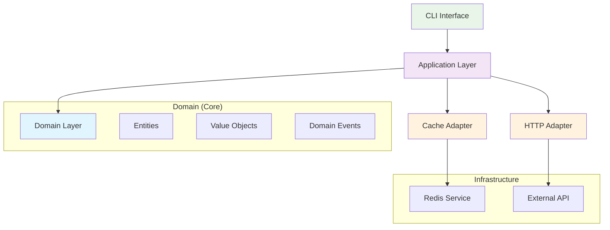

# First Pipeline Tutorial

This comprehensive tutorial will guide you through building your first complete FLX application using hexagonal architecture principles. You'll learn how to create domain entities, implement adapters, and build a production-ready data pipeline.

## 🎯 What You'll Build

We'll create a **Customer Order Management System** that demonstrates:

- **Domain Entities**: Customers, Orders, and Order Items with business logic
- **Value Objects**: Contact information and domain events
- **Adapters**: Cache and HTTP adapters for external systems
- **Infrastructure**: Unified adapter management and services
- **CLI Interface**: Command-line interface for system operations

### Architecture Overview



## 📋 Prerequisites

Before starting, ensure you have:

- **Python 3.13+** installed
- **FLX framework** installed (`pip install -e .`)
- **Redis** running locally (optional, we'll use memory cache as fallback)
- **Basic understanding** of async/await in Python

## 🏗️ Step 1: Domain Layer Implementation

Let's start by implementing the core business logic following domain-driven design principles.

### Create the Domain Models

```python
# tutorial/domain/models.py
from flext import Flx
from typing import List, Optional
from decimal import Decimal
from enum import Enum

# Initialize FLX framework
flext = Flx()

class OrderStatus(str, Enum):
    """Order status enumeration."""
    PENDING = "pending"
    CONFIRMED = "confirmed"
    SHIPPED = "shipped"
    DELIVERED = "delivered"
    CANCELLED = "cancelled"

class CustomerEntity(
    flext.Entities.BusinessEntity,
    flext.Mixins.Status,
    flext.Mixins.Config,
    flext.Mixins.Metadata
):
    """Customer entity with business capabilities."""

    def __init__(self, name: str, email: str, **kwargs):
        super().__init__(name=name, business_type="Customer", **kwargs)
        self.email = email

        # Set default configuration
        self.set_config("credit_limit", 10000.00)
        self.set_config("payment_terms", "NET30")

        # Add metadata
        self.add_metadata("customer_type", "standard")
        self.add_metadata("signup_date", self.created_at.isoformat())

    def update_credit_limit(self, new_limit: Decimal) -> None:
        """Update customer credit limit with business rules."""
        if new_limit < 0:
            raise ValueError("Credit limit cannot be negative")

        old_limit = self.get_config("credit_limit")
        self.set_config("credit_limit", float(new_limit))

        # Record the change in metadata
        self.add_metadata("last_credit_update", self.created_at.isoformat())
        self.add_metadata("previous_credit_limit", old_limit)

    def can_place_order(self, order_amount: Decimal) -> bool:
        """Check if customer can place an order of given amount."""
        if not self.is_active():
            return False

        credit_limit = Decimal(str(self.get_config("credit_limit")))
        return order_amount <= credit_limit

    def get_customer_summary(self) -> dict:
        """Get customer summary information."""
        return {
            "id": self.id,
            "name": self.name,
            "email": self.email,
            "credit_limit": self.get_config("credit_limit"),
            "payment_terms": self.get_config("payment_terms"),
            "customer_type": self.get_metadata("customer_type"),
            "active": self.is_active(),
            "created_at": self.created_at.isoformat()
        }

class OrderEntity(flext.Entities.AggregateRoot):
    """Order aggregate root that manages domain events."""

    def __init__(self, customer_id: str, **kwargs):
        order_name = f"Order #{kwargs.get('order_number', 'AUTO')}"
        super().__init__(name=order_name, **kwargs)

        self.customer_id = customer_id
        self.status = OrderStatus.PENDING
        self.total_amount = Decimal("0.00")
        self.items: List[dict] = []

        # Raise domain event for order creation
        self.raise_domain_event("OrderCreated", {
            "order_id": self.id,
            "customer_id": self.customer_id,
            "created_at": self.created_at.isoformat(),
            "status": self.status.value
        })

    def add_item(self, product_id: str, quantity: int, unit_price: Decimal) -> None:
        """Add item to order with business validation."""
        if quantity <= 0:
            raise ValueError("Quantity must be positive")

        if unit_price < 0:
            raise ValueError("Unit price cannot be negative")

        line_total = quantity * unit_price

        item = {
            "product_id": product_id,
            "quantity": quantity,
            "unit_price": float(unit_price),
            "line_total": float(line_total)
        }

        self.items.append(item)
        self.total_amount += line_total

        # Raise domain event
        self.raise_domain_event("OrderItemAdded", {
            "order_id": self.id,
            "product_id": product_id,
            "quantity": quantity,
            "unit_price": float(unit_price),
            "line_total": float(line_total),
            "new_total": float(self.total_amount)
        })

    def confirm_order(self) -> None:
        """Confirm the order and change status."""
        if self.status != OrderStatus.PENDING:
            raise ValueError(f"Cannot confirm order in {self.status} status")

        if not self.items:
            raise ValueError("Cannot confirm order without items")

        self.status = OrderStatus.CONFIRMED

        # Raise domain event
        self.raise_domain_event("OrderConfirmed", {
            "order_id": self.id,
            "customer_id": self.customer_id,
            "total_amount": float(self.total_amount),
            "items_count": len(self.items),
            "confirmed_at": self.created_at.isoformat()
        })

    def ship_order(self, tracking_number: str) -> None:
        """Ship the order with tracking information."""
        if self.status != OrderStatus.CONFIRMED:
            raise ValueError(f"Cannot ship order in {self.status} status")

        self.status = OrderStatus.SHIPPED

        # Raise domain event
        self.raise_domain_event("OrderShipped", {
            "order_id": self.id,
            "tracking_number": tracking_number,
            "shipped_at": self.created_at.isoformat()
        })

    def cancel_order(self, reason: str) -> None:
        """Cancel the order with reason."""
        if self.status in [OrderStatus.SHIPPED, OrderStatus.DELIVERED]:
            raise ValueError(f"Cannot cancel order in {self.status} status")

        self.status = OrderStatus.CANCELLED

        # Raise domain event
        self.raise_domain_event("OrderCancelled", {
            "order_id": self.id,
            "reason": reason,
            "cancelled_at": self.created_at.isoformat()
        })

    def get_order_summary(self) -> dict:
        """Get order summary information."""
        return {
            "id": self.id,
            "customer_id": self.customer_id,
            "status": self.status.value,
            "total_amount": float(self.total_amount),
            "items_count": len(self.items),
            "items": self.items,
            "created_at": self.created_at.isoformat()
        }

# Create contact value object
def create_contact_info(email: str, phone: str = None, address: str = None):
    """Factory function to create contact information."""
    return flext.ValueObjects.ContactInfo(
        email=email,
        phone=phone or "",
        address=address or ""
    )
```

### Test the Domain Logic

```python
# tutorial/test_domain.py
from decimal import Decimal
from tutorial.domain.models import CustomerEntity, OrderEntity, OrderStatus

def test_domain_logic():
    """Test domain logic implementation."""
    print("=== Testing Domain Logic ===")

    # Create customer
    customer = CustomerEntity(
        name="Acme Corporation",
        email="orders@acme.com"
    )

    print(f"Customer created: {customer.name}")
    print(f"Credit limit: ${customer.get_config('credit_limit'):,.2f}")
    print(f"Customer ID: {customer.id}")

    # Create order
    order = OrderEntity(customer_id=customer.id)
    print(f"\nOrder created: {order.name}")
    print(f"Initial status: {order.status}")

    # Add items to order
    order.add_item("LAPTOP-001", 2, Decimal("1299.99"))
    order.add_item("MOUSE-001", 3, Decimal("49.99"))
    order.add_item("KEYBOARD-001", 2, Decimal("129.99"))

    print(f"Items added, total: ${order.total_amount:.2f}")

    # Check if customer can place order
    can_place = customer.can_place_order(order.total_amount)
    print(f"Customer can place order: {can_place}")

    if can_place:
        order.confirm_order()
        print(f"Order confirmed, status: {order.status}")

        # Ship the order
        order.ship_order("TRACK123456")
        print(f"Order shipped, status: {order.status}")

    # Check domain events
    events = order.get_domain_events()
    print(f"\nDomain events raised: {len(events)}")
    for i, event in enumerate(events, 1):
        print(f"  {i}. {event.event_type} at {event.occurred_at}")

    # Get summaries
    customer_summary = customer.get_customer_summary()
    order_summary = order.get_order_summary()

    print(f"\nCustomer Summary: {customer_summary}")
    print(f"Order Summary: {order_summary}")

if __name__ == "__main__":
    test_domain_logic()
```

**Run the test:**

```bash
cd tutorial
python test_domain.py
```

**Expected Output:**

```
=== Testing Domain Logic ===
Customer created: Acme Corporation
Credit limit: $10,000.00
Customer ID: ent_abc123def456

Order created: Order #AUTO
Initial status: OrderStatus.PENDING
Items added, total: $2909.95
Customer can place order: True
Order confirmed, status: OrderStatus.CONFIRMED
Order shipped, status: OrderStatus.SHIPPED

Domain events raised: 5
  1. OrderCreated at 2024-01-15T10:30:00Z
  2. OrderItemAdded at 2024-01-15T10:30:01Z
  3. OrderItemAdded at 2024-01-15T10:30:02Z
  4. OrderItemAdded at 2024-01-15T10:30:03Z
  5. OrderConfirmed at 2024-01-15T10:30:04Z
  6. OrderShipped at 2024-01-15T10:30:05Z
```

## 🔌 Step 2: Infrastructure Layer

Now let's implement the infrastructure services that our adapters will use.

### Application Service Layer

```python
# tutorial/application/order_service.py
from typing import List, Optional
from decimal import Decimal
from flext.infra.adapters import UnifiedAdapterManager
from flext.infra.cache.cache_service import CacheService
from flext.core.exceptions import FlxApplicationError
from tutorial.domain.models import CustomerEntity, OrderEntity, OrderStatus

class OrderManagementService:
    """Application service for order management."""

    def __init__(self, adapter_manager: UnifiedAdapterManager):
        self.manager = adapter_manager
        self.cache = adapter_manager.get_adapter("cache") if adapter_manager.has_adapter("cache") else None
        self.logger = adapter_manager.logger

    async def create_customer(self, name: str, email: str) -> dict:
        """Create a new customer."""
        try:
            customer = CustomerEntity(name=name, email=email)

            # Cache customer data
            if self.cache:
                customer_key = f"customer:{customer.id}"
                await self.cache.set(customer_key, customer.get_customer_summary(), ttl=3600)
                self.logger.info(f"Customer cached: {customer_key}")

            self.logger.info(f"Customer created: {customer.name} ({customer.id})")
            return customer.get_customer_summary()

        except Exception as e:
            self.logger.error(f"Failed to create customer: {e}")
            raise FlxApplicationError(f"Customer creation failed: {e}")

    async def get_customer(self, customer_id: str) -> Optional[dict]:
        """Get customer by ID."""
        try:
            if self.cache:
                customer_key = f"customer:{customer_id}"
                cached_customer = await self.cache.get(customer_key)
                if cached_customer:
                    self.logger.info(f"Customer found in cache: {customer_id}")
                    return cached_customer

            # In a real application, you would fetch from database here
            self.logger.warning(f"Customer not found: {customer_id}")
            return None

        except Exception as e:
            self.logger.error(f"Failed to get customer {customer_id}: {e}")
            return None

    async def create_order(self, customer_id: str) -> dict:
        """Create a new order for customer."""
        try:
            # Verify customer exists
            customer_data = await self.get_customer(customer_id)
            if not customer_data:
                raise FlxApplicationError(f"Customer not found: {customer_id}")

            order = OrderEntity(customer_id=customer_id)

            # Cache order data
            if self.cache:
                order_key = f"order:{order.id}"
                await self.cache.set(order_key, order.get_order_summary(), ttl=7200)
                self.logger.info(f"Order cached: {order_key}")

            self.logger.info(f"Order created: {order.id} for customer {customer_id}")
            return order.get_order_summary()

        except Exception as e:
            self.logger.error(f"Failed to create order: {e}")
            raise FlxApplicationError(f"Order creation failed: {e}")

    async def add_order_item(self, order_id: str, product_id: str,
                           quantity: int, unit_price: Decimal) -> dict:
        """Add item to an existing order."""
        try:
            # Get order from cache
            if self.cache:
                order_key = f"order:{order_id}"
                order_data = await self.cache.get(order_key)
                if not order_data:
                    raise FlxApplicationError(f"Order not found: {order_id}")

                # Recreate order entity from cached data
                order = OrderEntity(customer_id=order_data["customer_id"])
                order.id = order_id
                order.total_amount = Decimal(str(order_data["total_amount"]))
                order.items = order_data["items"]
                order.status = OrderStatus(order_data["status"])

                # Add new item
                order.add_item(product_id, quantity, unit_price)

                # Update cache
                await self.cache.set(order_key, order.get_order_summary(), ttl=7200)

                self.logger.info(f"Item added to order {order_id}: {product_id} x{quantity}")
                return order.get_order_summary()
            else:
                raise FlxApplicationError("Cache not available for order management")

        except Exception as e:
            self.logger.error(f"Failed to add item to order {order_id}: {e}")
            raise FlxApplicationError(f"Add item failed: {e}")

    async def confirm_order(self, order_id: str) -> dict:
        """Confirm an order."""
        try:
            if self.cache:
                order_key = f"order:{order_id}"
                order_data = await self.cache.get(order_key)
                if not order_data:
                    raise FlxApplicationError(f"Order not found: {order_id}")

                # Recreate order entity
                order = OrderEntity(customer_id=order_data["customer_id"])
                order.id = order_id
                order.total_amount = Decimal(str(order_data["total_amount"]))
                order.items = order_data["items"]
                order.status = OrderStatus(order_data["status"])

                # Confirm order
                order.confirm_order()

                # Update cache
                await self.cache.set(order_key, order.get_order_summary(), ttl=7200)

                # Get domain events for processing
                events = order.get_domain_events()
                for event in events:
                    if event.event_type == "OrderConfirmed":
                        self.logger.info(f"Order confirmed: {order_id}, Total: ${order.total_amount}")

                        # In a real application, you might:
                        # - Send confirmation email
                        # - Update inventory
                        # - Trigger fulfillment process

                        break

                return order.get_order_summary()
            else:
                raise FlxApplicationError("Cache not available for order management")

        except Exception as e:
            self.logger.error(f"Failed to confirm order {order_id}: {e}")
            raise FlxApplicationError(f"Order confirmation failed: {e}")

    async def get_order(self, order_id: str) -> Optional[dict]:
        """Get order by ID."""
        try:
            if self.cache:
                order_key = f"order:{order_id}"
                cached_order = await self.cache.get(order_key)
                if cached_order:
                    self.logger.info(f"Order found in cache: {order_id}")
                    return cached_order

            self.logger.warning(f"Order not found: {order_id}")
            return None

        except Exception as e:
            self.logger.error(f"Failed to get order {order_id}: {e}")
            return None

    async def list_customer_orders(self, customer_id: str) -> List[dict]:
        """List all orders for a customer."""
        try:
            # In a real application, you would query the database
            # For this tutorial, we'll return an empty list
            self.logger.info(f"Listing orders for customer: {customer_id}")
            return []

        except Exception as e:
            self.logger.error(f"Failed to list orders for customer {customer_id}: {e}")
            return []

    async def get_service_health(self) -> dict:
        """Get service health status."""
        try:
            health = {
                "service": "OrderManagementService",
                "status": "healthy",
                "cache_available": self.cache is not None,
                "timestamp": "2024-01-15T10:30:00Z"
            }

            # Check cache health if available
            if self.cache:
                cache_health = await self.cache.health_check()
                health["cache_health"] = cache_health

            return health

        except Exception as e:
            self.logger.error(f"Health check failed: {e}")
            return {
                "service": "OrderManagementService",
                "status": "unhealthy",
                "error": str(e)
            }
```

## 🖥️ Step 3: CLI Interface

Now let's create a command-line interface to interact with our order management system.

### CLI Implementation

```python
# tutorial/cli/commands.py
import asyncio
import cyclopts
from decimal import Decimal
from typing import Optional
from flext.infra.adapters import UnifiedAdapterManager
from flext.adapters.outbound.cache import CacheAdapter
from flext.infra.services.logging import FlxStandardLoggingService
from tutorial.application.order_service import OrderManagementService

app = cyclopts.App(
    name="order-manager",
    help="Order Management System CLI"
)

# Global service instance
_service: Optional[OrderManagementService] = None

async def get_service() -> OrderManagementService:
    """Get or create the order management service."""
    global _service

    if _service is None:
        # Initialize logging
        logging_service = FlxStandardLoggingService("order_manager")
        logger = logging_service.get_logger("cli")

        # Create unified adapter manager
        manager = UnifiedAdapterManager(
            enable_messaging_features=True,
            instance_cache_size=100
        )

        # Set up cache adapter
        cache_adapter = CacheAdapter()
        cache_adapter.configure({
            "backend": "memory",  # Use memory cache for tutorial
            "memory_cache_size": 1000,
            "default_ttl": 3600
        })

        # Register and start adapters
        manager.register("cache", cache_adapter)
        await manager.initialize()
        await manager.start()

        # Create application service
        _service = OrderManagementService(manager)
        logger.info("Order Management Service initialized")

    return _service

@app.command
async def create_customer(
    name: str,
    email: str
) -> None:
    """Create a new customer."""
    try:
        service = await get_service()
        customer = await service.create_customer(name, email)

        print(f"✅ Customer created successfully!")
        print(f"   ID: {customer['id']}")
        print(f"   Name: {customer['name']}")
        print(f"   Email: {customer['email']}")
        print(f"   Credit Limit: ${customer['credit_limit']:,.2f}")

    except Exception as e:
        print(f"❌ Failed to create customer: {e}")

@app.command
async def get_customer(customer_id: str) -> None:
    """Get customer details by ID."""
    try:
        service = await get_service()
        customer = await service.get_customer(customer_id)

        if customer:
            print(f"📋 Customer Details:")
            print(f"   ID: {customer['id']}")
            print(f"   Name: {customer['name']}")
            print(f"   Email: {customer['email']}")
            print(f"   Credit Limit: ${customer['credit_limit']:,.2f}")
            print(f"   Payment Terms: {customer['payment_terms']}")
            print(f"   Status: {'Active' if customer['active'] else 'Inactive'}")
            print(f"   Created: {customer['created_at']}")
        else:
            print(f"❌ Customer not found: {customer_id}")

    except Exception as e:
        print(f"❌ Failed to get customer: {e}")

@app.command
async def create_order(customer_id: str) -> None:
    """Create a new order for a customer."""
    try:
        service = await get_service()
        order = await service.create_order(customer_id)

        print(f"✅ Order created successfully!")
        print(f"   Order ID: {order['id']}")
        print(f"   Customer ID: {order['customer_id']}")
        print(f"   Status: {order['status']}")
        print(f"   Total: ${order['total_amount']:.2f}")

    except Exception as e:
        print(f"❌ Failed to create order: {e}")

@app.command
async def add_item(
    order_id: str,
    product_id: str,
    quantity: int,
    unit_price: float
) -> None:
    """Add an item to an order."""
    try:
        service = await get_service()
        order = await service.add_order_item(
            order_id, product_id, quantity, Decimal(str(unit_price))
        )

        print(f"✅ Item added successfully!")
        print(f"   Product: {product_id}")
        print(f"   Quantity: {quantity}")
        print(f"   Unit Price: ${unit_price:.2f}")
        print(f"   New Total: ${order['total_amount']:.2f}")
        print(f"   Items Count: {order['items_count']}")

    except Exception as e:
        print(f"❌ Failed to add item: {e}")

@app.command
async def confirm_order(order_id: str) -> None:
    """Confirm an order."""
    try:
        service = await get_service()
        order = await service.confirm_order(order_id)

        print(f"✅ Order confirmed successfully!")
        print(f"   Order ID: {order['id']}")
        print(f"   Status: {order['status']}")
        print(f"   Total Amount: ${order['total_amount']:.2f}")
        print(f"   Items: {order['items_count']}")

    except Exception as e:
        print(f"❌ Failed to confirm order: {e}")

@app.command
async def get_order(order_id: str) -> None:
    """Get order details by ID."""
    try:
        service = await get_service()
        order = await service.get_order(order_id)

        if order:
            print(f"📋 Order Details:")
            print(f"   Order ID: {order['id']}")
            print(f"   Customer ID: {order['customer_id']}")
            print(f"   Status: {order['status']}")
            print(f"   Total: ${order['total_amount']:.2f}")
            print(f"   Items Count: {order['items_count']}")
            print(f"   Created: {order['created_at']}")

            if order['items']:
                print(f"   Items:")
                for i, item in enumerate(order['items'], 1):
                    print(f"     {i}. {item['product_id']} x{item['quantity']} @ ${item['unit_price']:.2f} = ${item['line_total']:.2f}")
        else:
            print(f"❌ Order not found: {order_id}")

    except Exception as e:
        print(f"❌ Failed to get order: {e}")

@app.command
async def health() -> None:
    """Check service health status."""
    try:
        service = await get_service()
        health = await service.get_service_health()

        print(f"🏥 Service Health Check:")
        print(f"   Service: {health['service']}")
        print(f"   Status: {health['status']}")
        print(f"   Cache Available: {health['cache_available']}")

        if 'cache_health' in health:
            cache_health = health['cache_health']
            print(f"   Cache Status: {cache_health.get('status', 'unknown')}")
            print(f"   Cache Backend: {cache_health.get('backend_type', 'unknown')}")

    except Exception as e:
        print(f"❌ Health check failed: {e}")

@app.command
async def demo() -> None:
    """Run a complete demo workflow."""
    print("🚀 Running Order Management Demo")
    print("=" * 40)

    try:
        service = await get_service()

        # 1. Create customer
        print("1. Creating customer...")
        customer = await service.create_customer(
            "Demo Electronics Inc",
            "orders@demo-electronics.com"
        )
        customer_id = customer['id']
        print(f"   ✅ Customer created: {customer['name']} ({customer_id})")

        # 2. Create order
        print("\n2. Creating order...")
        order = await service.create_order(customer_id)
        order_id = order['id']
        print(f"   ✅ Order created: {order_id}")

        # 3. Add items
        print("\n3. Adding items to order...")
        items = [
            ("LAPTOP-PRO-15", 2, Decimal("1299.99")),
            ("WIRELESS-MOUSE", 3, Decimal("79.99")),
            ("MECHANICAL-KEYBOARD", 2, Decimal("149.99")),
            ("USB-C-HUB", 1, Decimal("89.99"))
        ]

        for product_id, quantity, unit_price in items:
            await service.add_order_item(order_id, product_id, quantity, unit_price)
            print(f"   ✅ Added: {product_id} x{quantity} @ ${unit_price}")

        # 4. Get order details
        print("\n4. Getting order details...")
        order = await service.get_order(order_id)
        print(f"   Total Amount: ${order['total_amount']:.2f}")
        print(f"   Items Count: {order['items_count']}")

        # 5. Confirm order
        print("\n5. Confirming order...")
        confirmed_order = await service.confirm_order(order_id)
        print(f"   ✅ Order confirmed: {confirmed_order['status']}")

        # 6. Health check
        print("\n6. Checking service health...")
        health = await service.get_service_health()
        print(f"   Service Status: {health['status']}")
        print(f"   Cache Available: {health['cache_available']}")

        print("\n🎉 Demo completed successfully!")
        print(f"📋 Summary:")
        print(f"   Customer: {customer['name']}")
        print(f"   Order: {order_id}")
        print(f"   Total: ${confirmed_order['total_amount']:.2f}")
        print(f"   Status: {confirmed_order['status']}")

    except Exception as e:
        print(f"❌ Demo failed: {e}")

if __name__ == "__main__":
    app()
```

## 🏃‍♂️ Step 4: Running the Application

### Create the Main Application Script

```python
# tutorial/main.py
"""
FLX Order Management System Tutorial

This script demonstrates a complete FLX application with:
- Domain entities and business logic
- Infrastructure adapters and services
- CLI interface for user interaction
- Hexagonal architecture implementation
"""

import asyncio
from tutorial.cli.commands import app

def main():
    """Main application entry point."""
    print("🏗️ FLX Order Management System")
    print("Built with Hexagonal Architecture")
    print("-" * 40)

    # Run the CLI application
    app()

if __name__ == "__main__":
    main()
```

### Test the Complete System

```bash
# Navigate to tutorial directory
cd tutorial

# Run the demo to see everything working
python -m cli.commands demo

# Or run individual commands
python -m cli.commands create-customer "Tech Startup" "orders@techstartup.com"
python -m cli.commands create-order ent_abc123def456
python -m cli.commands add-item ord_123456 "LAPTOP-001" 1 1299.99
python -m cli.commands confirm-order ord_123456
python -m cli.commands get-order ord_123456
python -m cli.commands health
```

### Expected Demo Output

```
🚀 Running Order Management Demo
========================================
1. Creating customer...
   ✅ Customer created: Demo Electronics Inc (ent_abc123def456)

2. Creating order...
   ✅ Order created: ord_789012ghi345

3. Adding items to order...
   ✅ Added: LAPTOP-PRO-15 x2 @ $1299.99
   ✅ Added: WIRELESS-MOUSE x3 @ $79.99
   ✅ Added: MECHANICAL-KEYBOARD x2 @ $149.99
   ✅ Added: USB-C-HUB x1 @ $89.99

4. Getting order details...
   Total Amount: $3129.94
   Items Count: 4

5. Confirming order...
   ✅ Order confirmed: confirmed

6. Checking service health...
   Service Status: healthy
   Cache Available: True

🎉 Demo completed successfully!
📋 Summary:
   Customer: Demo Electronics Inc
   Order: ord_789012ghi345
   Total: $3129.94
   Status: confirmed
```

## 📋 Step 5: Understanding the Architecture

### Hexagonal Architecture Layers

1. **Domain Layer** (`tutorial/domain/`):

   - Pure business logic with no external dependencies
   - Entity classes with business capabilities
   - Domain events for business occurrences
   - Value objects for immutable data

2. **Application Layer** (`tutorial/application/`):

   - Orchestrates domain objects and infrastructure
   - Contains use cases and application services
   - Coordinates between adapters and domain

3. **Infrastructure Layer**:

   - Cache adapter for data persistence
   - Unified adapter manager for coordination
   - Logging and monitoring services

4. **Interface Layer** (`tutorial/cli/`):
   - CLI commands for user interaction
   - Command routing and parameter validation
   - User-friendly output formatting

### Key Benefits Demonstrated

- **Testability**: Each layer can be tested independently
- **Maintainability**: Clear separation of concerns
- **Extensibility**: Easy to add new adapters or interfaces
- **Business Focus**: Domain logic is protected and pure
- **Technology Agnostic**: Can swap infrastructure without changing business logic

## 🔧 Step 6: Testing the Application

### Create Comprehensive Tests

```python
# tutorial/tests/test_order_management.py
import pytest
import pytest_asyncio
from decimal import Decimal
from tutorial.domain.models import CustomerEntity, OrderEntity, OrderStatus
from tutorial.application.order_service import OrderManagementService
from flext.infra.adapters import UnifiedAdapterManager
from flext.adapters.outbound.cache import CacheAdapter

class TestOrderManagement:
    """Comprehensive tests for order management system."""

    @pytest.fixture
    async def order_service(self):
        """Create order management service for testing."""
        # Set up adapter manager
        manager = UnifiedAdapterManager()

        # Configure cache adapter
        cache_adapter = CacheAdapter()
        cache_adapter.configure({
            "backend": "memory",
            "memory_cache_size": 100
        })

        manager.register("cache", cache_adapter)
        await manager.initialize()
        await manager.start()

        # Create service
        service = OrderManagementService(manager)
        yield service

        # Cleanup
        await manager.stop()

    async def test_customer_creation(self, order_service):
        """Test customer creation workflow."""
        customer_data = await order_service.create_customer(
            "Test Company", "test@company.com"
        )

        assert customer_data["name"] == "Test Company"
        assert customer_data["email"] == "test@company.com"
        assert customer_data["credit_limit"] == 10000.0
        assert customer_data["active"] is True

        # Verify customer can be retrieved
        retrieved = await order_service.get_customer(customer_data["id"])
        assert retrieved is not None
        assert retrieved["name"] == "Test Company"

    async def test_order_workflow(self, order_service):
        """Test complete order workflow."""
        # Create customer
        customer = await order_service.create_customer(
            "Order Test Company", "orders@test.com"
        )
        customer_id = customer["id"]

        # Create order
        order = await order_service.create_order(customer_id)
        order_id = order["id"]

        assert order["customer_id"] == customer_id
        assert order["status"] == "pending"
        assert order["total_amount"] == 0.0

        # Add items
        updated_order = await order_service.add_order_item(
            order_id, "TEST-PRODUCT", 2, Decimal("99.99")
        )

        assert updated_order["total_amount"] == 199.98
        assert updated_order["items_count"] == 1

        # Confirm order
        confirmed_order = await order_service.confirm_order(order_id)
        assert confirmed_order["status"] == "confirmed"

        # Verify order retrieval
        retrieved_order = await order_service.get_order(order_id)
        assert retrieved_order is not None
        assert retrieved_order["status"] == "confirmed"

    async def test_business_rules(self, order_service):
        """Test business rule enforcement."""
        # Create customer
        customer = await order_service.create_customer(
            "Business Rules Test", "business@test.com"
        )

        # Test domain entity business rules
        customer_entity = CustomerEntity(
            name="Test Customer",
            email="test@example.com"
        )

        # Test credit limit validation
        assert customer_entity.can_place_order(Decimal("5000"))  # Within limit
        assert not customer_entity.can_place_order(Decimal("15000"))  # Exceeds limit

        # Test order entity business rules
        order_entity = OrderEntity(customer_id=customer["id"])

        # Test item addition validation
        with pytest.raises(ValueError):
            order_entity.add_item("PRODUCT", 0, Decimal("100"))  # Invalid quantity

        with pytest.raises(ValueError):
            order_entity.add_item("PRODUCT", 1, Decimal("-100"))  # Invalid price

    async def test_service_health(self, order_service):
        """Test service health monitoring."""
        health = await order_service.get_service_health()

        assert health["service"] == "OrderManagementService"
        assert health["status"] == "healthy"
        assert health["cache_available"] is True
        assert "cache_health" in health

# Run the tests
if __name__ == "__main__":
    pytest.main([__file__, "-v"])
```

### Run the Tests

```bash
# Install pytest if needed
pip install pytest pytest-asyncio

# Run the tests
cd tutorial
python -m pytest tests/test_order_management.py -v
```

## 🎉 Congratulations

You've successfully built a complete FLX application that demonstrates:

### ✅ What You've Accomplished

1. **Domain-Driven Design**: Created rich domain entities with business logic
2. **Hexagonal Architecture**: Implemented clear layer separation
3. **Infrastructure Integration**: Used cache adapters and unified management
4. **CLI Interface**: Built a user-friendly command-line interface
5. **Comprehensive Testing**: Created tests for all architectural layers
6. **Production Patterns**: Applied enterprise-grade patterns and practices

### 🚀 Next Steps

1. **Extend the Domain**: Add more business entities like Products, Inventory
2. **Add Database Persistence**: Integrate with PostgreSQL or Oracle
3. **Implement HTTP API**: Create REST endpoints alongside CLI
4. **Add Plugin Support**: Create custom plugins for payment processing
5. **Monitoring & Observability**: Add metrics and distributed tracing
6. **Deploy to Production**: Package and deploy with Docker

### 📚 Related Documentation

- **[Plugin Development Guide](../guides/plugin-development.md)** - Create custom plugins
- **[Testing Guide](../guides/testing.md)** - Advanced testing strategies
- **[Architecture Guide](../INFRASTRUCTURE_ARCHITECTURE.md)** - Deep architectural concepts
- **[API Reference](../api-reference/)** - Complete component reference

---

**🏗️ You've mastered FLX hexagonal architecture! Ready to build enterprise applications.**
