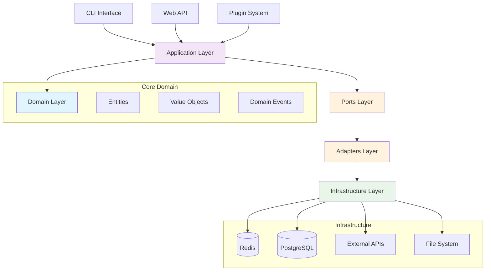

# FLX - Hexagonal Architecture Framework Overview

[](https://www.python.org/downloads/)
[](https://github.com/flext/flext)
[](https://opensource.org/licenses/MIT)
[](http://mypy-lang.org/)
[](../architecture/INFRASTRUCTURE_ARCHITECTURE.md)
[](../../reports/coverage/)

> **Related Documentation:**
>
> - [Installation Guide](./installation.md) - Complete installation and setup instructions
> - [Quick Start Guide](./quickstart.md) - 5-minute tutorial to get started
> - [Hexagonal Architecture Guide](../architecture/UNIFIED_ARCHITECTURE_GUIDE.md) - Architecture overview
> - [Development Standards](../development/standardization-plan.md) - Development guidelines

**FLX** is a comprehensive Python framework that implements **Hexagonal Architecture** (Ports & Adapters) with **Domain-Driven Design** patterns. Built with Python 3.13+, it provides a production-ready foundation for building scalable, maintainable, and testable enterprise applications.

## Key Features

### 🏛️ Hexagonal Architecture

- **Clean Separation**: Domain logic isolated from infrastructure concerns
- **Ports & Adapters**: Well-defined interfaces for external system integration
- **Dependency Inversion**: Inner layers don't depend on outer layers
- **Testability**: Each layer can be tested independently

### 🎭 Domain-Driven Design

- **Rich Domain Entities**: Business logic encapsulated in domain objects
- **Value Objects**: Immutable data structures with validation
- **Aggregate Roots**: Manage domain events and business invariants
- **Domain Events**: Capture business occurrences for event-driven patterns

### 🚀 Modern Python Excellence

- **Python 3.13+**: Latest language features and performance improvements
- **Full Type Safety**: Comprehensive type hints with Pydantic validation
- **Async/Await**: First-class async support throughout the framework
- **Zero Dependencies**: Core framework has minimal external dependencies

### 🔌 Extensible Plugin System

- **Bidirectional Plugins**: Act as both inbound and outbound adapters
- **Runtime Discovery**: Automatic plugin discovery via entry points
- **Hook System**: Comprehensive lifecycle and extension hooks
- **CLI Extensions**: Extend command-line interface with plugin commands

### 🏭 Enterprise Infrastructure

- **Unified Adapter Management**: Single manager for all adapters
- **Production Engines**: Enterprise-grade HTTP, Cache, and Database engines
- **Connection Pooling**: Built-in pooling for all external connections
- **Health Monitoring**: Comprehensive health checks and metrics

### 🛡️ Production Ready

- **Error Handling**: Comprehensive exception hierarchy and recovery
- **Logging & Monitoring**: Structured logging with correlation IDs
- **Performance Optimization**: Batching, caching, and parallel operations
- **Security**: Built-in security patterns and best practices

## Quick Start Examples

### Your First FLX Application

```python
from flext import Flx
from decimal import Decimal

# Initialize the FLX framework
flext = Flx()

# Create rich domain entities
customer = flext.Entities.BusinessEntity(
    name="Acme Corporation",
    business_type="Enterprise"
)

# Use composable mixins for advanced capabilities
class AdvancedCustomer(
    flext.Entities.BaseEntity,
    flext.Mixins.Status,
    flext.Mixins.Config,
    flext.Mixins.Metadata
):
    pass

# Create entities with business logic
advanced_customer = AdvancedCustomer(name="Tech Startup Inc")
advanced_customer.set_config("credit_limit", 50000)
advanced_customer.add_metadata("industry", "technology")
advanced_customer.activate()

# Work with aggregate roots and domain events
order = flext.Entities.AggregateRoot(name="Order #12345")
order.raise_domain_event("OrderCreated", {
    "customer_id": customer.id,
    "order_total": 2500.00,
    "created_by": "sales_team"
})

# Use value objects for immutable data
contact = flext.ValueObjects.ContactInfo(
    email="orders@acme.com",
    phone="+1-555-0123"
)

print(f"Customer: {customer.name}")
print(f"Order: {order.name}")
print(f"Events: {len(order.get_domain_events())}")
print(f"Contact: {contact.email}")
```

### Infrastructure and Adapters

```python
import asyncio
from flext.infra.adapters import UnifiedAdapterManager
from flext.adapters.outbound.cache import CacheAdapter

async def main():
    # Set up infrastructure with unified management
    manager = UnifiedAdapterManager(
        enable_messaging_features=True,
        instance_cache_size=1000
    )

    # Configure adapters
    cache_adapter = CacheAdapter()
    cache_adapter.configure({
        "backend": "redis",
        "redis_url": "redis://localhost:6379",
        "enable_compression": True
    })

    # Register and start services
    manager.register("cache", cache_adapter)
    await manager.initialize()
    await manager.start()

    # Use in your application
    await cache_adapter.set("customer:123", customer.get_summary())
    cached_customer = await cache_adapter.get("customer:123")

    # Health monitoring
    health = await manager.health_check_all()
    print(f"System health: {health}")

    # Cleanup
    await manager.stop()

asyncio.run(main())
```

### CLI Applications

```python
import cyclopts
from flext import Flx

app = cyclopts.App(name="myapp", help="My FLX Application")
flext = Flx()

@app.command
async def create_customer(name: str, email: str) -> None:
    """Create a new customer."""
    customer = flext.Entities.BusinessEntity(
        name=name,
        business_type="Standard"
    )

    print(f"✅ Customer created: {customer.name}")
    print(f"   ID: {customer.id}")
    print(f"   Email: {email}")

@app.command
async def health() -> None:
    """Check application health."""
    print("🏥 Application is healthy!")

if __name__ == "__main__":
    app()
```

## Architecture Overview

FLX implements **Hexagonal Architecture** (Ports & Adapters) with clear layer separation:



### Architecture Principles

- **🎯 Domain-Centric**: Business logic is isolated and protected
- **🔌 Port-Driven**: Clear interfaces for all external interactions
- **🏗️ Layer Separation**: Each layer has distinct responsibilities
- **🧪 Test-Friendly**: Architecture designed for comprehensive testing
- **📈 Scalable**: Components can be scaled independently

## Core Components

### 🎭 Domain Layer

Pure business logic with no external dependencies:

- **Rich Entities**: Business objects with identity and behavior
- **Value Objects**: Immutable data structures with validation
- **Aggregate Roots**: Manage domain events and business invariants
- **Domain Events**: Capture important business occurrences
- **Mixins**: Composable functionality for entities

### 🔌 Ports & Adapters

Clean interfaces and implementations:

- **Inbound Ports**: For driving adapters (CLI, Web API, Plugins)
- **Outbound Ports**: For driven adapters (Database, Cache, HTTP)
- **Adapter Implementations**: Concrete integrations with external systems
- **Unified Management**: Single manager for all adapter lifecycle

### 🏭 Infrastructure Services

Production-ready infrastructure components:

- **Cache Service**: Redis and memory backends with compression
- **HTTP Service**: Connection pooling and circuit breakers
- **Logging Service**: Structured logging with correlation IDs
- **Monitoring**: Health checks and performance metrics

## Development & Testing

### Testing Strategy

FLX follows a comprehensive testing pyramid:

```python
import pytest
from flext import Flx

# Unit tests - Domain logic
def test_business_logic():
    flext = Flx()
    customer = flext.Entities.BusinessEntity(
        name="Test Corp",
        business_type="Enterprise"
    )
    assert customer.is_valid()
    assert customer.name == "Test Corp"

# Integration tests - Adapter integration
@pytest.mark.integration
async def test_cache_integration():
    from flext.adapters.outbound.cache import CacheAdapter

    adapter = CacheAdapter()
    adapter.configure({"backend": "memory"})
    await adapter.connect()

    await adapter.set("test", "value")
    result = await adapter.get("test")
    assert result == "value"

    await adapter.disconnect()

# E2E tests - Complete workflows
@pytest.mark.e2e
async def test_complete_workflow():
    # Test complete business workflow
    pass
```

### Project Structure

```
flext/
├── src/flext/
│   ├── core/                   # Domain layer - pure business logic
│   │   ├── entities.py        # Domain entities and aggregates
│   │   ├── events.py          # Domain events
│   │   ├── value_objects.py   # Immutable value objects
│   │   └── mixins.py          # Composable entity capabilities
│   ├── ports/                 # Interface contracts
│   │   ├── inbound/           # Driving port interfaces
│   │   └── outbound/          # Driven port interfaces
│   ├── adapters/              # Concrete implementations
│   │   ├── inbound/           # CLI, API adapters
│   │   └── outbound/          # Database, cache adapters
│   ├── infra/                 # Infrastructure services
│   │   ├── adapters/          # Unified adapter management
│   │   ├── cache/             # Cache service implementations
│   │   ├── services/          # Core infrastructure services
│   │   └── logging/           # Logging infrastructure
│   └── application/           # Application services
├── docs/                      # Comprehensive documentation
├── tests/                     # Test suite (unit, integration, e2e)
├── examples/                  # Working examples and tutorials
└── scripts/                   # Development and maintenance tools
```

## Configuration & CLI

### Configuration Management

```python
from flext.infra.config import FlxConfig

# Environment-based configuration
config = FlxConfig.from_env()

# YAML configuration
config = FlxConfig.from_file("config.yaml")

# Programmatic configuration
config = FlxConfig(
    cache_backend="redis",
    cache_url="redis://localhost:6379",
    log_level="INFO"
)
```

### CLI Commands

```bash
# Built-in commands
flext --help                    # Show available commands
flext --version                 # Show version information

# Configuration management
flext config show               # Show current configuration
flext config validate           # Validate configuration

# System operations
flext system health             # Check system health
flext system info               # Show system information
```

## Plugin Development

Create powerful plugins that extend FLX:

```python
# Plugin entry point
def register_adapters(registry: dict) -> None:
    """Register custom adapters."""
    from .my_adapter import MyCustomAdapter
    registry["my_custom"] = MyCustomAdapter

# Plugin configuration in pyproject.toml
[tool.poetry.plugins."flext.plugins"]
my_plugin = "my_plugin_package"
```

## Complete Documentation Structure

- **[Getting Started](./installation.md)** - Installation and quick start
- **[Architecture Guides](../architecture/)** - Hexagonal architecture
- **[User Guides](../guides/)** - Plugin development, testing, performance
- **[API Reference](../api-reference/)** - Complete API documentation
- **[Examples](../../examples/)** - Working code examples
- **[Development](../development/)** - Contributing guidelines

### Key Documentation

- **[Plugin Development Guide](../guides/plugin-development.md)** - Create powerful plugins
- **[Testing Guide](../development/testing-comprehensive-guide.md)** - Comprehensive testing strategies
- **[Quick Start Tutorial](./quickstart.md)** - Complete hands-on tutorial
- **[Architecture Guide](../architecture/UNIFIED_ARCHITECTURE_GUIDE.md)** - Modern unified architecture

## Contributing

We welcome contributions! Please see our [Contributing Guide](../development/documentation-guide.md) for:

- **Development Setup**: Local environment configuration
- **Code Standards**: Quality guidelines and best practices
- **Testing Requirements**: Comprehensive testing approach
- **Documentation Guidelines**: Writing and maintaining docs

## License

MIT License - see [LICENSE](../../LICENSE) file for details.

## About

**FLX** is developed and maintained by [Datacosmos](https://datacosmos.com.br), a Brazilian company specializing in enterprise data integration solutions with Oracle systems.

### Support & Community

- **📖 Documentation**: [Complete FLX Documentation](../README.md)
- **🐛 Issues**: [GitHub Issues](https://github.com/datacosmos-br/flext/issues)
- **💬 Discussions**: [GitHub Discussions](https://github.com/datacosmos-br/flext/discussions)
- **📧 Enterprise Support**: Contact us for enterprise support options

---

**🏗️ FLX Framework v0.4.0 - Enterprise Python with Hexagonal Architecture and Modern Infrastructure**

## See Also

- [Installation Guide](./installation.md) - Complete setup instructions
- [Quick Start Guide](./quickstart.md) - Get started in 5 minutes
- [Core Domain Layer](../architecture/core-domain-layer.md) - Domain implementation details
- [Ports Interface Definitions](../architecture/ports-interface-definitions.md) - Port contracts
