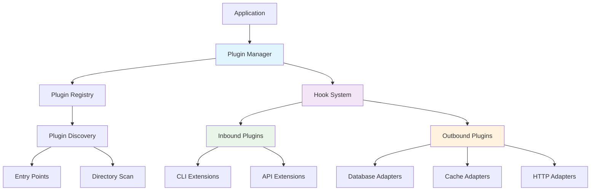

# Plugin Development Guide

> _"The power of a system lies in its extensibility."_
> This guide explains how FLX's plugin architecture enables seamless extension without modifying the core codebase.

## Overview

FLX implements a sophisticated plugin system where **every external connector**—Oracle DB, Cache, HTTP, Message Queues—is treated as a _plugin_ discovered at runtime via Python entry-points. This design enables developers to add new functionality, support additional protocols, or integrate with different systems while maintaining compatibility with the existing ecosystem.

The core framework stays dependency-free while teams add features on their own cadence.

## Plugin System Architecture

### Core Components

The plugin system consists of several key components working together:

- **Hook Specifications**: Define extension points where plugins can integrate
- **Hook Implementations**: Plugin implementations that connect to extension points
- **Plugin Registry**: Central registry that manages plugin discovery and registration
- **Plugin Manager**: Coordinates plugin loading, validation, and execution
- **Bidirectional Support**: Plugins can act as both inbound and outbound adapters

### Architectural Flow



### Hook Specification System

A plugin is a Python module that **implements one or more hooks** defined in the FLX hook specifications. Each hook receives a mutable registry that the plugin can modify.

```python
# flx/ports/plugin/hookspecs.py
import pluggy
from typing import Type, Protocol

hookspec = pluggy.HookspecMarker("flx")

@hookspec
def register_adapters(registry: dict[str, Type["FlxAdapter"]]) -> None:
    """Add custom adapters keyed by a user-friendly name."""

@hookspec
def register_cache_providers(registry: dict[str, Type["CacheProvider"]]) -> None:
    """Expose new caching mechanisms (Redis, Memory, Distributed)."""

@hookspec
def register_auth_providers(registry: dict[str, Type["AuthProvider"]]) -> None:
    """Add authentication mechanisms (OAuth, JWT, API Keys, mTLS)."""

@hookspec
def register_cli_commands(registry: dict[str, "CommandGroup"]) -> None:
    """Extend CLI with custom commands."""

@hookspec
def register_lifecycle_hooks(registry: list[Type["LifecycleHook"]]) -> None:
    """Inject application lifecycle hooks (startup, shutdown, monitoring)."""
```

Additional hooks can be added without breaking existing plugins because unimplemented hooks are simply ignored.

### Registry Organization

The plugin system uses multiple specialized registries:

- **Adapter Registry**: Protocol adapters for different systems (Database, HTTP, Cache)
- **Provider Registries**: Specialized providers (Auth, Schema, Config, Data)
- **Extension Registries**: CLI commands, middleware, and lifecycle hooks
- **Service Registries**: Infrastructure services and production engines

Each registry is a dictionary mapping names to component classes, enabling easy lookup and extension.

## Creating Plugins

### Plugin Structure

A typical FLX plugin follows this organized structure:

```
my-flx-plugin/
├── my_flx_plugin/
│   ├── __init__.py          # Plugin registration and exports
│   ├── adapter.py           # Main adapter implementation
│   ├── config.py            # Configuration models
│   ├── models.py            # Data models and schemas
│   └── exceptions.py        # Plugin-specific exceptions
├── tests/                   # Comprehensive test suite
│   ├── test_adapter.py      # Adapter tests
│   ├── test_integration.py  # Integration tests
│   └── conftest.py          # Test configuration
├── docs/                    # Plugin documentation
│   └── README.md            # Usage and examples
├── pyproject.toml           # Package metadata and entry points
└── README.md                # Plugin overview
```

### Implementation Example: Redis Cache Plugin

Let's create a comprehensive Redis cache plugin:

#### Configuration (`config.py`)

```python
from pydantic import BaseModel, Field, validator
from typing import Optional
from enum import Enum

class RedisBackend(str, Enum):
    REDIS = "redis"
    REDIS_CLUSTER = "redis_cluster"
    REDIS_SENTINEL = "redis_sentinel"

class RedisCacheConfig(BaseModel):
    """Redis cache configuration with validation."""

    url: str = Field(..., description="Redis connection URL")
    backend: RedisBackend = RedisBackend.REDIS

    # Connection settings
    max_connections: int = Field(20, ge=1, le=100)
    connection_timeout: float = Field(5.0, ge=0.1)
    socket_keepalive: bool = True

    # Cache settings
    default_ttl: int = Field(3600, ge=1)  # 1 hour default
    key_prefix: str = Field("flx:", description="Key prefix for all cache keys")

    # Performance settings
    enable_compression: bool = False
    compression_threshold: int = Field(1024, ge=1)  # Compress if larger than 1KB

    @validator('url')
    def validate_redis_url(cls, v):
        if not v.startswith(('redis://', 'rediss://')):
            raise ValueError('Redis URL must start with redis:// or rediss://')
        return v
```

#### Main Adapter (`adapter.py`)

```python
from flx.adapters.base import BaseAdapter
from flx.infra.cache.cache_service import CacheService
from flx.core.exceptions import FlxConnectionError, FlxTimeoutError
from .config import RedisCacheConfig
import redis.asyncio as redis
import json
import gzip
from typing import Any, Optional

class RedisCacheAdapter(BaseAdapter):
    """Redis cache adapter with advanced features."""

    def __init__(self, config: RedisCacheConfig):
        super().__init__()
        self.config = config
        self._cache_service: Optional[CacheService] = None
        self._redis_pool: Optional[redis.ConnectionPool] = None

    async def _connect(self) -> None:
        """Establish Redis connection with pooling."""
        try:
            self._redis_pool = redis.ConnectionPool.from_url(
                self.config.url,
                max_connections=self.config.max_connections,
                socket_connect_timeout=self.config.connection_timeout,
                socket_keepalive=self.config.socket_keepalive
            )

            # Create cache service with Redis backend
            self._cache_service = CacheService(
                backend="redis",
                redis_pool=self._redis_pool,
                default_ttl=self.config.default_ttl,
                key_prefix=self.config.key_prefix,
                enable_compression=self.config.enable_compression,
                compression_threshold=self.config.compression_threshold
            )

            await self._cache_service.connect()
            self.logger.info(f"Connected to Redis: {self.config.url}")

        except Exception as e:
            raise FlxConnectionError(f"Failed to connect to Redis: {e}")

    async def _disconnect(self) -> None:
        """Close Redis connections gracefully."""
        if self._cache_service:
            await self._cache_service.disconnect()
        if self._redis_pool:
            await self._redis_pool.disconnect()
        self.logger.info("Disconnected from Redis")

    async def get(self, key: str) -> Optional[Any]:
        """Get value from cache with automatic decompression."""
        if not self._cache_service:
            raise FlxConnectionError("Not connected to Redis")

        try:
            return await self._cache_service.get(key)
        except Exception as e:
            self.logger.error(f"Cache get failed for key {key}: {e}")
            raise FlxTimeoutError(f"Cache operation timeout: {e}")

    async def set(self, key: str, value: Any, ttl: Optional[int] = None) -> bool:
        """Set value in cache with automatic compression."""
        if not self._cache_service:
            raise FlxConnectionError("Not connected to Redis")

        try:
            await self._cache_service.set(key, value, ttl)
            return True
        except Exception as e:
            self.logger.error(f"Cache set failed for key {key}: {e}")
            return False

    async def delete(self, key: str) -> bool:
        """Delete key from cache."""
        if not self._cache_service:
            raise FlxConnectionError("Not connected to Redis")

        try:
            return await self._cache_service.delete(key)
        except Exception as e:
            self.logger.error(f"Cache delete failed for key {key}: {e}")
            return False

    async def exists(self, key: str) -> bool:
        """Check if key exists in cache."""
        if not self._cache_service:
            raise FlxConnectionError("Not connected to Redis")

        try:
            return await self._cache_service.exists(key)
        except Exception as e:
            self.logger.error(f"Cache exists check failed for key {key}: {e}")
            return False

    async def health_check(self) -> dict[str, Any]:
        """Perform Redis health check."""
        if not self._cache_service:
            return {"status": "disconnected", "error": "Not connected"}

        try:
            health = await self._cache_service.health_check()
            return {
                "status": "healthy",
                "backend": self.config.backend.value,
                "url": self.config.url,
                "pool_info": health
            }
        except Exception as e:
            return {"status": "unhealthy", "error": str(e)}
```

#### Plugin Registration (`__init__.py`)

```python
"""Redis Cache Plugin for FLX."""

from .adapter import RedisCacheAdapter
from .config import RedisCacheConfig

# Plugin exports
__all__ = ["RedisCacheAdapter", "RedisCacheConfig"]

# Plugin registration function
def register_adapters(registry: dict) -> None:
    """Register Redis cache adapter."""
    registry["redis_cache"] = RedisCacheAdapter

def register_cache_providers(registry: dict) -> None:
    """Register Redis as a cache provider."""
    registry["redis"] = {
        "adapter": RedisCacheAdapter,
        "config": RedisCacheConfig,
        "description": "Redis cache provider with clustering support",
        "features": ["compression", "clustering", "monitoring"]
    }

# Plugin metadata
PLUGIN_NAME = "flx-redis-cache"
PLUGIN_VERSION = "1.0.0"
PLUGIN_DESCRIPTION = "Redis cache adapter for FLX with advanced features"
```

#### Package Configuration (`pyproject.toml`)

```toml
[build-system]
requires = ["poetry-core>=1.0.0"]
build-backend = "poetry.core.masonry.api"

[tool.poetry]
name = "flx-redis-cache"
version = "1.0.0"
description = "Redis cache adapter for FLX framework"
authors = ["Your Name <your.email@example.com>"]
license = "MIT"
readme = "README.md"
homepage = "https://github.com/yourorg/flx-redis-cache"
repository = "https://github.com/yourorg/flx-redis-cache"
keywords = ["flx", "redis", "cache", "plugin"]

[tool.poetry.dependencies]
python = "^3.9,<4.0"
flx = "^0.4.0"
redis = "^5.0.0"
pydantic = "^2.0.0"

[tool.poetry.group.dev.dependencies]
pytest = "^7.0.0"
pytest-asyncio = "^0.21.0"
pytest-mock = "^3.10.0"
fakeredis = "^2.0.0"  # For testing without Redis

# Plugin entry points
[tool.poetry.plugins."flx.plugins"]
redis_cache = "flx_redis_cache"

[tool.poetry.plugins."flx.cache_providers"]
redis = "flx_redis_cache:register_cache_providers"

[tool.poetry.plugins."flx.adapters"]
redis_cache = "flx_redis_cache:register_adapters"
```

### Using the Plugin

Once installed, the plugin can be used seamlessly:

```python
import asyncio
from flx import Flx
from flx.infra.adapters import UnifiedAdapterManager

async def main():
    # Initialize FLX with plugin discovery
    flx = Flx()
    flx.discover_plugins()  # Auto-discovers all installed plugins

    # Get Redis cache adapter from registry
    cache_adapter = flx.get_adapter("redis_cache")

    # Configure with connection details
    from flx_redis_cache import RedisCacheConfig
    config = RedisCacheConfig(
        url="redis://localhost:6379",
        max_connections=20,
        enable_compression=True
    )

    # Initialize adapter
    cache = cache_adapter(config)

    # Use with unified manager
    manager = UnifiedAdapterManager()
    manager.register("cache", cache)

    await manager.initialize()
    await manager.start()

    # Use the cache
    await cache.set("user:123", {"name": "John", "email": "john@example.com"})
    user = await cache.get("user:123")
    print(f"Retrieved user: {user}")

    # Health check
    health = await cache.health_check()
    print(f"Cache health: {health}")

    # Cleanup
    await manager.stop()

# Run the example
asyncio.run(main())
```

## Advanced Plugin Features

### Bidirectional Plugin Architecture

FLX plugins support bidirectional patterns - they can act as both inbound (driving) and outbound (driven) adapters:

```python
class BidirectionalHttpPlugin(BaseAdapter):
    """HTTP plugin that can both receive and make requests."""

    # Inbound capability - receive HTTP requests
    async def handle_request(self, request: HttpRequest) -> HttpResponse:
        """Handle incoming HTTP requests."""
        return await self._process_request(request)

    # Outbound capability - make HTTP requests
    async def make_request(self, method: str, url: str, **kwargs) -> HttpResponse:
        """Make outbound HTTP requests."""
        return await self._http_client.request(method, url, **kwargs)

    # Plugin registration for both directions
    def register_inbound_handlers(self, registry: dict) -> None:
        registry["http_server"] = self.handle_request

    def register_outbound_adapters(self, registry: dict) -> None:
        registry["http_client"] = self.make_request
```

### CLI Extensions

Plugins can extend the FLX command-line interface:

```python
import cyclopts
from flx.ports.inbound.cli import CLICommandGroup

class RedisCLIExtension:
    """CLI commands for Redis cache management."""

    def __init__(self, cache_adapter: RedisCacheAdapter):
        self.cache = cache_adapter

    @cyclopts.App
    def redis_commands(self):
        """Redis cache management commands."""
        pass

    @redis_commands.command
    async def get(self, key: str) -> None:
        """Get value from Redis cache."""
        value = await self.cache.get(key)
        if value is None:
            print(f"Key '{key}' not found")
        else:
            print(f"{key}: {value}")

    @redis_commands.command
    async def set(self, key: str, value: str, ttl: int = 3600) -> None:
        """Set value in Redis cache."""
        success = await self.cache.set(key, value, ttl)
        if success:
            print(f"Set {key} = {value} (TTL: {ttl}s)")
        else:
            print(f"Failed to set {key}")

    @redis_commands.command
    async def delete(self, key: str) -> None:
        """Delete key from Redis cache."""
        deleted = await self.cache.delete(key)
        if deleted:
            print(f"Deleted {key}")
        else:
            print(f"Key '{key}' not found")

    @redis_commands.command
    async def health(self) -> None:
        """Check Redis health."""
        health = await self.cache.health_check()
        print(f"Redis Health: {health}")

# Register CLI extension
def register_cli_commands(registry: dict) -> None:
    """Register Redis CLI commands."""
    registry["redis"] = RedisCLIExtension
```

### Lifecycle Hooks

Plugins can register handlers for application lifecycle events:

```python
from flx.ports.plugin.hooks import LifecycleHook

class RedisCacheLifecycleHook(LifecycleHook):
    """Lifecycle management for Redis cache."""

    def __init__(self, cache_adapter: RedisCacheAdapter):
        self.cache = cache_adapter

    async def on_startup(self, app) -> None:
        """Execute when application starts."""
        await self.cache.connect()
        self.logger.info("Redis cache connected on startup")

    async def on_shutdown(self, app) -> None:
        """Execute when application shuts down."""
        await self.cache.disconnect()
        self.logger.info("Redis cache disconnected on shutdown")

    async def on_health_check(self, app) -> dict:
        """Return health information."""
        return await self.cache.health_check()

# Register lifecycle hook
def register_lifecycle_hooks(registry: list) -> None:
    """Register Redis lifecycle hooks."""
    registry.append(RedisCacheLifecycleHook)
```

## Testing Plugins

### Comprehensive Test Setup

```python
# tests/conftest.py
import pytest
import pytest_asyncio
from flx_redis_cache import RedisCacheAdapter, RedisCacheConfig
from fakeredis import aioredis

@pytest.fixture
async def redis_config():
    """Test Redis configuration."""
    return RedisCacheConfig(
        url="redis://localhost:6379",
        max_connections=5,
        default_ttl=300,
        enable_compression=True
    )

@pytest.fixture
async def mock_redis_adapter(redis_config):
    """Mock Redis adapter for testing."""
    adapter = RedisCacheAdapter(redis_config)

    # Use fake Redis for testing
    adapter._redis_pool = aioredis.ConnectionPool()

    await adapter.connect()
    yield adapter
    await adapter.disconnect()

@pytest.fixture
async def integration_redis_adapter(redis_config):
    """Real Redis adapter for integration tests."""
    adapter = RedisCacheAdapter(redis_config)
    await adapter.connect()
    yield adapter
    await adapter.disconnect()
```

### Unit Tests

```python
# tests/test_adapter.py
import pytest
from flx_redis_cache import RedisCacheAdapter, RedisCacheConfig
from flx.core.exceptions import FlxConnectionError

class TestRedisCacheAdapter:
    """Unit tests for Redis cache adapter."""

    async def test_adapter_creation(self, redis_config):
        """Test adapter creation with valid config."""
        adapter = RedisCacheAdapter(redis_config)
        assert adapter.config == redis_config
        assert not adapter.is_connected()

    async def test_connection_lifecycle(self, mock_redis_adapter):
        """Test connection and disconnection."""
        assert mock_redis_adapter.is_connected()

        await mock_redis_adapter.disconnect()
        assert not mock_redis_adapter.is_connected()

    async def test_cache_operations(self, mock_redis_adapter):
        """Test basic cache operations."""
        # Set value
        success = await mock_redis_adapter.set("test_key", "test_value")
        assert success

        # Get value
        value = await mock_redis_adapter.get("test_key")
        assert value == "test_value"

        # Check existence
        exists = await mock_redis_adapter.exists("test_key")
        assert exists

        # Delete value
        deleted = await mock_redis_adapter.delete("test_key")
        assert deleted

        # Verify deletion
        value = await mock_redis_adapter.get("test_key")
        assert value is None

    async def test_health_check(self, mock_redis_adapter):
        """Test health check functionality."""
        health = await mock_redis_adapter.health_check()
        assert health["status"] == "healthy"
        assert "backend" in health
        assert "url" in health

    async def test_error_handling(self, redis_config):
        """Test error handling for connection failures."""
        adapter = RedisCacheAdapter(redis_config)

        # Test operations without connection
        with pytest.raises(FlxConnectionError):
            await adapter.get("test_key")

        with pytest.raises(FlxConnectionError):
            await adapter.set("test_key", "value")
```

### Integration Tests

```python
# tests/test_integration.py
import pytest
from flx import Flx
from flx.infra.adapters import UnifiedAdapterManager

@pytest.mark.integration
class TestRedisIntegration:
    """Integration tests with FLX framework."""

    async def test_plugin_discovery(self):
        """Test automatic plugin discovery."""
        flx = Flx()
        flx.discover_plugins()

        # Verify plugin is discovered
        adapters = flx.get_available_adapters()
        assert "redis_cache" in adapters

    async def test_unified_manager_integration(self, integration_redis_adapter):
        """Test integration with unified adapter manager."""
        manager = UnifiedAdapterManager()
        manager.register("cache", integration_redis_adapter)

        await manager.initialize()
        await manager.start()

        # Test through manager
        health = await manager.health_check_all()
        assert "cache" in health
        assert health["cache"]["status"] == "healthy"

        await manager.stop()

    @pytest.mark.performance
    async def test_performance_benchmarks(self, integration_redis_adapter):
        """Test performance characteristics."""
        import time

        # Benchmark set operations
        start_time = time.perf_counter()
        for i in range(1000):
            await integration_redis_adapter.set(f"perf_key_{i}", f"value_{i}")
        set_duration = time.perf_counter() - start_time

        # Benchmark get operations
        start_time = time.perf_counter()
        for i in range(1000):
            await integration_redis_adapter.get(f"perf_key_{i}")
        get_duration = time.perf_counter() - start_time

        # Performance assertions
        assert set_duration < 2.0  # Should complete in under 2 seconds
        assert get_duration < 1.0  # Should complete in under 1 second

        print(f"Set 1000 keys in {set_duration:.3f}s")
        print(f"Get 1000 keys in {get_duration:.3f}s")
```

## Best Practices

### Plugin Development Checklist

1. **✅ Lazy Imports**: Import heavy dependencies inside functions to avoid startup cost
2. **✅ Comprehensive Tests**: Unit tests, integration tests, and performance benchmarks
3. **✅ Documentation**: README with examples, configuration options, and troubleshooting
4. **✅ Error Handling**: Proper exception handling with meaningful error messages
5. **✅ Type Safety**: Full type hints for all public APIs and configuration
6. **✅ Logging**: Structured logging for debugging and monitoring
7. **✅ Health Checks**: Implement health check methods for monitoring
8. **✅ Configuration Validation**: Use Pydantic for robust configuration validation
9. **✅ Semantic Versioning**: Follow semver for compatibility guarantees
10. **✅ CI/CD**: Automated testing across Python versions and platforms

### Performance Considerations

- **Connection Pooling**: Always use connection pools for database and HTTP adapters
- **Async Operations**: Use async/await for I/O-bound operations
- **Batch Operations**: Implement batch operations for improved throughput
- **Caching**: Add intelligent caching where appropriate
- **Resource Management**: Proper cleanup of connections and resources

### Security Best Practices

- **No Hard-coded Credentials**: Always use configuration or environment variables
- **Input Validation**: Validate all inputs from external systems
- **Secure Defaults**: Use secure defaults for SSL/TLS and authentication
- **Error Information**: Don't leak sensitive information in error messages
- **Audit Logging**: Log security-relevant operations appropriately

## Plugin Ecosystem Roadmap

FLX is building an extensive plugin ecosystem with planned expansions:

### Infrastructure Plugins

- **Redis Cluster**: Advanced Redis clustering support
- **PostgreSQL**: Full PostgreSQL adapter with advanced features
- **Oracle Database**: Enhanced Oracle integration with modern drivers
- **Message Queues**: RabbitMQ, Apache Kafka, Apache Pulsar adapters

### Cloud Platform Plugins

- **AWS Services**: S3, DynamoDB, SQS, Lambda integrations
- **Azure Services**: Blob Storage, CosmosDB, Service Bus
- **Google Cloud**: Cloud Storage, Firestore, Pub/Sub

### Monitoring and Observability

- **OpenTelemetry**: Complete observability integration
- **Prometheus**: Metrics collection and monitoring
- **Grafana**: Dashboard and visualization support
- **Sentry**: Error tracking and performance monitoring

### Data Pipeline Plugins

- **Singer Protocol**: Standardized ETL taps and targets
- **Apache Airflow**: Workflow orchestration integration
- **dbt**: Data transformation tool integration

## Related Documentation

- **[Architecture Guide](../INFRASTRUCTURE_ARCHITECTURE.md)** - Understanding hexagonal architecture
- **[Testing Guide](testing.md)** - Comprehensive testing strategies
- **[API Reference](../api-reference/)** - Complete API documentation
- **[Examples](../examples/)** - Working plugin examples

---

**🔌 Ready to extend FLX with powerful plugins!**
