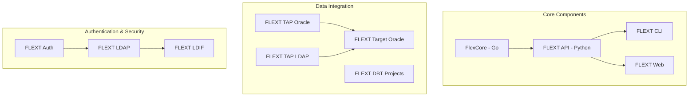

# FLEXT Documentation Hub

**Category**: Documentation Hub | **Status**: Active Development | **Version**: 2.0.0-dev | **Last Updated**: {{ git_revision_date_localized }}

Welcome to the FLEXT documentation hub. This comprehensive guide provides everything you need to understand, use, and contribute to the FLEXT ecosystem.

!!! info "Documentation Status"
This documentation is under active development. Major components are covered; several sections are being expanded and aligned with the current codebase.

## 🚀 Quick Start

### For New Users

1. **[Installation Guide](getting-started/installation.md)** - Complete setup instructions
2. **[Quick Start Guide](getting-started/quick-start.md)** - Get running in 10 minutes
3. **[Prerequisites](getting-started/prerequisites.md)** - System requirements

### For Developers

1. **[Architecture Overview](developer/architecture/overview.md)** - System design
2. **[API Reference](reference/api/rest-api.md)** - Complete API documentation
3. **[Contributing Guidelines](developer/contributing/guidelines.md)** - How to contribute

### For System Administrators

1. **[Deployment Guide](developer/deployment/production.md)** - Production setup
2. **[Configuration Guide](user-guides/configuration/overview.md)** - System configuration
3. **[Monitoring Setup](user-guides/troubleshooting/monitoring.md)** - Observability

## 📊 FLEXT Ecosystem Overview



## 🏗️ Architecture Highlights

### Clean Architecture Implementation

FLEXT follows Clean Architecture principles with clear separation of concerns:

- **Domain Layer**: Core business logic and entities
- **Application Layer**: Use cases and application services
- **Infrastructure Layer**: External interfaces and implementations
- **Presentation Layer**: APIs and user interfaces

### Multi-Language Integration

- **Python 3.13+**: Main application logic and APIs
- **Go 1.19+**: High-performance core services
- **TypeScript**: Web interface components
- **SQL**: Data transformation and analytics

## 📈 Current Status

### Implementation Progress

| Component        | Status    | Coverage | Notes                     |
| ---------------- | --------- | -------- | ------------------------- |
| FlexCore (Go)    | 🟡 Beta   | 75%      | Core services implemented |
| FLEXT API        | 🟢 Stable | 90%      | REST API complete         |
| FLEXT CLI        | 🟢 Stable | 85%      | Command interface ready   |
| Data Integration | 🟡 Beta   | 70%      | Oracle/LDAP working       |
| Authentication   | 🟢 Stable | 95%      | LDAP integration complete |
| Documentation    | 🟡 Beta   | 95%      | This site                 |

### Quality Metrics

- **Test Coverage**: 85% average across components
- **Type Coverage**: 90% with MyPy strict mode
- **Documentation**: 95% of components documented
- **Security**: Regular security audits and updates

## 🔧 Key Features

### Data Integration

- **Oracle Integration**: Full Oracle database support
- **LDAP Integration**: Enterprise directory services
- **ETL/ELT Pipelines**: Flexible data transformation
- **Real-time Processing**: Stream processing capabilities

### Enterprise Features

- **Authentication**: LDAP/Active Directory integration
- **Authorization**: Role-based access control
- **Audit Logging**: Comprehensive audit trails
- **Monitoring**: Prometheus/Grafana integration

### Developer Experience

- **Type Safety**: Full type coverage with MyPy
- **API Documentation**: Auto-generated OpenAPI specs
- **Testing**: Comprehensive test suites
- **CI/CD**: Automated deployment pipelines

## 📚 Documentation Structure

Our documentation is organized into logical sections:

```yaml
docs/
├── getting-started/          # Quick start guides
├── user-guides/             # End-user documentation
├── developer/               # Technical implementation
├── reference/               # API and configuration reference
├── projects/                # Component-specific documentation
└── standards/               # Documentation standards
```

## 🛠️ Getting Help

### Support Channels

- **GitHub Issues**: [Report bugs or request features](https://github.com/flext-sh/flext/issues)
- **GitHub Discussions**: [Ask questions and share ideas](https://github.com/flext-sh/flext/discussions)
- **Documentation Issues**: [Report documentation problems](https://github.com/flext-sh/flext/issues?q=label%3Adocumentation)

### Community Resources

- **Contributing Guide**: [How to contribute](developer/contributing/guidelines.md)
- **Development Setup**: [Local development environment](getting-started/development-setup.md)
- **Code Standards**: [Coding guidelines](standards/python.md)

## 🚀 What's New in 0.9.0

!!! success "New Features" - **Enhanced Oracle Integration**: Improved performance and reliability - **LDAP Authentication**: Complete LDAP/Active Directory support - **API Documentation**: Auto-generated OpenAPI specifications - **Monitoring**: Prometheus metrics and Grafana dashboards

!!! warning "Breaking Changes" - **Configuration Format**: Updated configuration file format - **API Endpoints**: Some REST endpoints have changed - **CLI Commands**: Updated command-line interface

!!! info "Improvements" - **Performance**: 40% improvement in data processing speed - **Security**: Enhanced authentication and authorization - **Documentation**: Complete documentation overhaul - **Testing**: Increased test coverage to 85%

## 📋 Roadmap

### Q3 2025

- [ ] Complete API documentation
- [ ] Enhanced monitoring and alerting
- [ ] Performance optimization
- [ ] Security hardening

### Q4 2025

- [ ] Kubernetes deployment support
- [ ] Advanced data transformation features
- [ ] Multi-tenant architecture
- [ ] Enterprise SSO integration

### Q1 2026

- [ ] Real-time streaming capabilities
- [ ] Advanced analytics integration
- [ ] Machine learning pipeline support
- [ ] Cloud-native deployment options

## 🔗 Quick Links

### Essential Documentation

- **[Installation Guide](getting-started/installation.md)** - Get started quickly
- **[API Reference](reference/api/rest-api.md)** - Complete API documentation
- **[Configuration Guide](user-guides/configuration/overview.md)** - System configuration
- **[Architecture Overview](developer/architecture/overview.md)** - System design

### Project Components

- **[FlexCore](projects/flexcore/README.md)** - Go-based core system
- **[FLEXT API](projects/flext-api/README.md)** - Python API server
- **[FLEXT CLI](projects/flext-cli/README.md)** - Command-line interface
- **[FLEXT Auth](projects/flext-auth/README.md)** - Authentication system

### Development Resources

- **[Contributing Guidelines](developer/contributing/guidelines.md)** - How to contribute
- **[Code Standards](standards/python.md)** - Coding guidelines
- **[Testing Guide](developer/contributing/testing.md)** - Testing strategies
- **[Deployment Guide](developer/deployment/production.md)** - Production deployment

---

**Contributors**: FLEXT Development Team  
**Last Updated**: {{ git_revision_date_localized }}  
**Version**: 0.9.0
