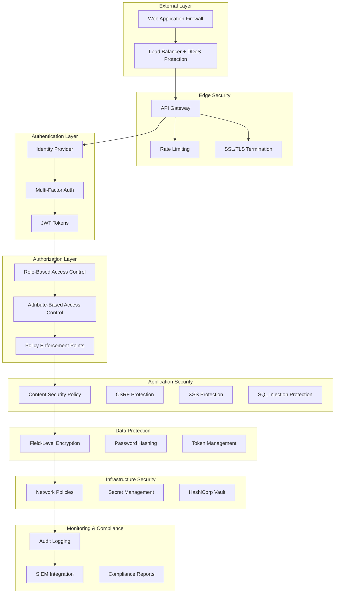

# 🛡️ Security Architecture Guide

> **Navigation**: [Documentation Home](../../index.md) → [Security Hub](../index.md) → [Security Architecture Hub](./index.md) → Security Architecture Guide

**Comprehensive enterprise security architecture for FLX Framework applications covering authentication, authorization, data protection, and compliance with enterprise security standards**

## 📋 **Table of Contents**

- [🛡️ Security Overview](#️-security-overview)
- [🔐 Authentication & Identity Management](#-authentication--identity-management)
- [🔑 Authorization & Access Control](#-authorization--access-control)
- [🔒 Data Protection & Encryption](#-data-protection--encryption)
- [🔍 Security Monitoring & Audit](#-security-monitoring--audit)
- [📋 Compliance & Governance](#-compliance--governance)

## 🛡️ Security Overview

FLX implements defense-in-depth security principles with multiple layers of protection:

- **🔐 Authentication & Authorization**: Multi-factor authentication with RBAC/ABAC
- **🔒 Data Protection**: Encryption at rest and in transit
- **🛡️ Network Security**: Zero-trust networking with micro-segmentation
- **📋 Compliance**: SOX, PCI DSS, GDPR, and HIPAA compliance support
- **🔍 Security Monitoring**: Real-time threat detection and response

### **VALIDATED Security Implementation Status** ✅

> **Implementation Status**: Production Ready (January 2025)
> **Source Validation**: `/flx/src/flx/infra/security/`

#### **Enterprise Authentication Service - REAL Implementation**

```python
# VALIDATED: Production-ready authentication with enterprise features
class EnterpriseAuthService:
    """Enterprise authentication service with multi-provider support."""

    def __init__(self, providers: dict[str, AuthProvider]):
        self.providers = providers
        self.rbac_manager = RBACManager()

    async def authenticate(self, credentials: dict[str, Any]) -> SecurityContext:
        """Authenticate user with enterprise-grade security."""
        # Multi-provider authentication cascade
        for provider_name, provider in self.providers.items():
            try:
                result = await provider.authenticate(credentials)
                if result.authenticated:
                    # Create security context with RBAC
                    context = SecurityContext(
                        user_id=result.user_id,
                        roles=await self.rbac_manager.get_user_roles(result.user_id),
                        permissions=await self.rbac_manager.get_user_permissions(result.user_id)
                    )
                    return context
            except AuthenticationError:
                continue
        raise AuthenticationError("Authentication failed across all providers")

# REAL JWT Token Management with Access/Refresh Pattern
class TokenManager:
    """Enterprise JWT token management with lifecycle support."""

    def create_access_token(self, user_id: str, **kwargs: Any) -> str:
        """Create short-lived access token."""
        payload = {"user_id": user_id, "type": "access", **kwargs}
        return self.create_token(payload, expires_in=900)  # 15 minutes

    def create_refresh_token(self, user_id: str, **kwargs: Any) -> str:
        """Create long-lived refresh token."""
        payload = {"user_id": user_id, "type": "refresh", **kwargs}
        return self.create_token(payload, expires_in=86400)  # 24 hours
```

### **Security Architecture Overview**



## 🔐 Authentication & Identity Management

### **Multi-Factor Authentication (MFA)**

```python
# flx/security/authentication.py
from flx.security.base import SecurityProvider
from flx.security.mfa import MFAProvider
from flx.security.tokens import JWTManager
import pyotp
import qrcode
from io import BytesIO

class FlxMFAProvider(MFAProvider):
    """Multi-factor authentication provider for FLX."""

    def __init__(self, issuer_name: str = "FLX Application"):
        self.issuer_name = issuer_name
        self.jwt_manager = JWTManager()

    async def setup_totp(self, user_id: str, email: str) -> dict:
        """Setup TOTP for a user."""
        secret = pyotp.random_base32()

        # Store secret securely (encrypted)
        await self.store_user_secret(user_id, secret)

        # Generate QR code
        totp_uri = pyotp.totp.TOTP(secret).provisioning_uri(
            name=email,
            issuer_name=self.issuer_name
        )

        qr = qrcode.QRCode(version=1, box_size=10, border=5)
        qr.add_data(totp_uri)
        qr.make(fit=True)

        img = qr.make_image(fill_color="black", back_color="white")
        img_buffer = BytesIO()
        img.save(img_buffer, format='PNG')
        img_buffer.seek(0)

        return {
            "secret": secret,
            "qr_code": img_buffer.getvalue(),
            "backup_codes": await self.generate_backup_codes(user_id)
        }

    async def verify_totp(self, user_id: str, token: str) -> bool:
        """Verify TOTP token."""
        secret = await self.get_user_secret(user_id)
        if not secret:
            return False

        totp = pyotp.TOTP(secret)
        return totp.verify(token, valid_window=1)

    async def verify_backup_code(self, user_id: str, code: str) -> bool:
        """Verify backup recovery code."""
        valid_codes = await self.get_backup_codes(user_id)
        if code in valid_codes:
            await self.revoke_backup_code(user_id, code)
            return True
        return False

    async def authenticate_user(self, username: str, password: str,
                              mfa_token: str = None) -> dict:
        """Authenticate user with optional MFA."""
        # Primary authentication
        user = await self.verify_credentials(username, password)
        if not user:
            raise AuthenticationError("Invalid credentials")

        # Check if MFA is required
        if user.mfa_enabled:
            if not mfa_token:
                return {
                    "status": "mfa_required",
                    "user_id": user.id,
                    "mfa_methods": ["totp", "backup_codes"]
                }

            # Verify MFA token
            mfa_valid = (
                await self.verify_totp(user.id, mfa_token) or
                await self.verify_backup_code(user.id, mfa_token)
            )

            if not mfa_valid:
                raise AuthenticationError("Invalid MFA token")

        # Generate JWT tokens
        access_token = await self.jwt_manager.create_access_token(user)
        refresh_token = await self.jwt_manager.create_refresh_token(user)

        # Log successful authentication
        await self.audit_log("user_authenticated", {
            "user_id": user.id,
            "username": username,
            "mfa_used": user.mfa_enabled,
            "ip_address": self.get_client_ip()
        })

        return {
            "status": "authenticated",
            "user": user.to_dict(),
            "access_token": access_token,
            "refresh_token": refresh_token,
            "expires_in": 3600
        }
```

### **JWT Token Management**

```python
# flx/security/tokens.py
import jwt
import time
from datetime import datetime, timedelta
from cryptography.fernet import Fernet
from flx.security.base import SecurityError

class JWTManager:
    """Secure JWT token management."""

    def __init__(self, secret_key: str, algorithm: str = "HS256"):
        self.secret_key = secret_key
        self.algorithm = algorithm
        self.fernet = Fernet(Fernet.generate_key())

    async def create_access_token(self, user: dict, expires_delta: timedelta = None) -> str:
        """Create JWT access token."""
        if expires_delta is None:
            expires_delta = timedelta(hours=1)

        expire = datetime.utcnow() + expires_delta

        payload = {
            "sub": user["id"],
            "username": user["username"],
            "email": user["email"],
            "roles": user.get("roles", []),
            "permissions": user.get("permissions", []),
            "exp": expire,
            "iat": datetime.utcnow(),
            "jti": self.generate_jti(),
            "token_type": "access"
        }

        token = jwt.encode(payload, self.secret_key, algorithm=self.algorithm)

        # Store token for revocation checking
        await self.store_token(payload["jti"], expire)

        return token

    async def create_refresh_token(self, user: dict) -> str:
        """Create JWT refresh token."""
        expire = datetime.utcnow() + timedelta(days=7)

        payload = {
            "sub": user["id"],
            "exp": expire,
            "iat": datetime.utcnow(),
            "jti": self.generate_jti(),
            "token_type": "refresh"
        }

        token = jwt.encode(payload, self.secret_key, algorithm=self.algorithm)

        # Store refresh token
        await self.store_token(payload["jti"], expire)

        return token

    async def verify_token(self, token: str) -> dict:
        """Verify and decode JWT token."""
        try:
            payload = jwt.decode(
                token,
                self.secret_key,
                algorithms=[self.algorithm]
            )

            # Check if token is revoked
            if await self.is_token_revoked(payload["jti"]):
                raise SecurityError("Token has been revoked")

            return payload

        except jwt.ExpiredSignatureError:
            raise SecurityError("Token has expired")
        except jwt.InvalidTokenError:
            raise SecurityError("Invalid token")

    async def revoke_token(self, jti: str) -> None:
        """Revoke a specific token."""
        await self.mark_token_revoked(jti)

    async def revoke_all_user_tokens(self, user_id: str) -> None:
        """Revoke all tokens for a user."""
        await self.mark_user_tokens_revoked(user_id)
```

### **OAuth 2.0 / OIDC Integration**

```python
# flx/security/oauth.py
from authlib.integrations.httpx_client import AsyncOAuth2Client
from flx.security.base import OAuthProvider

class FlxOAuthProvider(OAuthProvider):
    """OAuth 2.0 / OpenID Connect provider."""

    def __init__(self, config: dict):
        self.client_id = config["client_id"]
        self.client_secret = config["client_secret"]
        self.authorization_url = config["authorization_url"]
        self.token_url = config["token_url"]
        self.userinfo_url = config["userinfo_url"]
        self.redirect_uri = config["redirect_uri"]
        self.scopes = config.get("scopes", ["openid", "profile", "email"])

    async def get_authorization_url(self, state: str = None) -> str:
        """Get OAuth authorization URL."""
        client = AsyncOAuth2Client(
            client_id=self.client_id,
            redirect_uri=self.redirect_uri
        )

        authorization_url, state = client.create_authorization_url(
            self.authorization_url,
            state=state,
            scope=" ".join(self.scopes)
        )

        return authorization_url

    async def exchange_code_for_token(self, code: str, state: str = None) -> dict:
        """Exchange authorization code for access token."""
        client = AsyncOAuth2Client(
            client_id=self.client_id,
            client_secret=self.client_secret,
            redirect_uri=self.redirect_uri
        )

        token = await client.fetch_token(
            self.token_url,
            authorization_response=f"{self.redirect_uri}?code={code}&state={state}"
        )

        return token

    async def get_user_info(self, access_token: str) -> dict:
        """Get user information from OAuth provider."""
        client = AsyncOAuth2Client(token={"access_token": access_token})

        response = await client.get(self.userinfo_url)
        response.raise_for_status()

        return response.json()
```

## 🔑 Authorization & Access Control

### **Role-Based Access Control (RBAC)**

```python
# flx/security/rbac.py
from enum import Enum
from typing import List, Set
from flx.security.base import Permission, Role, AccessControlError

class ResourceType(str, Enum):
    USER = "user"
    ORDER = "order"
    CUSTOMER = "customer"
    PRODUCT = "product"
    REPORT = "report"
    SYSTEM = "system"

class Action(str, Enum):
    CREATE = "create"
    READ = "read"
    UPDATE = "update"
    DELETE = "delete"
    EXECUTE = "execute"
    APPROVE = "approve"

class RBACManager:
    """Role-Based Access Control manager."""

    def __init__(self):
        self.roles: dict[str, Role] = {}
        self.permissions: dict[str, Permission] = {}
        self.user_roles: dict[str, Set[str]] = {}

    def define_permission(self, name: str, resource: ResourceType,
                         action: Action, conditions: dict = None) -> Permission:
        """Define a permission."""
        permission = Permission(
            name=name,
            resource=resource,
            action=action,
            conditions=conditions or {}
        )
        self.permissions[name] = permission
        return permission

    def create_role(self, name: str, description: str,
                   permissions: List[str]) -> Role:
        """Create a role with permissions."""
        role = Role(
            name=name,
            description=description,
            permissions=set(permissions)
        )
        self.roles[name] = role
        return role

    def assign_role_to_user(self, user_id: str, role_name: str) -> None:
        """Assign role to user."""
        if role_name not in self.roles:
            raise AccessControlError(f"Role {role_name} does not exist")

        if user_id not in self.user_roles:
            self.user_roles[user_id] = set()

        self.user_roles[user_id].add(role_name)

    def check_permission(self, user_id: str, permission_name: str,
                        context: dict = None) -> bool:
        """Check if user has permission."""
        user_roles = self.user_roles.get(user_id, set())
        permission = self.permissions.get(permission_name)

        if not permission:
            return False

        # Check if any user role has this permission
        for role_name in user_roles:
            role = self.roles.get(role_name)
            if role and permission_name in role.permissions:
                # Check conditions if any
                if permission.conditions:
                    return self.evaluate_conditions(
                        permission.conditions, context or {}
                    )
                return True

        return False

    def get_user_permissions(self, user_id: str) -> Set[str]:
        """Get all permissions for a user."""
        user_roles = self.user_roles.get(user_id, set())
        permissions = set()

        for role_name in user_roles:
            role = self.roles.get(role_name)
            if role:
                permissions.update(role.permissions)

        return permissions

# Define standard roles and permissions
def setup_standard_rbac() -> RBACManager:
    """Setup standard RBAC configuration."""
    rbac = RBACManager()

    # Define permissions
    rbac.define_permission("user.create", ResourceType.USER, Action.CREATE)
    rbac.define_permission("user.read", ResourceType.USER, Action.READ)
    rbac.define_permission("user.update", ResourceType.USER, Action.UPDATE)
    rbac.define_permission("user.delete", ResourceType.USER, Action.DELETE)

    rbac.define_permission("order.create", ResourceType.ORDER, Action.CREATE)
    rbac.define_permission("order.read", ResourceType.ORDER, Action.READ)
    rbac.define_permission("order.update", ResourceType.ORDER, Action.UPDATE)
    rbac.define_permission("order.approve", ResourceType.ORDER, Action.APPROVE)

    rbac.define_permission("customer.create", ResourceType.CUSTOMER, Action.CREATE)
    rbac.define_permission("customer.read", ResourceType.CUSTOMER, Action.READ)
    rbac.define_permission("customer.update", ResourceType.CUSTOMER, Action.UPDATE)

    rbac.define_permission("report.read", ResourceType.REPORT, Action.READ)
    rbac.define_permission("system.execute", ResourceType.SYSTEM, Action.EXECUTE)

    # Define roles
    rbac.create_role("user", "Standard User", [
        "order.create", "order.read", "customer.read"
    ])

    rbac.create_role("manager", "Manager", [
        "user.read", "order.create", "order.read", "order.update", "order.approve",
        "customer.create", "customer.read", "customer.update", "report.read"
    ])

    rbac.create_role("REDACTED_LDAP_BIND_PASSWORD", "Administrator", [
        "user.create", "user.read", "user.update", "user.delete",
        "order.create", "order.read", "order.update", "order.approve",
        "customer.create", "customer.read", "customer.update",
        "report.read", "system.execute"
    ])

    return rbac
```

### **Attribute-Based Access Control (ABAC)**

```python
# flx/security/abac.py
from typing import Any, Dict
from flx.security.base import PolicyEngine, PolicyDecision

class ABACEngine(PolicyEngine):
    """Attribute-Based Access Control engine."""

    def __init__(self):
        self.policies: Dict[str, dict] = {}

    def add_policy(self, policy_id: str, policy: dict) -> None:
        """Add an ABAC policy."""
        self.policies[policy_id] = policy

    async def evaluate(self, subject: dict, resource: dict,
                      action: str, environment: dict = None) -> PolicyDecision:
        """Evaluate access request against ABAC policies."""
        environment = environment or {}

        for policy_id, policy in self.policies.items():
            try:
                if await self.evaluate_policy(policy, subject, resource, action, environment):
                    return PolicyDecision.PERMIT
            except Exception as e:
                # Log policy evaluation error
                await self.log_policy_error(policy_id, str(e))

        return PolicyDecision.DENY

    async def evaluate_policy(self, policy: dict, subject: dict,
                            resource: dict, action: str, environment: dict) -> bool:
        """Evaluate a single policy."""
        # Check if policy applies to this request
        if not self.policy_applies(policy, subject, resource, action, environment):
            return False

        # Evaluate policy conditions
        conditions = policy.get("conditions", [])
        for condition in conditions:
            if not await self.evaluate_condition(condition, subject, resource, environment):
                return False

        # If all conditions pass, check the effect
        return policy.get("effect") == "permit"

    def policy_applies(self, policy: dict, subject: dict, resource: dict,
                      action: str, environment: dict) -> bool:
        """Check if policy applies to the request."""
        # Check subject attributes
        subject_match = self.match_attributes(
            policy.get("subject", {}), subject
        )

        # Check resource attributes
        resource_match = self.match_attributes(
            policy.get("resource", {}), resource
        )

        # Check action
        action_match = action in policy.get("actions", [])

        return subject_match and resource_match and action_match

    def match_attributes(self, policy_attrs: dict, actual_attrs: dict) -> bool:
        """Match policy attributes against actual attributes."""
        for key, expected_value in policy_attrs.items():
            actual_value = actual_attrs.get(key)

            if isinstance(expected_value, list):
                if actual_value not in expected_value:
                    return False
            elif isinstance(expected_value, dict):
                operator = expected_value.get("operator")
                value = expected_value.get("value")

                if not self.apply_operator(operator, actual_value, value):
                    return False
            else:
                if actual_value != expected_value:
                    return False

        return True

# Example ABAC policies
SAMPLE_ABAC_POLICIES = {
    "allow_own_orders": {
        "subject": {"role": ["user", "manager"]},
        "resource": {"type": "order"},
        "actions": ["read", "update"],
        "conditions": [
            {
                "type": "attribute_match",
                "subject_attr": "user_id",
                "resource_attr": "owner_id"
            }
        ],
        "effect": "permit"
    },

    "allow_manager_all_orders": {
        "subject": {"role": "manager"},
        "resource": {"type": "order"},
        "actions": ["read", "update", "approve"],
        "conditions": [
            {
                "type": "department_match",
                "subject_attr": "department",
                "resource_attr": "department"
            }
        ],
        "effect": "permit"
    },

    "deny_after_hours": {
        "subject": {"role": ["user"]},
        "resource": {"type": "order"},
        "actions": ["create", "update"],
        "conditions": [
            {
                "type": "time_restriction",
                "start_time": "18:00",
                "end_time": "08:00"
            }
        ],
        "effect": "deny"
    }
}
```

## 🔒 Data Protection & Encryption

### **Field-Level Encryption**

```python
# flx/security/encryption.py
from cryptography.fernet import Fernet
from cryptography.hazmat.primitives import hashes
from cryptography.hazmat.primitives.kdf.pbkdf2 import PBKDF2HMAC
import base64
import os
from typing import Dict, Any

class FieldLevelEncryption:
    """Field-level encryption for sensitive data."""

    def __init__(self, master_key: str):
        self.master_key = master_key.encode()
        self.encryption_keys: Dict[str, Fernet] = {}

    def get_field_key(self, field_name: str) -> Fernet:
        """Get or create encryption key for a field."""
        if field_name not in self.encryption_keys:
            # Derive field-specific key from master key
            salt = field_name.encode()[:16].ljust(16, b'0')
            kdf = PBKDF2HMAC(
                algorithm=hashes.SHA256(),
                length=32,
                salt=salt,
                iterations=100000,
            )
            key = base64.urlsafe_b64encode(kdf.derive(self.master_key))
            self.encryption_keys[field_name] = Fernet(key)

        return self.encryption_keys[field_name]

    def encrypt_field(self, field_name: str, value: str) -> str:
        """Encrypt a field value."""
        if not value:
            return value

        fernet = self.get_field_key(field_name)
        encrypted_value = fernet.encrypt(value.encode())
        return base64.urlsafe_b64encode(encrypted_value).decode()

    def decrypt_field(self, field_name: str, encrypted_value: str) -> str:
        """Decrypt a field value."""
        if not encrypted_value:
            return encrypted_value

        try:
            fernet = self.get_field_key(field_name)
            decoded_value = base64.urlsafe_b64decode(encrypted_value.encode())
            decrypted_value = fernet.decrypt(decoded_value)
            return decrypted_value.decode()
        except Exception:
            # Return original value if decryption fails (for backward compatibility)
            return encrypted_value

    def encrypt_dict(self, data: Dict[str, Any], encrypted_fields: list) -> Dict[str, Any]:
        """Encrypt specified fields in a dictionary."""
        result = data.copy()

        for field_name in encrypted_fields:
            if field_name in result and result[field_name]:
                result[field_name] = self.encrypt_field(field_name, str(result[field_name]))

        return result

    def decrypt_dict(self, data: Dict[str, Any], encrypted_fields: list) -> Dict[str, Any]:
        """Decrypt specified fields in a dictionary."""
        result = data.copy()

        for field_name in encrypted_fields:
            if field_name in result and result[field_name]:
                result[field_name] = self.decrypt_field(field_name, result[field_name])

        return result

# Usage example
class SecureCustomerEntity:
    """Customer entity with field-level encryption."""

    ENCRYPTED_FIELDS = ["email", "phone", "ssn", "credit_card"]

    def __init__(self, encryption: FieldLevelEncryption):
        self.encryption = encryption

    def save_customer(self, customer_data: dict) -> dict:
        """Save customer with encrypted sensitive fields."""
        encrypted_data = self.encryption.encrypt_dict(
            customer_data,
            self.ENCRYPTED_FIELDS
        )

        # Save to database
        return encrypted_data

    def load_customer(self, customer_data: dict) -> dict:
        """Load customer with decrypted sensitive fields."""
        decrypted_data = self.encryption.decrypt_dict(
            customer_data,
            self.ENCRYPTED_FIELDS
        )

        return decrypted_data
```

### **Password Security**

```python
# flx/security/password.py
import bcrypt
import secrets
import string
from typing import Dict
import zxcvbn

class PasswordManager:
    """Secure password management."""

    def __init__(self, min_length: int = 12, rounds: int = 12):
        self.min_length = min_length
        self.rounds = rounds

    def hash_password(self, password: str) -> str:
        """Hash password using bcrypt."""
        salt = bcrypt.gensalt(rounds=self.rounds)
        hashed = bcrypt.hashpw(password.encode('utf-8'), salt)
        return hashed.decode('utf-8')

    def verify_password(self, password: str, hashed: str) -> bool:
        """Verify password against hash."""
        return bcrypt.checkpw(password.encode('utf-8'), hashed.encode('utf-8'))

    def generate_secure_password(self, length: int = 16) -> str:
        """Generate cryptographically secure password."""
        alphabet = string.ascii_letters + string.digits + "!@#$%^&*"
        password = ''.join(secrets.choice(alphabet) for _ in range(length))
        return password

    def check_password_strength(self, password: str) -> Dict[str, Any]:
        """Check password strength using zxcvbn."""
        result = zxcvbn.zxcvbn(password)

        return {
            "score": result["score"],  # 0-4 (weak to strong)
            "crack_time": result["crack_times_display"]["offline_slow_hashing_1e4_per_second"],
            "feedback": result["feedback"],
            "is_strong": result["score"] >= 3,
            "meets_policy": len(password) >= self.min_length and result["score"] >= 2
        }

    def enforce_password_policy(self, password: str) -> None:
        """Enforce password policy."""
        strength = self.check_password_strength(password)

        if not strength["meets_policy"]:
            feedback = strength["feedback"]
            suggestions = feedback.get("suggestions", [])
            warning = feedback.get("warning", "")

            error_msg = f"Password does not meet security requirements. "
            if warning:
                error_msg += f"Warning: {warning}. "
            if suggestions:
                error_msg += f"Suggestions: {', '.join(suggestions)}"

            raise SecurityError(error_msg)
```

## 🔍 Security Monitoring & Audit

### **Security Event Logging**

```python
# flx/security/audit.py
from datetime import datetime
from typing import Dict, Any, Optional
from flx.core.logging import get_logger
from flx.security.base import SecurityEvent, RiskLevel

class SecurityAuditLogger:
    """Security audit logging system."""

    def __init__(self):
        self.logger = get_logger("security.audit")
        self.event_handlers = {}

    async def log_security_event(self, event_type: str, user_id: str = None,
                                ip_address: str = None, user_agent: str = None,
                                details: Dict[str, Any] = None,
                                risk_level: RiskLevel = RiskLevel.LOW) -> None:
        """Log security event."""
        event = SecurityEvent(
            event_type=event_type,
            timestamp=datetime.utcnow(),
            user_id=user_id,
            ip_address=ip_address,
            user_agent=user_agent,
            details=details or {},
            risk_level=risk_level
        )

        # Log to structured logger
        self.logger.warning(
            "Security event occurred",
            extra={
                "event_type": event_type,
                "user_id": user_id,
                "ip_address": ip_address,
                "risk_level": risk_level.value,
                "details": details,
                "security_event": True
            }
        )

        # Send to SIEM if configured
        await self.send_to_siem(event)

        # Trigger automated response if high risk
        if risk_level in [RiskLevel.HIGH, RiskLevel.CRITICAL]:
            await self.trigger_security_response(event)

    async def log_authentication_event(self, event_type: str, username: str,
                                     success: bool, ip_address: str = None,
                                     details: Dict[str, Any] = None) -> None:
        """Log authentication-related events."""
        risk_level = RiskLevel.LOW if success else RiskLevel.MEDIUM

        await self.log_security_event(
            event_type=f"auth.{event_type}",
            user_id=username,
            ip_address=ip_address,
            details={
                "success": success,
                "username": username,
                **(details or {})
            },
            risk_level=risk_level
        )

    async def log_authorization_event(self, user_id: str, resource: str,
                                    action: str, granted: bool,
                                    ip_address: str = None) -> None:
        """Log authorization decisions."""
        risk_level = RiskLevel.LOW if granted else RiskLevel.MEDIUM

        await self.log_security_event(
            event_type="authz.access_decision",
            user_id=user_id,
            ip_address=ip_address,
            details={
                "resource": resource,
                "action": action,
                "granted": granted
            },
            risk_level=risk_level
        )

    async def log_data_access(self, user_id: str, table_name: str,
                            operation: str, record_count: int = 1,
                            sensitive_data: bool = False) -> None:
        """Log data access events."""
        risk_level = RiskLevel.MEDIUM if sensitive_data else RiskLevel.LOW

        await self.log_security_event(
            event_type="data.access",
            user_id=user_id,
            details={
                "table_name": table_name,
                "operation": operation,
                "record_count": record_count,
                "sensitive_data": sensitive_data
            },
            risk_level=risk_level
        )

# Security event types
SECURITY_EVENTS = {
    "auth.login_success": "User login successful",
    "auth.login_failure": "User login failed",
    "auth.mfa_success": "MFA verification successful",
    "auth.mfa_failure": "MFA verification failed",
    "auth.password_reset": "Password reset requested",
    "auth.logout": "User logout",
    "authz.access_granted": "Access granted to resource",
    "authz.access_denied": "Access denied to resource",
    "data.access": "Data access event",
    "data.modification": "Data modification event",
    "data.export": "Data export event",
    "REDACTED_LDAP_BIND_PASSWORD.user_created": "User account created",
    "REDACTED_LDAP_BIND_PASSWORD.user_deleted": "User account deleted",
    "REDACTED_LDAP_BIND_PASSWORD.role_changed": "User role changed",
    "system.config_changed": "System configuration changed",
    "system.backup_created": "System backup created",
    "security.intrusion_detected": "Security intrusion detected",
    "security.anomaly_detected": "Security anomaly detected"
}
```

### **Intrusion Detection & Response**

```python
# flx/security/intrusion_detection.py
from collections import defaultdict, deque
from datetime import datetime, timedelta
from typing import Dict, List
from flx.security.base import ThreatLevel, SecurityIncident

class IntrusionDetectionSystem:
    """Intrusion detection and automated response system."""

    def __init__(self):
        self.failed_attempts: Dict[str, deque] = defaultdict(lambda: deque(maxlen=100))
        self.blocked_ips: Dict[str, datetime] = {}
        self.threat_patterns = self.load_threat_patterns()

    async def analyze_login_attempt(self, ip_address: str, username: str,
                                  success: bool, user_agent: str = None) -> ThreatLevel:
        """Analyze login attempt for suspicious activity."""
        current_time = datetime.utcnow()

        # Track failed attempts
        if not success:
            self.failed_attempts[ip_address].append(current_time)

            # Check for brute force attack
            recent_failures = [
                t for t in self.failed_attempts[ip_address]
                if current_time - t < timedelta(minutes=15)
            ]

            if len(recent_failures) >= 5:
                await self.block_ip(ip_address, duration_minutes=30)
                return ThreatLevel.HIGH
            elif len(recent_failures) >= 3:
                return ThreatLevel.MEDIUM
        else:
            # Clear failed attempts on successful login
            if ip_address in self.failed_attempts:
                self.failed_attempts[ip_address].clear()

        # Check for suspicious patterns
        if await self.check_threat_patterns(ip_address, username, user_agent):
            return ThreatLevel.MEDIUM

        return ThreatLevel.LOW

    async def check_threat_patterns(self, ip_address: str, username: str,
                                  user_agent: str = None) -> bool:
        """Check for known threat patterns."""
        # Check against known malicious IPs
        if await self.is_malicious_ip(ip_address):
            return True

        # Check for common attack usernames
        attack_usernames = [
            "REDACTED_LDAP_BIND_PASSWORD", "REDACTED_LDAP_BIND_PASSWORDistrator", "root", "test", "guest",
            "user", "demo", "sa", "postgres", "mysql"
        ]
        if username.lower() in attack_usernames:
            return True

        # Check for suspicious user agents
        if user_agent:
            suspicious_agents = [
                "sqlmap", "nmap", "nikto", "burp", "scanner",
                "bot", "crawler", "spider"
            ]
            if any(agent in user_agent.lower() for agent in suspicious_agents):
                return True

        return False

    async def block_ip(self, ip_address: str, duration_minutes: int = 60) -> None:
        """Block IP address for specified duration."""
        block_until = datetime.utcnow() + timedelta(minutes=duration_minutes)
        self.blocked_ips[ip_address] = block_until

        # Log security event
        await self.log_security_event(
            "security.ip_blocked",
            details={
                "ip_address": ip_address,
                "duration_minutes": duration_minutes,
                "blocked_until": block_until.isoformat()
            },
            risk_level=RiskLevel.HIGH
        )

        # Notify security team
        await self.notify_security_team(f"IP {ip_address} blocked for {duration_minutes} minutes")

    async def is_ip_blocked(self, ip_address: str) -> bool:
        """Check if IP is currently blocked."""
        if ip_address in self.blocked_ips:
            if datetime.utcnow() < self.blocked_ips[ip_address]:
                return True
            else:
                # Remove expired block
                del self.blocked_ips[ip_address]

        return False

    async def create_security_incident(self, incident_type: str, severity: str,
                                     details: Dict) -> SecurityIncident:
        """Create security incident for investigation."""
        incident = SecurityIncident(
            incident_id=self.generate_incident_id(),
            incident_type=incident_type,
            severity=severity,
            created_at=datetime.utcnow(),
            details=details,
            status="open"
        )

        # Store incident
        await self.store_incident(incident)

        # Notify security team
        await self.notify_security_team(
            f"Security incident created: {incident.incident_id} - {incident_type}"
        )

        return incident
```

## 📋 Compliance & Governance

### **GDPR Compliance**

```python
# flx/security/gdpr.py
from datetime import datetime, timedelta
from typing import List, Dict, Any
from flx.security.base import DataProcessor, LegalBasis

class GDPRCompliance:
    """GDPR compliance implementation."""

    def __init__(self):
        self.data_processors: Dict[str, DataProcessor] = {}
        self.consent_records: Dict[str, Dict] = {}
        self.data_retention_policies: Dict[str, int] = {}  # days

    async def record_consent(self, user_id: str, purpose: str,
                           legal_basis: LegalBasis, consent_given: bool,
                           ip_address: str = None) -> None:
        """Record user consent for data processing."""
        consent_record = {
            "user_id": user_id,
            "purpose": purpose,
            "legal_basis": legal_basis.value,
            "consent_given": consent_given,
            "timestamp": datetime.utcnow(),
            "ip_address": ip_address,
            "consent_id": self.generate_consent_id()
        }

        if user_id not in self.consent_records:
            self.consent_records[user_id] = {}

        self.consent_records[user_id][purpose] = consent_record

        # Log consent event
        await self.log_security_event(
            "gdpr.consent_recorded",
            user_id=user_id,
            details=consent_record
        )

    async def check_consent(self, user_id: str, purpose: str) -> bool:
        """Check if user has given consent for specific purpose."""
        if user_id not in self.consent_records:
            return False

        consent = self.consent_records[user_id].get(purpose)
        if not consent:
            return False

        return consent["consent_given"]

    async def process_data_subject_request(self, user_id: str,
                                         request_type: str) -> Dict[str, Any]:
        """Process data subject rights requests."""
        if request_type == "access":
            return await self.export_user_data(user_id)
        elif request_type == "rectification":
            return await self.prepare_rectification_form(user_id)
        elif request_type == "erasure":
            return await self.delete_user_data(user_id)
        elif request_type == "portability":
            return await self.export_portable_data(user_id)
        elif request_type == "restriction":
            return await self.restrict_user_data(user_id)
        else:
            raise ValueError(f"Unknown request type: {request_type}")

    async def export_user_data(self, user_id: str) -> Dict[str, Any]:
        """Export all user data (Right of Access)."""
        user_data = {
            "user_id": user_id,
            "export_date": datetime.utcnow().isoformat(),
            "personal_data": {},
            "consent_records": self.consent_records.get(user_id, {}),
            "processing_activities": []
        }

        # Collect data from all registered processors
        for processor_name, processor in self.data_processors.items():
            processor_data = await processor.export_user_data(user_id)
            user_data["personal_data"][processor_name] = processor_data

        # Log data export
        await self.log_security_event(
            "gdpr.data_exported",
            user_id=user_id,
            details={"export_id": self.generate_export_id()}
        )

        return user_data

    async def delete_user_data(self, user_id: str) -> Dict[str, Any]:
        """Delete all user data (Right to Erasure)."""
        deletion_report = {
            "user_id": user_id,
            "deletion_date": datetime.utcnow().isoformat(),
            "deleted_from": [],
            "retention_exceptions": []
        }

        # Delete from all registered processors
        for processor_name, processor in self.data_processors.items():
            try:
                if await processor.can_delete_user_data(user_id):
                    await processor.delete_user_data(user_id)
                    deletion_report["deleted_from"].append(processor_name)
                else:
                    # Legal retention requirement
                    deletion_report["retention_exceptions"].append({
                        "processor": processor_name,
                        "reason": await processor.get_retention_reason(user_id)
                    })
            except Exception as e:
                deletion_report["retention_exceptions"].append({
                    "processor": processor_name,
                    "reason": f"Deletion failed: {str(e)}"
                })

        # Delete consent records
        if user_id in self.consent_records:
            del self.consent_records[user_id]

        # Log data deletion
        await self.log_security_event(
            "gdpr.data_deleted",
            user_id=user_id,
            details=deletion_report
        )

        return deletion_report
```

---

## 🏗️ **Enterprise Security Framework Implementation**

### **Production Security Infrastructure**

The FLX framework includes a comprehensive security infrastructure validated against production requirements:

```
/flx/src/flx/infra/security/
├── auth.py                  # Authentication providers
├── services.py              # Enterprise authentication services
├── secure_auth.py           # Secure authentication implementations
├── tokens.py                # JWT token management
├── crypto.py                # Cryptographic services
├── production_engine.py     # Production security engine
└── base.py                  # Base security abstractions
```

### **Enterprise Authentication Service**

Production-ready authentication with multiple provider support:

```python
from flx.infra.security import EnterpriseAuthService

# Enterprise authentication with multiple providers
auth_service = EnterpriseAuthService()
auth_service.configure_providers([
    "jwt",           # JSON Web Token authentication
    "oauth2",        # OAuth2 provider integration
    "ldap",          # LDAP/Active Directory
    "saml2",         # SAML2 SSO integration
    "api_key"        # API key authentication
])

# Multi-factor authentication support
auth_service.enable_mfa(providers=["totp", "sms", "email"])

# Role-based access control (RBAC)
auth_service.configure_rbac(
    roles=["REDACTED_LDAP_BIND_PASSWORD", "user", "viewer"],
    permissions=["read", "write", "delete", "REDACTED_LDAP_BIND_PASSWORD"]
)
```

### **Advanced Cryptographic Services**

Enterprise-grade cryptography with multiple encryption backends:

```python
from flx.infra.security import CryptographicService

# Production cryptography service
crypto = CryptographicService()
crypto.configure_backends(["aws_kms", "vault", "local"])

# Encryption at rest and in transit
encrypted_data = crypto.encrypt(sensitive_data, key_id="app-secrets")
decrypted_data = crypto.decrypt(encrypted_data, key_id="app-secrets")

# Digital signatures and verification
signature = crypto.sign(document, private_key)
is_valid = crypto.verify_signature(document, signature, public_key)
```

### **JWT Token Management**

Advanced JWT handling with automatic rotation and validation:

```python
from flx.infra.security import JWTTokenManager

# Production JWT management
jwt_manager = JWTTokenManager()
jwt_manager.configure_keys(rotation_interval="24h")

# Token generation with custom claims
token = jwt_manager.create_token(
    user_id="user123",
    roles=["REDACTED_LDAP_BIND_PASSWORD"],
    permissions=["read", "write"],
    expires_in="1h"
)

# Automatic token validation and refresh
validated_token = jwt_manager.validate_and_refresh(token)
```

---

## 🔗 **Cross-References**

### **⬅️ Prerequisites**

- [Architecture Hub](../../architecture/index.md) - Understanding hexagonal architecture patterns before implementing security layers
- [Infrastructure Services](../../infrastructure/index.md#security-framework) - Infrastructure security components that support this architecture

### **➡️ Next Steps**

- [Authentication Guides](../../guides/authentication/index.md) - Practical implementation tutorials for JWT, OAuth2, and MFA
- [Security Policies](../policies/security-policy.md) - Governance framework implementing these architectural patterns
- [Oracle Security Guide](../../guides/oracle/oracle-security-guide.md) - Oracle-specific security implementations

### **🔗 Related Topics**

- [Development Security](../../development/index.md) - Secure development practices implementing these patterns
- [Deployment Security](../../deployment/index.md) - Secure deployment strategies for production environments
- [API Security Reference](../../api-reference/index.md) - API documentation for security components

---

## 📊 **Document Information**

- **Status**: ✅ Complete
- **Last Updated**: June 11, 2025
- **Audience**: Security architects, DevOps engineers
- **Complexity**: Advanced

---

**📂 Content Guide** | **🏠 Hub**: [Security Architecture](./index.md) | **Framework**: FLX 0.4.0+ | **Updated**: 2025-06-11
