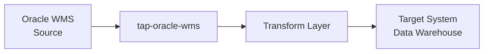
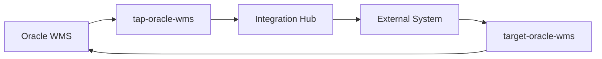
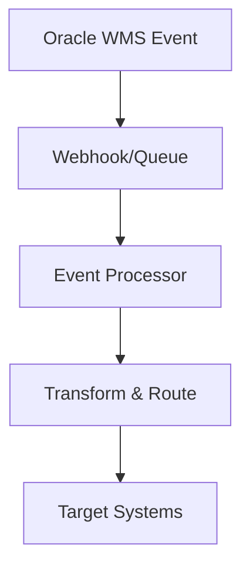

# Oracle WMS Integration Patterns

## Overview

This guide covers comprehensive integration patterns for Oracle WMS, including using it as both a source (tap) and target (destination) system. It provides real-world scenarios, best practices, and complete implementation examples.

## Integration Architecture Patterns

### 1. Extract-Transform-Load (ETL) Pattern

Oracle WMS as source → Data Pipeline → Target System



#### Implementation Example

```python
# ETL Pipeline Configuration
etl_config = {
    "source": {
        "tap": "tap-oracle-wms",
        "config": {
            "base_url": "https://wms-instance.oraclecloud.com",
            "username": "integration_user",
            "password": "secure_password",
            "entities": ["inventory", "orders", "receipts", "shipments"]
        }
    },
    "transforms": [
        {
            "name": "standardize_dates",
            "type": "field_transform"
        },
        {
            "name": "enrich_location_data",
            "type": "lookup_transform"
        }
    ],
    "target": {
        "type": "snowflake",
        "schema": "wms_data",
        "batch_size": 1000
    }
}
```

### 2. Extract-Load-Transform (ELT) Pattern

Oracle WMS → Raw Data Lake → Transform in Target

### 3. Bidirectional Sync Pattern

Oracle WMS ↔ External System



#### Implementation Example

```python
class BidirectionalWMSSync:
    def __init__(self, wms_config, external_config):
        self.wms_tap = OracleWMSTap(wms_config)
        self.wms_target = OracleWMSTarget(wms_config)
        self.external_system = ExternalSystem(external_config)

    def sync_inventory_updates(self):
        """Sync inventory changes bidirectionally."""

        # Extract from WMS
        wms_inventory = self.wms_tap.extract_entity('inventory',
                                                   since_last_sync=True)

        # Push to external system
        for record in wms_inventory:
            self.external_system.update_inventory(record)

        # Extract from external system
        external_updates = self.external_system.get_inventory_updates()

        # Push to WMS
        for update in external_updates:
            wms_record = self.transform_to_wms_format(update)
            self.wms_target.write_record('inventory', wms_record)
```

### 4. Event-Driven Integration Pattern

Real-time integration using events and webhooks



## Common Integration Scenarios

### Scenario 1: WMS to Data Warehouse

**Use Case**: Extract WMS data for analytics and reporting

```yaml
# meltano.yml configuration
extractors:
  - name: tap-oracle-wms
    namespace: tap_oracle_wms
    pip_url: tap-oracle-wms
    config:
      base_url: https://your-wms.oraclecloud.com
      username: analytics_user
      password: ${WMS_PASSWORD}
      entities:
        - inventory
        - orders
        - receipts
        - shipments
        - locations
        - items
      batch_size: 1000
      request_timeout: 300

loaders:
  - name: target-snowflake
    namespace: target_snowflake
    pip_url: pipelinewise-target-snowflake
    config:
      account: your_account
      dbname: WMS_ANALYTICS
      user: ${SNOWFLAKE_USER}
      password: ${SNOWFLAKE_PASSWORD}
      warehouse: COMPUTE_WH
      default_target_schema: wms_raw
```

### Scenario 2: ERP to WMS Integration

**Use Case**: Push orders from ERP to WMS for fulfillment

```python
class ERPToWMSIntegration:
    def __init__(self, erp_client, wms_target):
        self.erp = erp_client
        self.wms = wms_target
        self.order_mapper = OrderMapper()

    def sync_new_orders(self):
        """Sync new orders from ERP to WMS."""

        # Get new orders from ERP
        new_orders = self.erp.get_new_orders()

        for erp_order in new_orders:
            try:
                # Transform ERP order to WMS format
                wms_order = self.order_mapper.transform(erp_order)

                # Validate order data
                self.validate_order(wms_order)

                # Create order in WMS
                result = self.wms.write_record('orders', wms_order)

                # Update ERP with WMS order ID
                self.erp.update_order_status(
                    erp_order['id'],
                    'SENT_TO_WMS',
                    wms_order_id=result['order_id']
                )

            except Exception as e:
                self.handle_order_error(erp_order, e)
```

### Scenario 3: Multi-Warehouse Consolidation

**Use Case**: Consolidate data from multiple WMS instances

```python
class MultiWarehouseConsolidation:
    def __init__(self, warehouse_configs):
        self.warehouses = {}
        for wh_id, config in warehouse_configs.items():
            self.warehouses[wh_id] = {
                'tap': OracleWMSTap(config),
                'location': config['location']
            }

    def consolidate_inventory(self):
        """Consolidate inventory across all warehouses."""

        consolidated_inventory = []

        for wh_id, warehouse in self.warehouses.items():
            # Extract inventory from each warehouse
            inventory = warehouse['tap'].extract_entity('inventory')

            # Add warehouse context
            for item in inventory:
                item['warehouse_id'] = wh_id
                item['warehouse_location'] = warehouse['location']
                consolidated_inventory.append(item)

        return consolidated_inventory
```

## Data Transformation Patterns

### 1. Field Mapping and Standardization

```python
class WMSDataTransformer:
    def __init__(self):
        self.field_mappings = {
            'inventory': {
                'item_id': 'sku',
                'location_id': 'warehouse_location',
                'qty': 'quantity_on_hand',
                'allocated_qty': 'allocated_quantity'
            },
            'orders': {
                'order_id': 'order_number',
                'customer_id': 'customer_code',
                'order_date': 'created_date'
            }
        }

    def transform_record(self, entity_type, record):
        """Transform WMS record to standard format."""
        mapping = self.field_mappings.get(entity_type, {})
        transformed = {}

        for wms_field, standard_field in mapping.items():
            if wms_field in record:
                transformed[standard_field] = record[wms_field]

        # Add metadata
        transformed['_extracted_at'] = datetime.utcnow().isoformat()
        transformed['_source_system'] = 'oracle_wms'

        return transformed
```

### 2. Data Quality and Validation

```python
class WMSDataValidator:
    def __init__(self):
        self.validation_rules = {
            'inventory': [
                ('qty', lambda x: x >= 0, 'Quantity cannot be negative'),
                ('item_id', lambda x: x and len(x) > 0, 'Item ID is required'),
                ('location_id', lambda x: x and len(x) > 0, 'Location ID is required')
            ],
            'orders': [
                ('order_id', lambda x: x and len(x) > 0, 'Order ID is required'),
                ('order_date', self.validate_date, 'Invalid order date format')
            ]
        }

    def validate_record(self, entity_type, record):
        """Validate record against business rules."""
        rules = self.validation_rules.get(entity_type, [])
        errors = []

        for field, validator, error_msg in rules:
            if field in record:
                try:
                    if not validator(record[field]):
                        errors.append(f"{field}: {error_msg}")
                except Exception as e:
                    errors.append(f"{field}: Validation error - {str(e)}")

        return errors

    def validate_date(self, date_str):
        """Validate date format."""
        try:
            datetime.fromisoformat(date_str.replace('Z', '+00:00'))
            return True
        except:
            return False
```

## Performance Optimization Patterns

### 1. Incremental Data Extraction

```python
class IncrementalExtractor:
    def __init__(self, wms_tap, state_manager):
        self.tap = wms_tap
        self.state = state_manager

    def extract_incremental(self, entity_name):
        """Extract only changed records since last run."""

        # Get last extraction timestamp
        last_sync = self.state.get_bookmark(entity_name, 'last_modified')

        # Extract with filter
        records = self.tap.extract_entity(
            entity_name,
            filters={
                'last_modified__gt': last_sync
            }
        )

        # Update bookmark
        if records:
            latest_timestamp = max(r['last_modified'] for r in records)
            self.state.set_bookmark(entity_name, 'last_modified', latest_timestamp)

        return records
```

### 2. Parallel Processing

```python
import concurrent.futures
from threading import Lock

class ParallelWMSProcessor:
    def __init__(self, wms_configs, max_workers=5):
        self.wms_instances = [OracleWMSTap(config) for config in wms_configs]
        self.max_workers = max_workers
        self.results_lock = Lock()
        self.results = []

    def extract_parallel(self, entity_name):
        """Extract from multiple WMS instances in parallel."""

        with concurrent.futures.ThreadPoolExecutor(max_workers=self.max_workers) as executor:
            # Submit extraction tasks
            futures = []
            for i, wms in enumerate(self.wms_instances):
                future = executor.submit(self.extract_from_instance, wms, entity_name, i)
                futures.append(future)

            # Collect results
            for future in concurrent.futures.as_completed(futures):
                try:
                    result = future.result()
                    with self.results_lock:
                        self.results.extend(result)
                except Exception as e:
                    print(f"Error in parallel extraction: {e}")

        return self.results

    def extract_from_instance(self, wms_instance, entity_name, instance_id):
        """Extract from a single WMS instance."""
        records = wms_instance.extract_entity(entity_name)

        # Add instance context
        for record in records:
            record['_source_instance'] = instance_id

        return records
```

## Error Handling and Recovery Patterns

### 1. Circuit Breaker Pattern

```python
import time
from enum import Enum

class CircuitState(Enum):
    CLOSED = "closed"
    OPEN = "open"
    HALF_OPEN = "half_open"

class WMSCircuitBreaker:
    def __init__(self, failure_threshold=5, recovery_timeout=60):
        self.failure_threshold = failure_threshold
        self.recovery_timeout = recovery_timeout
        self.failure_count = 0
        self.last_failure_time = None
        self.state = CircuitState.CLOSED

    def call(self, func, *args, **kwargs):
        """Execute function with circuit breaker protection."""

        if self.state == CircuitState.OPEN:
            if time.time() - self.last_failure_time > self.recovery_timeout:
                self.state = CircuitState.HALF_OPEN
            else:
                raise Exception("Circuit breaker is OPEN")

        try:
            result = func(*args, **kwargs)
            self.on_success()
            return result
        except Exception as e:
            self.on_failure()
            raise e

    def on_success(self):
        """Handle successful call."""
        self.failure_count = 0
        self.state = CircuitState.CLOSED

    def on_failure(self):
        """Handle failed call."""
        self.failure_count += 1
        self.last_failure_time = time.time()

        if self.failure_count >= self.failure_threshold:
            self.state = CircuitState.OPEN
```

### 2. Retry with Exponential Backoff

```python
import random
import time

class RetryHandler:
    def __init__(self, max_retries=3, base_delay=1, max_delay=60):
        self.max_retries = max_retries
        self.base_delay = base_delay
        self.max_delay = max_delay

    def retry_with_backoff(self, func, *args, **kwargs):
        """Retry function with exponential backoff."""

        for attempt in range(self.max_retries + 1):
            try:
                return func(*args, **kwargs)
            except Exception as e:
                if attempt == self.max_retries:
                    raise e

                # Calculate delay with jitter
                delay = min(
                    self.base_delay * (2 ** attempt) + random.uniform(0, 1),
                    self.max_delay
                )

                print(f"Attempt {attempt + 1} failed: {e}. Retrying in {delay:.2f}s")
                time.sleep(delay)
```

## Monitoring and Observability

### 1. Integration Metrics

```python
from dataclasses import dataclass
from typing import Dict, List
import time

@dataclass
class IntegrationMetrics:
    records_extracted: int = 0
    records_loaded: int = 0
    records_failed: int = 0
    extraction_duration: float = 0.0
    load_duration: float = 0.0
    errors: List[str] = None

    def __post_init__(self):
        if self.errors is None:
            self.errors = []

class WMSIntegrationMonitor:
    def __init__(self):
        self.metrics = {}
        self.start_time = None

    def start_integration(self, integration_name):
        """Start monitoring an integration run."""
        self.start_time = time.time()
        self.metrics[integration_name] = IntegrationMetrics()

    def record_extraction(self, integration_name, record_count, duration):
        """Record extraction metrics."""
        if integration_name in self.metrics:
            self.metrics[integration_name].records_extracted = record_count
            self.metrics[integration_name].extraction_duration = duration

    def record_load(self, integration_name, record_count, duration):
        """Record load metrics."""
        if integration_name in self.metrics:
            self.metrics[integration_name].records_loaded = record_count
            self.metrics[integration_name].load_duration = duration

    def record_error(self, integration_name, error_message):
        """Record an error."""
        if integration_name in self.metrics:
            self.metrics[integration_name].errors.append(error_message)
            self.metrics[integration_name].records_failed += 1

    def get_summary(self, integration_name) -> Dict:
        """Get integration summary."""
        if integration_name not in self.metrics:
            return {}

        metrics = self.metrics[integration_name]
        total_duration = time.time() - self.start_time if self.start_time else 0

        return {
            'integration_name': integration_name,
            'total_duration': total_duration,
            'records_extracted': metrics.records_extracted,
            'records_loaded': metrics.records_loaded,
            'records_failed': metrics.records_failed,
            'extraction_duration': metrics.extraction_duration,
            'load_duration': metrics.load_duration,
            'success_rate': (metrics.records_loaded / max(metrics.records_extracted, 1)) * 100,
            'errors': metrics.errors
        }
```

## Oracle Official References

This integration patterns guide is based on Oracle's official documentation:

### Primary References

- **[Oracle WMS Integration Guide](https://docs.oracle.com/en/cloud/saas/warehouse-management/25b/owmap/)** - Complete integration patterns and best practices
- **[Oracle Cloud Integration Patterns](https://docs.oracle.com/en/cloud/paas/integration-cloud/integration-patterns/)** - Enterprise integration patterns
- **[Oracle WMS REST API Guide](https://docs.oracle.com/en/cloud/saas/warehouse-management/25b/owmre/)** - API implementation details

### Integration Best Practices

- **[Oracle Cloud Data Integration Best Practices](https://blogs.oracle.com/cloud-infrastructure/post/oracle-cloud-data-integration-best-practices)** - Performance and reliability patterns
- **[Oracle WMS Performance Tuning](https://docs.oracle.com/en/cloud/saas/warehouse-management/25b/owmpt/)** - Optimization strategies
- **[Oracle Cloud Security Best Practices](https://docs.oracle.com/en-us/iaas/Content/Security/Reference/security_best_practices.htm)** - Security patterns

### Specific Pattern Documentation

- **Chapter 12: Integration Patterns** - Common integration scenarios
- **Chapter 13: Error Handling** - Error recovery and resilience patterns
- **Chapter 14: Performance Optimization** - Scalability and performance patterns
- **Appendix D: Monitoring and Observability** - Operational patterns

---

*Last updated: Based on Oracle WMS Cloud 25B Integration Guide (June 2025)*
