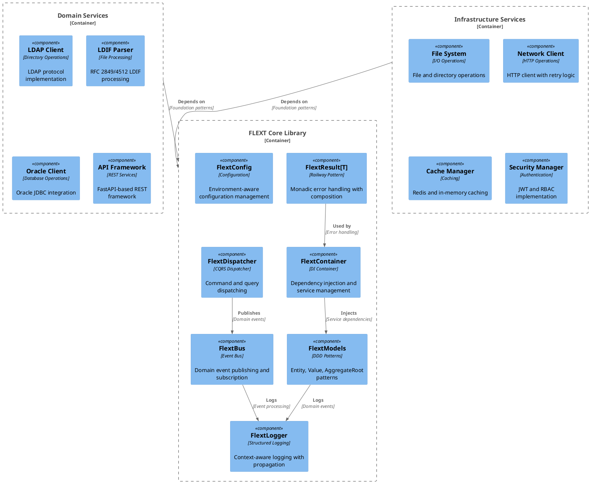

# Core Components Diagram

## Overview

Detailed view of FLEXT core components and their relationships:

## Component Details

### Core Components

#### FlextResult[T]
- **Pattern**: Railway-oriented programming
- **Purpose**: Type-safe error handling with composition
- **Usage**: All operations that can fail return FlextResult[T]

#### FlextContainer
- **Pattern**: Dependency injection container
- **Purpose**: Service registration and resolution
- **Usage**: Global singleton for dependency management

#### FlextModels
- **Pattern**: Domain-Driven Design
- **Purpose**: Entity, Value, and AggregateRoot patterns
- **Usage**: Business domain modeling

#### FlextLogger
- **Pattern**: Structured logging
- **Purpose**: Context-aware logging with propagation
- **Usage**: Consistent logging across all components

### Domain Components

#### LDAP Client
- **Protocol**: LDAP v3 (RFC 4511)
- **Purpose**: Directory operations and authentication
- **Features**: Connection pooling, server-specific quirks

#### LDIF Parser
- **Standard**: RFC 2849/4512
- **Purpose**: LDIF file processing and migration
- **Features**: Schema parsing, entry validation, server quirks

#### Oracle Client
- **Protocol**: JDBC/OCI
- **Purpose**: Oracle database operations
- **Features**: Connection pooling, transaction management

#### API Framework
- **Technology**: FastAPI
- **Purpose**: REST API development
- **Features**: OpenAPI documentation, validation, middleware

---

**Generated:** 2025-10-10 15:19:05
**Version:** 0.9.0
