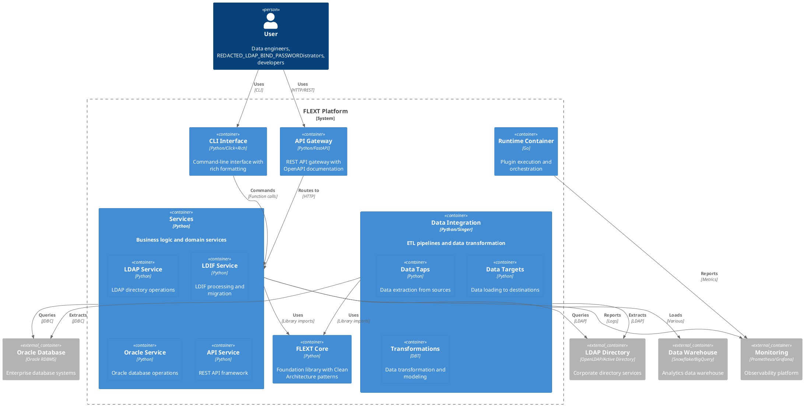

# Container Diagram

<!-- TOC START -->
- [Overview](#overview)
- [Container Descriptions](#container-descriptions)
  - [User-Facing Containers](#user-facing-containers)
  - [Core Containers](#core-containers)
  - [External Systems](#external-systems)
<!-- TOC END -->

## Overview

FLEXT container architecture showing the high-level technology choices and deployment units:

## Container Descriptions

### User-Facing Containers

#### API Gateway

- **Technology**: Python/FastAPI
- **Purpose**: REST API gateway with OpenAPI documentation
- **Responsibilities**:
  - Request routing and load balancing
  - API documentation generation
  - Authentication and rate limiting
  - Request/response transformation

#### CLI Interface

- **Technology**: Python/Click+Rich
- **Purpose**: Command-line interface with rich formatting
- **Responsibilities**:
  - Command parsing and execution
  - Interactive user experience
  - Progress reporting and error handling
  - Configuration management

### Core Containers

#### FLEXT Core

- **Technology**: Python
- **Purpose**: Foundation library with Clean Architecture patterns
- **Responsibilities**:
  - FlextResult[T] error handling
  - FlextContainer dependency injection
  - FlextModels domain patterns
  - FlextLogger structured logging

#### Services

- **Technology**: Python
- **Purpose**: Business logic and domain services
- **Responsibilities**:
  - LDAP directory operations
  - LDIF processing and migration
  - Oracle database integration
  - REST API framework

#### Data Integration

- **Technology**: Python/Singer+DBT
- **Purpose**: ETL pipelines and data transformation
- **Responsibilities**:
  - Data extraction (Taps)
  - Data loading (Targets)
  - Data transformation (DBT)

#### Runtime Container

- **Technology**: Go
- **Purpose**: Plugin execution and orchestration
- **Responsibilities**:
  - Plugin lifecycle management
  - Service orchestration
  - Health monitoring
  - Container management

### External Systems

#### LDAP Directory

- **Technology**: OpenLDAP/Active Directory/Oracle OID
- **Purpose**: Corporate directory services
- **Interfaces**: LDAP protocol (RFC 4511)

#### Oracle Database

- **Technology**: Oracle RDBMS
- **Purpose**: Enterprise database systems
- **Interfaces**: JDBC, OCI

#### Data Warehouse

- **Technology**: Snowflake/BigQuery/Redshift
- **Purpose**: Analytics data warehouse
- **Interfaces**: Various ETL protocols

#### Monitoring

- **Technology**: Prometheus/Grafana
- **Purpose**: Observability platform
- **Interfaces**: Metrics, logs, traces

---

**Generated:** 2025-10-10 15:19:05
**Version:** 0.9.0
