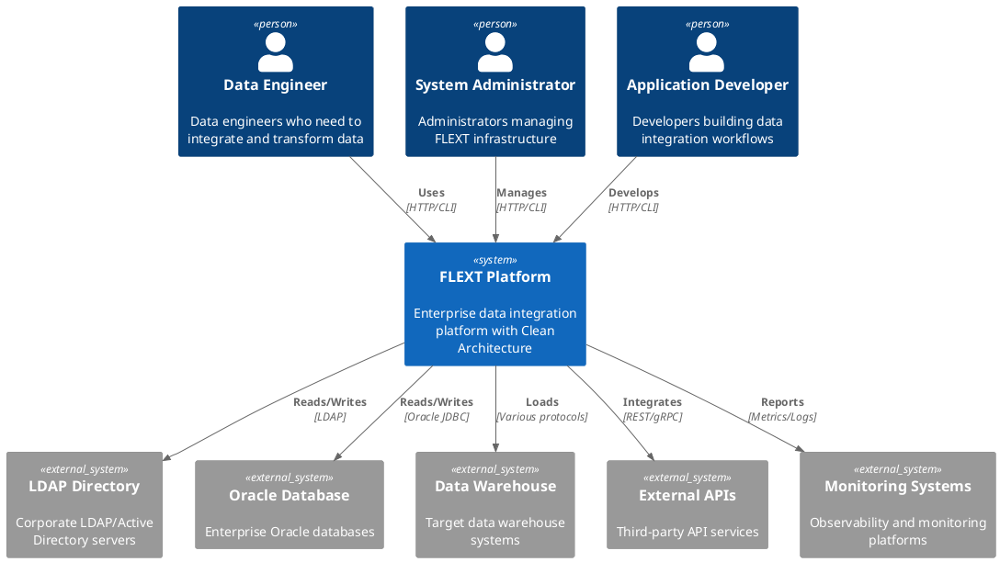

# System Context Diagram

## Overview

FLEXT Enterprise Data Integration Platform operates within the following system context:

## External Systems

### Data Sources
- **LDAP Directories**: Corporate user directories (OpenLDAP, Active Directory, Oracle OID/OUD)
- **Oracle Databases**: Enterprise Oracle databases with complex schemas
- **External APIs**: Third-party services for data enrichment
- **File Systems**: Local and remote file storage systems

### Data Targets
- **Data Warehouses**: Snowflake, BigQuery, Redshift, etc.
- **Analytics Platforms**: Tableau, PowerBI, custom dashboards
- **Application Databases**: PostgreSQL, MySQL for application data
- **Message Queues**: Kafka, RabbitMQ for event streaming

### Infrastructure
- **Container Orchestration**: Docker, Kubernetes for deployment
- **Monitoring Systems**: Prometheus, Grafana for observability
- **Logging Systems**: ELK stack, Splunk for log aggregation
- **Security Systems**: SSO providers, certificate authorities

## User Personas

### Data Engineer
- **Needs**: Extract, transform, and load data from various sources
- **Goals**: Build reliable data pipelines with monitoring and error handling
- **Pain Points**: Complex integrations, data quality issues, performance bottlenecks

### System Administrator
- **Needs**: Deploy, configure, and monitor FLEXT infrastructure
- **Goals**: Ensure system reliability, security, and performance
- **Pain Points**: Complex deployment, configuration management, troubleshooting

### Application Developer
- **Needs**: Build custom integrations and extensions
- **Goals**: Rapid development with clean APIs and comprehensive documentation
- **Pain Points**: Learning curve, API complexity, testing challenges

## Quality Attributes

### Performance
- **Throughput**: Handle millions of records per hour
- **Latency**: Sub-second response times for API operations
- **Scalability**: Horizontal scaling across multiple nodes
- **Efficiency**: Optimized resource usage and memory management

### Security
- **Authentication**: Multi-factor authentication support
- **Authorization**: Fine-grained access control
- **Data Protection**: End-to-end encryption
- **Compliance**: GDPR, HIPAA, SOX compliance support

### Reliability
- **Availability**: 99.9% uptime with high availability deployment
- **Fault Tolerance**: Graceful degradation and automatic recovery
- **Data Consistency**: ACID compliance for critical operations
- **Error Handling**: Comprehensive error handling and reporting

---

**Generated:** 2025-10-10 15:19:05
**Version:** 0.9.0
